## Introduction

OpenECPDS has been designed as a multi-purpose repository, hereafter referred to as the **Data Store**, delivering three strategic data-related services:

- **Data Acquisition**: the automatic discovery and retrieval of data from data providers.
- **Data Dissemination**: the automatic distribution of data products to remote sites.
- **Data Portal**: the pulling and pushing of data initiated by remote sites.

Data Acquisition and Data Dissemination are active services initiated by OpenECPDS, whereas the Data Portal is a passive service triggered by incoming requests from remote sites. The Data Portal service provides interactive access to the Data Dissemination and Data Acquisition services.

- [Introduction to OpenECPDS](#introduction)
  - [Driving Forces](#driving-forces)
  - [Data Storage and Retrieval](#data-storage-and-retrieval)
  - [Protocols and Connections](#protocols-and-connections)
  - [Object Storage](#object-storage)
  - [Additional Features](#additional-features)
- [Getting Started](#getting-started)
  - [System Requirements and Setup](#system-requirements-and-setup)
  - [Creating and Logging into the Development Container](#creating-and-logging-into-the-development-container)
  - [Building and Configuring OpenECPDS](#building-and-configuring-openecpds)
  - [Starting OpenECPDS](#starting-openecpds)
  - [Checking the Containers and Logs](#checking-the-containers-and-logs)
  - [Additional Makefile Options](#additional-makefile-options)
  - [Stopping OpenECPDS](#stopping-openecpds)
- [IDE Setup for OpenECPDS Development](#ide-setup-for-openecpds-development)
  - [Visual Studio Code](#visual-studio-code)
  - [Eclipse](#eclipse)
- [Deployment](#deployment)
  - [Deploying OpenECPDS on Kubernetes](#deploying-openecpds-on-kubernetes)
  - [Illustrative Physical Infrastructure](#illustrative-physical-infrastructure)
- [Concepts for Users](#concepts-for-users)
  - [OpenECPDS Entities](#openecpds-entities)
  - [Failover Mechanism in Host Selection](#failover-mechanism-in-host-selection)
  - [Lifecycle of a Data Transfer](#lifecycle-of-a-data-transfer)
- [Workflow for various Use Cases](#workflow-for-various-use-cases)
  - [ECPDS command-line Tool](#ecpds-command-line-tool)
  - [Data Portal](#data-portal)
  - [Acquisition](#acquisition)
  - [Dissemination](#dissemination)
- [Continental Data Movers](#continental-data-movers)
  - [Main Factors Affecting Data Transfer Speeds](#main-factors-affecting-data-transfer-speeds)
  - [Key Functionalities of a Continental Data Mover](#key-functionalities-of-a-continental-data-mover)
  - [Steps to Optimize Data Transfers](#steps-to-optimize-data-transfers)
- [Notification System (MQTT)](#notification-system-mqtt)
  - [Functional Overview of the Notification System](#functional-overview-of-the-notification-system)
  - [Typical Interaction in the OpenECPDS Notification System](#typical-interaction-in-the-openecpds-notification-system)
  - [Retained Messages and Late Client Connections](#retained-messages-and-late-client-connections)
  - [Configuration and Access Control](#configuration-and-access-control)
  - [MQTT Broker in OpenECPDS](#mqtt-broker-in-openecpds)
- [Event Logging in OpenECPDS](#event-logging-in-openecpds)
  - [Event Categories](#event-categories)
  - [Fields by Category](#fields-by-category)
- [Support Materials](#support-materials)
- [Notes](#notes)

OpenECPDS enhances data services by integrating innovative technologies to streamline the acquisition, dissemination, and storage of data across diverse environments and protocols.

### Driving Forces

To ensure ECMWF's forecasts reach Member and Co-operating States promptly, efficient data collection and dissemination are crucial. To address this, ECMWF has developed the ECMWF Product Data Store (ECPDS) in-house, which has been operational for many years. This mature solution has greatly enhanced the efficiency and productivity of data services, providing a portable and adaptable tool for various environments.

The picture below shows the essential role of ECPDS in the ECMWF Numerical Weather Prediction (NWP) system.

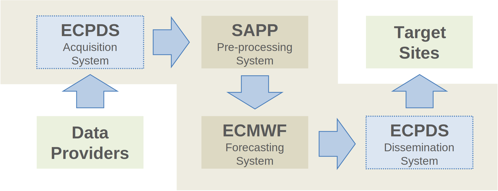

Recently, ECPDS has been rolled out to some Member States and is now in use within the United Weather Centers (UWC) West consortium. Building on the success of these deployments and following requests from our Member States, OpenECPDS was launched to encourage collaboration with other organizations, strengthen integration efforts, and enhance data service capabilities through community contributions.

OpenECPDS is using container technologies, simplifying application building and operation across different environments. This allows for easy testing on laptops with limited resources or scaling up for large deployments involving hundreds of systems and petabytes of data.

The software is designed for ease of building, using a development container that includes all necessary tools for compiling source code, building RPM files, creating container images, and deploying the application. Comprehensive documentation is available in the [Getting Started](#getting-started) section, guiding users through setup and execution, ensuring a smooth experience even for those new to container technologies.
 
The launch of OpenECPDS signifies a commitment to ongoing maintenance and updates, focusing on long-term sustainability and continuous improvement to meet evolving user needs.

### Data Storage and Retrieval

Unlike a conventional data store, OpenECPDS does not necessarily physically store the data in its persistent repository but rather works like a search engine, crawling and indexing metadata from data providers. However, OpenECPDS can cache data in its Data Store to ensure availability without relying on instant access to data providers.

Data can be fed into the Data Store via:
- The **Data Acquisition** service, discovering and fetching data from data providers.
- Data providers actively pushing data through the **Data Portal**.
- Data providers using the **OpenECPDS API** to register metadata, allowing asynchronous data retrieval.

Data products can be searched by name or metadata and either pushed by the Data Dissemination service or pulled from the Data Portal by users. OpenECPDS streams data on the fly or sends it from the Data Store if it was previously fetched.

### Protocols and Connections

OpenECPDS interacts with a variety of environments and supports multiple standard protocols:

- **Outgoing connections** (Data Acquisition & Dissemination): FTP, SFTP, FTPS, HTTP/S, AmazonS3, Azure and Google Cloud Storage.
- **Incoming connections** (Data Portal): FTP, HTTPS, S3 (at the moment, **SFTP** and **SCP** are available exclusively through a Commercial API).

Protocol configurations vary based on authentication and connection methods (e.g., password vs. key-based authentication, parallel vs. serial connections).

The OpenECPDS software is modular, supporting new protocols through extensions.

### Object Storage

OpenECPDS stores data as objects, combining data, metadata, and a globally unique identifier. It employs a file-system-based solution with replication across multiple locations to ensure continuous data availability. For example, data can be replicated across local storage systems and cloud platforms to bring data closer to users and enhance performance.

The object storage system in OpenECPDS is hierarchy-free but can emulate directory structures when necessary, based on metadata provided by data providers. OpenECPDS presents different views of the same data, depending on user preferences.

### Additional Features

- **Notification System**: Provides an embedded MQTT broker to publish notifications and an MQTT client to subscribe to data providers.
- **Data Compression**: Supports various algorithms (lzma, zip, gzip, bzip2, lbzip2, lz4, snappy) to reduce dissemination time and enable faster access to data.
- **Data Checksumming**: Provides MD5 for data integrity checks on the remote sites, and ADLER32 for data integrity checks in the data store.
- **Garbage Collection**: Automatically removes expired data, with no limit on expiry dates.
- **Data Backup**: Can be configured to map data sets in OpenECPDS to existing archiving systems.

## Getting Started

### System Requirements and Setup

OpenECPDS requires Docker to be installed and fully functional, with the default Docker socket enabled (Settings -> Advanced -> "Allow the default Docker socket to be used"). The build and run process has been tested on Linux and macOS (Intel/Apple Silicon) using Docker Desktop v4.34.2. It has also been reported to work on Windows with the WSL 2 backend and the host networking option enabled.

To test the deployment of OpenECPDS containers to a Kubernetes cluster, Kubernetes must be enabled in Docker (Settings -> Kubernetes -> "Enable Kubernetes").

>**Warning:** If Kubernetes is properly installed, your `$HOME/.kube/config` file should point to `https://kubernetes.docker.internal:6443`. If not, you can manually update the file.

The default setup needs a minimum of 3GB of available RAM. The disk space required depends on the size of the data you expect to handle, but at least 15GB is essential for the development and application containers.

To download the latest distribution, run the following command:

```bash
curl -L -o master.zip https://github.com/ecmwf/open-ecpds/archive/refs/heads/master.zip && unzip master.zip
```

A [Makefile](Makefile) located in the `open-ecpds-master` directory can be used to create the development container that installs all the necessary tools for building the application. The Java classes are compiled, packaged into RPM files, and used to build Docker images for each OpenECPDS component.

### Creating and Logging into the Development Container

To build the development container:

```bash
make dev
```

If successful, you should be logged into the development container.

### Building and Configuring OpenECPDS

Once inside the development container, you can run the following command to compile the Java classes, package the RPM files, and build the OpenECPDS Docker images:

```bash
make build
```
>**Warning:** In a production environment, ENV should be avoided in Dockerfiles for sensitive data like MYSQL_ROOT_PASSWORD for the [Database](docker/ecpds/database/Dockerfile) or KEYSTORE_PASSWORD for the [Monitor](docker/ecpds/monitor/Dockerfile) and [Mover](docker/ecpds/mover/Dockerfile). Docker secrets or environment variable files should be used instead.

Once the build process is complete, navigate to the following directory where another [Makefile](run/bin/ecpds/Makefile) is available:

```
cd run/bin/ecpds
```

The services are started using Docker Compose. The `docker-compose.yml` file contains all the necessary configurations to launch and manage the different components of OpenECPDS. You can find this file in the appropriate directory for your OS ([Darwin-ecpds](run/bin/ecpds/Darwin-ecpds/docker-compose.yml) for macOS or [Linux-ecpds](run/bin/ecpds/Linux-ecpds/docker-compose.yml) for Linux and Windows).

To verify the configuration and understand how Docker Compose interprets the settings before running the services, use the following command:

```
make config
```

For advanced configurations, you can fine-tune the options by modifying the default values in the Compose file. Each parameter is documented within the file itself to provide a better understanding of its function and how it impacts the system's behavior. By reviewing the Compose file, you can tailor the setup to your environment’s specific requirements.

### Starting OpenECPDS

To start the application:

```
make up
```

This will start the OpenECPDS master, monitor, mover, and database services.

It might take a few seconds for all the services to start. Once they are up, you can access the following URLs (please update them if you changed the configuration in the compose files):

>**Warning:** Certificate validation should be disabled when relevant, as the test environment uses a self-signed certificate.

| Interface             | URL                                              | Login Details         |
|-----------------------|--------------------------------------------------|-----------------------|
| Monitoring            | [https://127.0.0.1:3443](https://127.0.0.1:3443) | admin/admin2021       |
| Data Portal           | [https://127.0.0.1:4443](https://127.0.0.1:4443) | test/test2021         |
|                       | [ftp://127.0.0.1:4021](ftp://127.0.0.1:4021)     | test/test2021         |
| MQTT Broker           | [mqtt://127.0.0.1:4883](mqtt://127.0.0.1:4883)   | test/test2021         |
| Virtual FTP Server    | [ftp://127.0.0.1:2021](ftp://127.0.0.1:2021)     | admin/admin2021       |
| JMX Interfaces        | [http://127.0.0.1:2062](http://127.0.0.1:2062)   | master/admin          |
|                       | [http://127.0.0.1:3062](http://127.0.0.1:3062)   | monitor/admin         |
|                       | [http://127.0.0.1:4062](http://127.0.0.1:4062)   | mover/admin           |

### Checking the Containers and Logs

To verify that the containers are running, use:

```
make ps
```

To view the standard output (stdout) and standard error (stderr) streams generated by the containers, use:

```
make logs
```

To view the logs generated by OpenECPDS, you can browse the following directories mounted to the containers:

```
run/var/log/ecpds/master
run/var/log/ecpds/monitor
run/var/log/ecpds/mover
```

### Additional Makefile Options

To log in to the database:

```
make mariadb
```

To log in to the master container (use the same for monitor, mover, and database):

```
make connect container=master
```

### Stopping OpenECPDS

To stop the application, run:

```
make down
```

To clean the logs and data:

```
make clean
```

## IDE Setup for OpenECPDS Development

OpenECPDS includes configuration files for both **Visual Studio Code** and **Eclipse**, so you can choose the development environment you are most comfortable with. Simply select your preferred IDE, and you will find ready-to-use settings tailored to streamline your work with OpenECPDS.

Before following the guidelines to start OpenECPDS in your IDE, ensure that an instance of the OpenECPDS database is running. This can be done either within or outside the development container. To set it up, run:

```
make start-db
```

This command will start only the database service, while the Master, Monitor, and Mover services can be launched directly from the IDE.

### Visual Studio Code

When working with OpenECPDS in Visual Studio Code, the **Dev Containers extension** is required and will automatically detect the presence of a `.devcontainer` directory within the project folder. This directory contains key configuration files, such as [devcontainer.json](.devcontainer/devcontainer.json) and a [Dockerfile](.devcontainer/Dockerfile), which collectively define the development environment for OpenECPDS.

Before opening the project, make sure to edit `.devcontainer/devcontainer.json` to update the DOCKER_HOST_OS environment parameter according to your Docker host operating system (the default is set to Darwin for macOS).

Once you open the OpenECPDS folder, VS Code will prompt you to reopen the project within a container: **Reopen in Container**. If this option is selected, VS Code uses the `.devcontainer/Dockerfile` to build the container image, adding necessary tools and dependencies specified for OpenECPDS. The `.devcontainer/devcontainer.json` file configures additional settings, such as environment variables and workspace mounting, ensuring the container is fully tailored to the project. This setup provides a consistent and fully-equipped development environment from the start.

For more information on working with development containers in Visual Studio Code, please visit the [Visual Studio Code website](https://code.visualstudio.com/docs/devcontainers/containers).

To access the Debug and Run configurations:

- Open the **Command Palette** by pressing Ctrl+Shift+P (Windows/Linux) or Cmd+Shift+P (Mac).
- Type **Run and Debug** in the **Command Palette** to find the **Run and Debug** view.
- Select **Run and Debug** in the sidebar or access it through the **Debug icon** in the Activity Bar on the left side of VS Code.

This view displays the available **Run and Debug** configurations: **OpenECPDS Master Server**, **OpenECPDS Mover Server**, **OpenECPDS Monitor Server**, or **OpenECPDS Stack** to start them all at once.

To build the OpenECPDS Docker images, open a terminal in the development container by selecting **Terminal > New Terminal** from the top menu, and follow the instructions provided in the [Building and Configuring OpenECPDS](#building-and-configuring-openecpds) section.

### Eclipse

To open the OpenECPDS project in Eclipse:

- Go to **File > Import...**
- In the import dialog, select **Existing Maven Projects** under the **Maven category** and click **Next**.
- Browse to the location of your OpenECPDS project folder on your system and select it. Eclipse will automatically detect the project files.
- Once the project is detected, click **Finish** to complete the import.

To build the application from the source, follow these steps:

- Select the [pom.xml](pom.xml) file in the **Project Explorer** view.
- In the contextual menu, choose **Run As > OpenECPDS Clean Compile**

The application can now be started within Eclipse using the preconfigured Debug and Run options available: **OpenECPDS Master Server**, **OpenECPDS Mover Server**, and **OpenECPDS Monitor Server**. These configurations are accessible under **Run > Run Configurations...** and **Run > Debug Configurations...**

After completing these steps, the OpenECPDS project should be ready to work with in Eclipse, with access to any required dependencies and configurations.

Eclipse does not natively support development containers, and this is not required for simply running and debugging OpenECPDS within Eclipse. To build the OpenECPDS Docker images, the development container can be manually created as outlined in the [Getting Started](#getting-started) section.

## Deployment

### Deploying OpenECPDS on Kubernetes

If you have successfully built the OpenECPDS containers and enabled Kubernetes in Docker, navigate to the following directory where a [Makefile](deploy/kubernetes/Makefile) is available:

```
cd deploy/kubernetes
```

To convert the [docker-compose.yml](deploy/kubernetes/docker-compose.yml) file into Kubernetes YAML files in the  `k8s-configs` directory and start the pods, run:

```
make build
```

If successful, use the following command to get the port mappings needed to connect from outside the cluster:

```
make ports
```

If the default port for the monitoring interface has not been updated in the `docker-compose.yml` file, you can find the external port by checking the redirection for port 3443, for example:

3443 -> 32034/TCP

You can then use your browser to access the monitoring interface at:

https://127.0.0.1:32034

To get the YAML files for all pods, PVs, and PVCs (you can redirect the output to capture the full configuration), run:

```
make yaml
```

To delete all Kubernetes resources and stop the pods:

```
make delete
```

### Illustrative Physical Infrastructure

This section provides a high-level overview of the physical infrastructure supporting OpenECPDS at ECMWF. The deployment consists of three distinct services: Acquisition (ACQ), Dissemination (DISS), and Auxiliary (AUX). While this serves as an example of a possible physical infrastructure, the actual setup may vary depending on the specific requirements of each site.

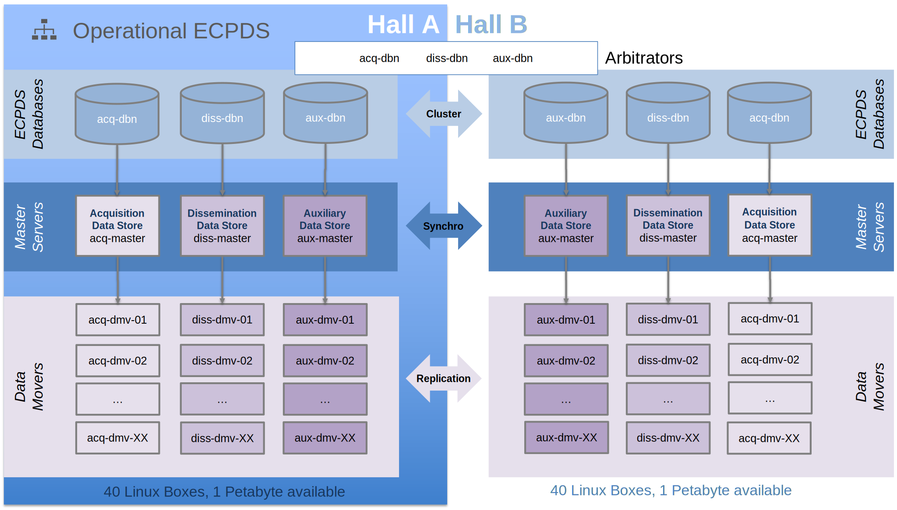

Each service is dedicated to a specific function but retains the same core capabilities. This separation primarily helps distribute workloads based on peak usage periods. For instance, the Acquisition service operates continuously, while the Dissemination and Auxiliary services experience peak activity three times a day, particularly during forecast deliveries.

The current infrastructure comprises 80 bare-metal systems with a total storage capacity of 2 petabytes. Storage capacity is regularly reassessed, especially when new processing cycles are introduced.

The following figure illustrates the main data flows for OpenECPDS and its various processes: first, the **Data Submission** from the HPC to OpenECPDS; then, the **Data Replication** between the Data Movers; and finally, the **Data Dissemination** to the Internet and RMDCN networks over the WAN.

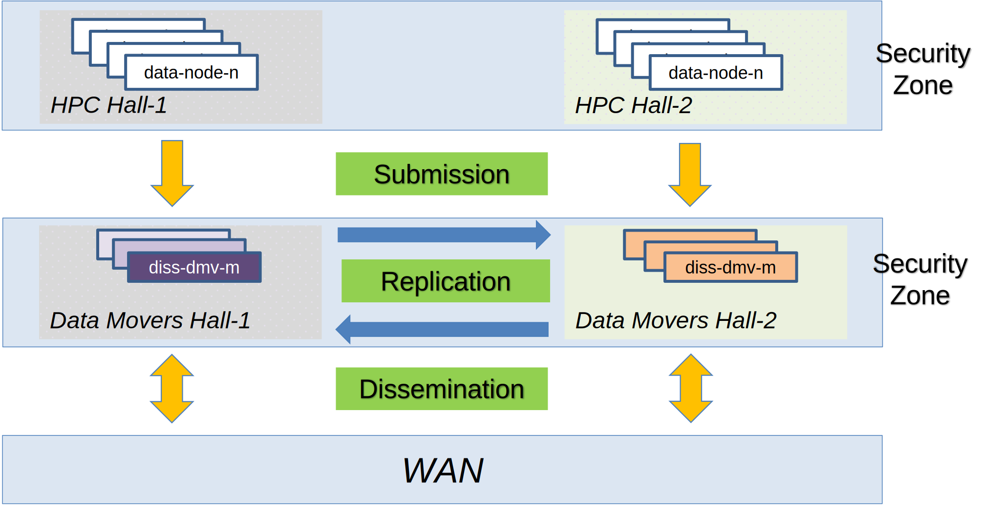

This refers to **Data Dissemination** in a broad sense, including both uploads to remote sites from OpenECPDS and downloads by customers through the OpenECPDS data portal.

The HPC and OpenECPDS are each within their respective security zones, and the traffic represented by the yellow arrows between these zones passes through a firewall.

## Concepts for Users

### OpenECPDS Entities

Understanding some key OpenECPDS concepts will help users to benefit fully from the tool’s capabilities:

- **data files**
- **data transfers**
- **destinations** and **aliases**
- **dissemination** and **acquisition hosts**

A user connecting to the OpenECPDS web interface will come across each of these entities, which are related to each other through the different services.

A **data file** is a record of a product stored in the OpenECPDS Data Store with a one-to-one mapping between the data file and the product. The data file contains information on the physical specifications of the product, such as its size, type, compression and entity tag (ETag) in the Data Store, as well as the metadata associated with it by the data provider (e.g. meteorological parameters, name or comments concerning the product).

A **data transfer** is linked to a unique data file and represents a transfer request for its content, together with any related information (e.g. schedule, priority, progress, status, rate, errors, history). A single data file can be linked to several data transfers as many remote sites might be interested in obtaining the same products from the Data Store.

A **destination** should be understood as a place where data transfers are queued and processed in order to deliver data to a unique remote place, hence the name ‘destination’. It specifies the information the Data Dissemination service needs to disseminate the content of a data file to a particular remote site.

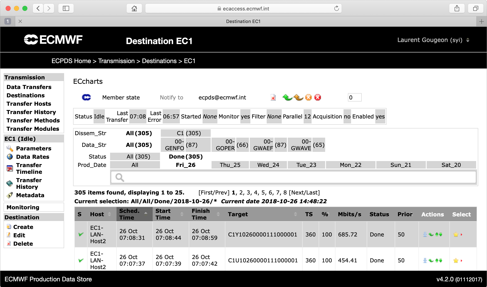

A breadcrumb trail at the top shows where a user currently is in the tool. In this case, a user has created a destination called EC1. Users with the right credentials can see the status of this destination and can review the progress of data transmission. They can manage the destination by, for example, requesting data transfers, changing priorities and stopping or starting data transmissions.

Each destination implements a transfer scheduler with its own configuration parameters, which can be fine-tuned to meet the remote site’s needs. These settings make it possible to control various things, such as how to organise the data transmission by using data transfer priorities and parallel transmissions, or how to deal with transmission errors with a fully customisable retry mechanism.

In addition, a destination can be associated with a list of **dissemination hosts**, with a primary host indicating the main target system where to deliver the data, and a list of fall-back hosts to switch to if for some reason the primary host is unavailable.

A dissemination host is used to connect and transmit the content of a data file to a target system. It enables users to configure various aspects of the data transmission, including which network and transfer protocol to use, in which target directory to place the data, which passwords, keys or certificates to use to connect to the remote system, and more.

If the data transfers within a destination are retrieved by remote users through the Data Portal service, then there will be no dissemination hosts attached to the destination. In this particular case, the destination can be seen as a ‘bucket’ (in Amazon S3 terms) or a ‘blob container’ (in Microsoft Azure terms). The transfer scheduler will be deactivated, and the data transfers will stay idle in the queue, waiting to be picked up through the Data Portal.

A destination can also be associated with a list of **acquisition hosts**, indicating the source systems where to discover and retrieve files from remote sites. Like their dissemination counterparts, the acquisition hosts contain all the information required to connect to the remote site, including which network, transfer protocol, source directory and credentials to use for the connection. In addition, the acquisition host also contains the information required to select the files at the source. Complex rules can be defined for each source directory, type, name, timestamp and protocol, to name just a few options.

A destination can be a dissemination destination, an acquisition destination or both. It will be a dissemination destination as long as at least one dissemination host is defined, and it will be an acquisition destination as long as at least one acquisition host is defined. When both are defined, then the destination can be used to automatically discover and retrieve data from one place and transmit it to another, with or without storing the data in the Data Store, depending on the destination configuration. This is a popular way of using OpenECPDS. For example, this mechanism is used for the delivery of some regional near-real-time ensemble air quality forecasts produced at ECMWF for the EU-funded Copernicus Atmospheric Monitoring Service implemented by the Centre.

There is also the concept of destination **aliases**, which makes it possible to link two or more destinations together, so that whatever data transfer is queued to one destination is also queued to the others. This mechanism enables processing the same set of data transfers to different sites with different schedules and/or transfer mechanisms defined on a destination basis. Conditional aliasing is also possible in order to alias only a subset of data transfers.

### Failover Mechanism in Host Selection

The diagram below illustrates how the system manages failures by dynamically switching between available hosts. OpenECPDS sequentially attempts to connect to each host in the list, moving to the next one if a failure occurs.

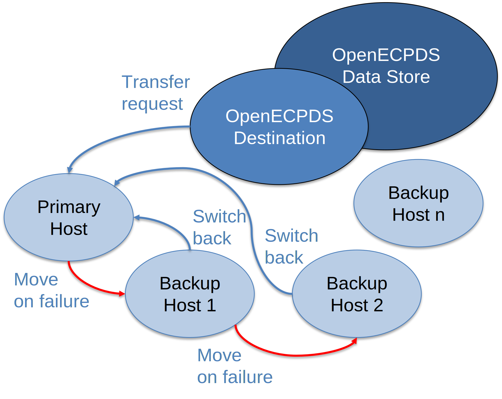

The behavior of the failover mechanism depends on the configuration of the transfer scheduler:

- It can either continue using the first successfully connected host or revert to the primary host once it becomes available.
- The switch can occur immediately after a successful transfer or after a predefined time interval.

### Lifecycle of a Data Transfer

Each data transfer in OpenECPDS follows a well-defined lifecycle, transitioning through different statuses from initiation to completion. This diagram illustrates the various states a transfer can go through, including successful deliveries, retries, and failure handling. Understanding these transitions helps in diagnosing issues, optimizing performance, and ensuring reliable data distribution across the system.

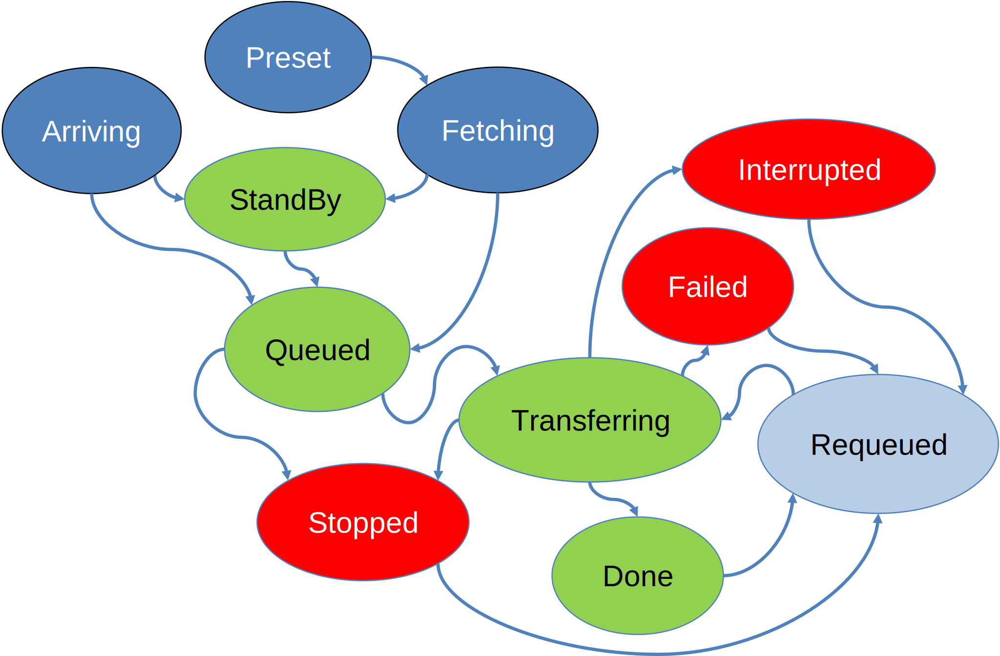

#### Submission

This phase involves submitting a data file to the OpenECPDS data store and registering a data transfer request for it. There are two submission modes, each with its associated statuses:

1) **Push Mode** - Both the metadata and the file content are pushed directly.

- **Arriving** - The metadata has been registered, and the file content is currently being uploaded to the data store.

2) **Fetch Mode** - The metadata is submitted first, and the file content is retrieved asynchronously.

- **Preset** - The metadata has been registered, and the data retrieval has been scheduled, awaiting processing by the **Data Retrieval Scheduler**.
- **Fetching** - The **Data Retrieval Scheduler** is actively retrieving the file content into the Data Store.

#### Processing

Once a data transfer request has been registered in OpenECPDS, it will be processed by various OpenECPDS schedulers and transition through multiple statuses. The data file associated with the transfer request can either be downloaded through the data portal or disseminated to a remote site. Each mode has its own set of statuses:

1) **Data Portal** - The file is in the destination queue, waiting to be retrieved.

- **StandBy** - The data transfer request was submitted with the standby option, causing it to be ignored by the **Data Transfer Scheduler**.
- **Done** - The data file has been successfully downloaded.

2) **Dissemination to a Remote Site** - The data transfer request is in the queue, waiting for the scheduled time to pass.

- **Queued** - The data transfer request is waiting to be picked up by the **Data Transfer Scheduler**.
- **Transferring** - The data is currently being disseminated to the remote site.
- **Done** - The data transmission has been successfully completed.

#### Failure Handling

At every stage of processing, an error can occur. When an error occurs, the data transfer request is assigned a specific status depending on the nature of the error. Once the error has been recorded, the transfer scheduler has two options: either retry the request or remain in the error state, depending on the destination or host configuration (e.g., maximum number of retries, unrecoverable error).

1) **Error State** - the file has failed to complete successfully the processing phase.

- **Failed** - The dissemination to the remote site has failed.
- **Interrupted** - The processing has been interrupted (e.g., destination or OpenECPDS restart).
- **Stopped** - The processing was stopped either manually through the monitoring interface, due to an unrecoverable error, or because the maximum number of retries was reached.

2) **Retry The Request** - automatic or manual.

- **Requeued** - The file has entered an error state but was requeued because the error was not considered unrecoverable. A file can also be manually requeued by a user through the monitoring interface. In the case of an automatic retry, the file can be rescheduled for a later time to prevent retries from occurring too frequently. A maximum number of retries can also be configured, with settings available at both the destination and host levels.

## Workflow for various Use Cases

### ECPDS command-line Tool

The `ecpds` command-line is designed to submit local data files to a specified destination on OpenECPDS. It provides several options to fine-tune transfer requests, monitor transfer statuses, and manage scheduled transfers. In this section, we will examine the workflow for submitting a local file in both synchronous and asynchronous modes.

#### Synchronous Push

This is the default mode for submitting data files to OpenECPDS. It allows both file transfer and metadata registration in a single execution of the `ecpds` command-line. Once OpenECPDS has successfully processed the file, it returns a **Data File ID**, which can be used to track the file via the OpenECPDS monitoring interface. The returned **Data File ID** guarantees that the file has been correctly registered and stored in the Data Store.

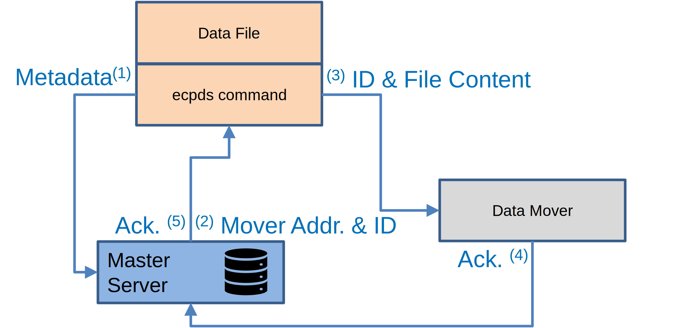

1) The `ecpds` command connects to the **Master Server**, authenticates, and sends metadata (e.g., source hostname, user ID, filename, location, size).
2) The **Master Server** allocates a **Data File ID** for the file and assigns a **Data Mover** to receive its content. It then returns the hostname and port of the selected **Data Mover**, along with the **Data File ID**, to the `ecpds` command.
3) The `ecpds` command connects to the **Data Mover** using the provided hostname and port and transfers the file content.
4) The **Data Mover** sends an acknowledgment of file reception to the **Master Server**.
5) The **Master Server** sends the acknowledgment to the `ecpds` command, including the **Data File ID**.

#### Asynchronous Push

The asynchronous mode is recommended when handling a large number of data files or high data volumes. In the first phase, metadata, including the file location and the source host for retrieval, is registered in OpenECPDS. In the second phase, OpenECPDS initiates the file downloads from the **Data Movers**. Typically, multiple files are registered at once, organised into groups, and retrieved in parallel streams managed by OpenECPDS. This approach enhances performance by using a load-balancing mechanism to distribute the workload across **Data Movers** and source hosts.

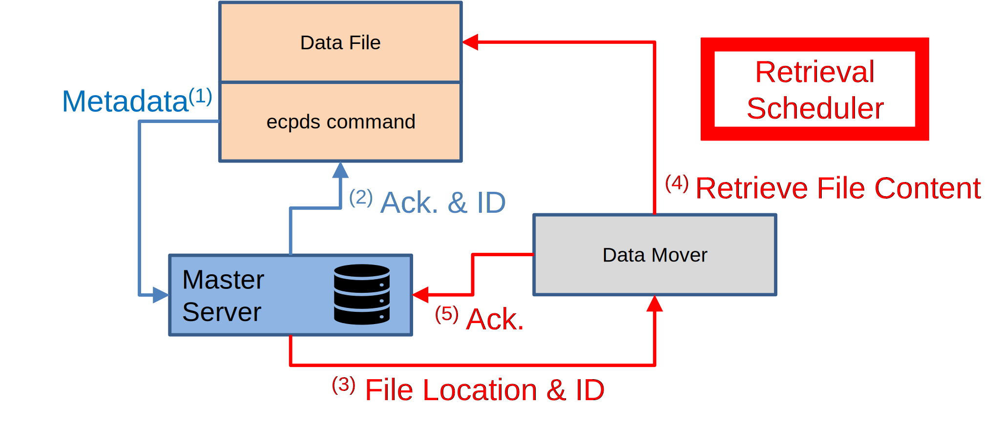

The workflow for submitting the request is as follows (in blue):

1) The `ecpds` command connects to the **Master Server**, authenticates, and sends metadata (e.g., source hostname, user ID, filename, location, size).
2) The Master Server allocates a **Data File ID** for the file and assigns a **Data Mover** to receive its content. It then sends an acknowledgment to the `ecpds` command, including the **Data File ID**.

The workflow for retrieving the file content is triggered by the **Transfer Scheduler** and is as follows (in red):

3) The **Master Server** contact the allocated **Data Mover** and request for the data file to be retrieved.
4) Using the provided metadata, the **Data Mover** connects to the source host with the user ID and retrieves the content of the file based on its filename and location.
4) After the retrieval is successfully completed, the **Data Mover** sends an acknowledgment to the **Master Server**.

After submitting the request with the `ecpds` command, the status can be checked using the `ecpds` command and the **Data File ID** to track the data file retrieval. Tracking can also be done through the OpenECPDS monitoring interface.

The diagram below provides a complete overview of the retrieval mechanism used in OpenECPDS at ECMWF.

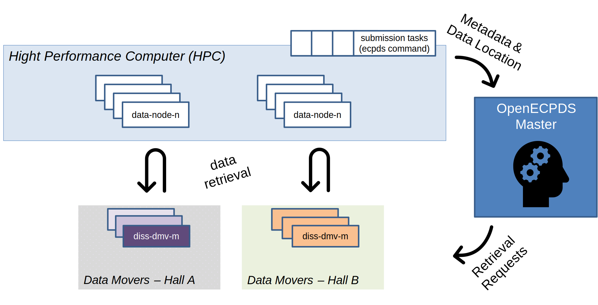

The forecast is produced and stored on the supercomputer (HPC) across multiple data nodes. Some submission tasks register these files with the OpenECPDS Master. The **Master Server** then records the requests, and the **Transfer Scheduler** asynchronously load-balances the data file retrievals across multiple **Data Movers** in each hall. This enables high parallelism between the HPC data nodes and the OpenECPDS **Data Movers**, maximizing the use of the local network. The maximum number of simultaneous data retrievals is configurable in OpenECPDS.

Data submission requests to OpenECPDS are grouped under a specific name. At the end of a batch submission, an `ecpds` command is executed to track the retrieval of all files in the group. Once all files have been successfully retrieved, the `ecpds` command returns.

### Data Portal

The `ftp`, `sftp`, `scp`, `s3`, and `wget/curl` command-line tools can be used to transfer data to and from OpenECPDS. These standard tools facilitate connections and file transfers via the OpenECPDS data portal. In this section, we examine the workflow for uploading and downloading files using these methods.

In these workflows:

 - The **User Data Mover** is the server where the customer connects using FTP, SFTP, SCP, HTTPS or S3 to upload or download a file.
 - The **Target Data Mover** is the server where the file is stored.

In a multi-mover setup:

 - The **User Data Mover** is selected by a Load Balancer, which distributes requests across available Data Movers.
 - The **Target Data Mover** is allocated by the Master Server, considering available storage and system load.

Thus, the **User Data Mover** and **Target Data Mover** may not be the same.

#### Synchronous Push

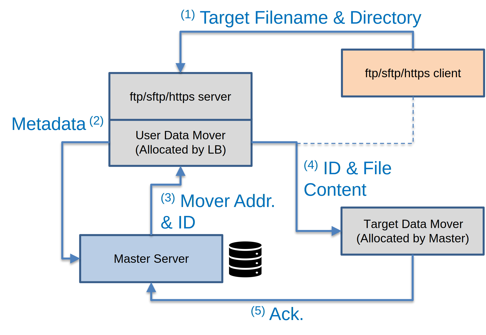

Workflow Steps:

1) The client connects to the **User Data Mover** via FTP, SFTP, SCP, HTTPS or S3 and uploads a file.
2) The **User Data Mover** extracts the target path, filename, and metadata (e.g., user ID) and sends a request to the Master Server.
3) The Master Server determines the target destination based on the filename and user configuration. It then assigns a DataFileID and selects a **Target Data Mover**.
4) The **User Data Mover** connects to the **Target Data Mover** and streams the file directly from the client.
5) Once the transfer is complete, the **Target Data Mover** sends an acknowledgment to the **Master Server**.
6) The **Master Server** notifies the **User Data Mover**, which then closes the connection with the client.

#### Synchronous Pull

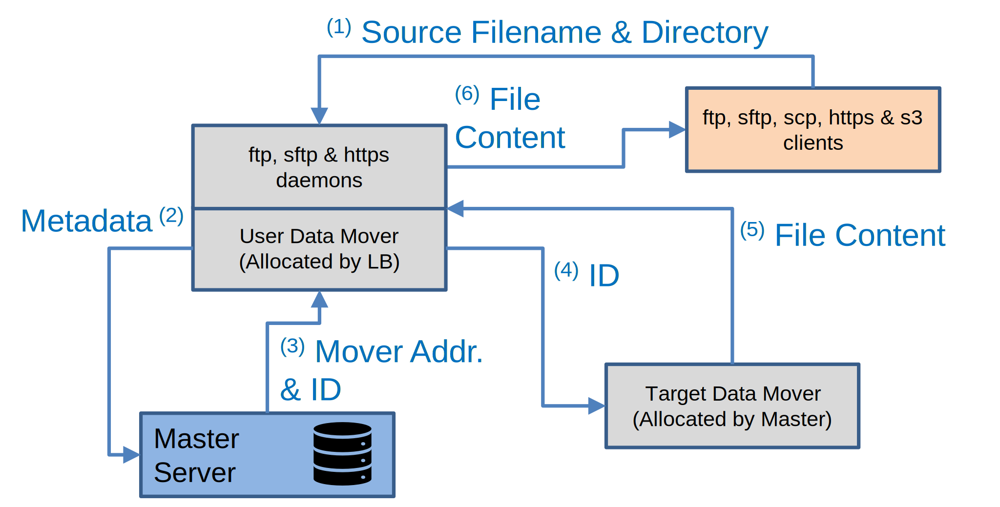

Workflow Steps:

1) The client connects to the **User Data Mover** via FTP, SFTP, SCP, HTTPS, or S3 and downloads a file.
2) The **User Data Mover** extracts the target path, filename, and metadata (e.g., user ID) and sends a request to the **Master Server**.
3) The **Master Server** determines the target destination and DataFileID based on the filename and user configuration, allowing it to locate the **Target Data Mover** where the data file is stored.
4) The **User Data Mover** connects to the **Target Data Mover** and requests the data file using its DataFileID.
5) The **Target Data Mover** streams the file content to the **User Data Mover**.
6) The **User Data Mover** streams the file content directly to the client.

### Acquisition

The **Acquisition System** is designed to connect to data providers to first discover the available data, then select the relevant data, and finally retrieve it in a second phase. Each phase occurs asynchronously: first, the **Discovery** phase, followed by the **Retrieval** phase. The corresponding workflows are explained below.

#### Discovery

The **Acquisition Scheduler** checks each acquisition host and triggers a discovery of remote files based on a timeline configured at the destination and host level.

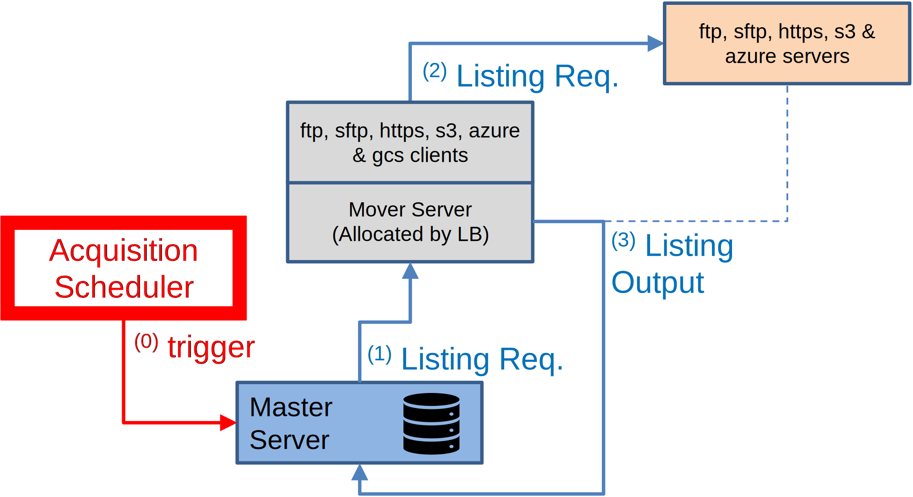

When a discovery is triggered, the following steps occur:

1) The Master allocates a Data Mover and connects to it to initiate a connection to the remote host and request a file listing.
2) The Data Mover selects the appropriate transfer module based on the protocol defined in the host configuration, and using the selected module, connects to the remote site and issues a listing request.
3) The listing output is sent back to the Master Server, which registers the selected data transfers.

#### Retrieval

The **Retrieval Scheduler** processes all files registered in OpenECPDS during the Discovery phase and triggers the retrieval of their content from the Data Providers.

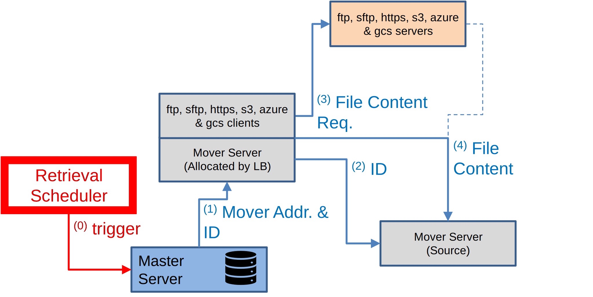

When a retrieval is triggered, the following steps occur:

1) The **Master Server** allocates a **User Data Mover** to connect to the remote site and forwards the **Data File ID** and the address of the **Target Data Mover**, which was allocated for storing the data file.
2) The **User Data Mover** connects to the **Target Data Mover**, forwards the **Data File ID**, and requests a stream for storing the file's content.
3) The **User Data Mover** locates the transfer module configured for the remote site, initiates a connection, and requests the file content.
4) The file content is streamed from the remote site to the **Target Data Mover**.

### Dissemination

After a file has been registered and stored in OpenECPDS, whether it was submitted and pushed via the `ecpds` command, uploaded through the **Data Portal**, or acquired via the **Acquisition System**, it can then be disseminated to a remote site via the **Dissemination System**.


When a request for disseminating a file is triggered, the following steps occur:

1) The **Master Server** allocates a **User Data Mover** to handle the dissemination of the selected file, providing the **Data File ID** and the address of the **Target Data Mover** where the file is stored.
2) The **User Data Mover** forwards a request to the **Target Data Mover** containing the **Data File ID**.
3) The **Target Data Mover** locates the file and returns a stream to allow the **User Data Mover** to download its content.
4) The **User Data Mover** connects to the remote site using the configured transfer module and uploads the file's content directly from the **Target Data Mover**.

## Continental Data Movers

Efficient data dissemination is crucial for ensuring timely access to critical information, especially when dealing with large datasets and geographically distributed users. A **Continental Data Mover** helps optimize data transfers by reducing network latency, balancing server load, and improving overall reliability. To maximize its benefits, several key strategies are implemented, including strategic deployment, network optimization and pre-replication of data.

### Main Factors Affecting Data Transfer Speeds

Several key factors influence the speed at which data is transferred:

- **Data File Size & Network Capability**: The larger the file and the more limited the network bandwidth, the longer the transfer duration.
- **Geographic Proximity**: The physical distance between the source and destination impacts transfer latency. The farther the data must travel, the greater the potential delay.
- **Early Data Availability**: In most cases, data products become available before their scheduled dissemination time, allowing for potential optimizations in the transfer process.

### Key Functionalities of a Continental Data Mover

Continental Data Movers play a crucial role in the OpenECPDS dissemination system by ensuring reliable and efficient data transfers across multiple locations. Their main functionalities include:

- **Seamless Dissemination Across Supported Protocols**: Continental Data Movers support all transfer protocols used within OpenECPDS, ensuring compatibility across different network environments and client systems.
- **Efficient Connection Management**: Control connections to the OpenECPDS Master Server are load-balanced through OpenECPDS Movers, optimizing accessibility and reliability. Communication occurs via secure HTTPS requests using a REST/JSON interface, ensuring robust and scalable data handling.

### Steps to Optimize Data Transfers

To ensure efficient and timely data dissemination, a Continental Data Mover is set up and optimized through the following key steps:

1) **Deploying a Continental Data Mover Near the Target Sites** - A Continental Data Mover is installed geographically closer to the intended recipients (e.g., in the US for North American users) to reduce latency and improve transfer speeds by minimizing long-distance network hops. The chosen location must have reliable infrastructure to support high-speed data transfers.

2) **Optimizing Internet Connectivity to the Continental Data Mover** - High-bandwidth, low-latency network connections are used to link the OpenECPDS Master Server to the Continental Data Mover, ensuring fast and stable transfers. Redundant network paths are established to minimize the risk of disruptions. Where possible, direct peering agreements with major Internet providers or dedicated network links (e.g., RMDCN for institutional users) are used to enhance performance.

3) **Pre-Replicating Data Before Peak Times** - Data is replicated onto the Continental Data Mover before the official schedule time to avoid congestion and delays. This ensures availability ahead of peak demand, reducing competition for bandwidth during dissemination. Replication is ideally scheduled during off-peak hours to take advantage of lower network usage.

4) **Disseminating Data Directly from the Continental Mover** - Users receive data from the Continental Data Mover instead of the OpenECPDS Data Movers, reducing the load on the primary dissemination system and improving delivery speeds. The Continental Data Mover is configured to support all required OpenECPDS dissemination protocols (e.g., FTP, SFTP, HTTPS, S3) to ensure seamless access.

The following diagram illustrates the data transfer flows between OpenECPDS, a Continental Data Mover and a target destination.


The data files are proactively replicated from one of the **OpenECPDS Data Movers** to the **Continental Data Mover** ahead of the scheduled dissemination time. This pre-replication ensures that the data is readily available, minimizing delays when dissemination begins.

Once the scheduled time arrives, the **OpenECPDS Master Server** instructs the **Continental Data Mover** to initiate the transfer to the designated target host. This process is illustrated in the diagram using green arrows, representing the primary dissemination workflow.

However, if the **Continental Data Mover** encounters an issue, such as a disconnection or malfunction, a fallback mechanism is in place. In such cases, the dissemination is automatically handled by one of the **OpenECPDS Data Movers**, ensuring continuity of service. This backup process is depicted in the diagram with red arrows.

The map below illustrates the OpenECPDS infrastructure deployed in Italy, alongside the **Continental Data Mover** installed in New York. The diagram shows the data transfer flows, highlighting the global reach and efficient data dissemination across geographically distributed locations.

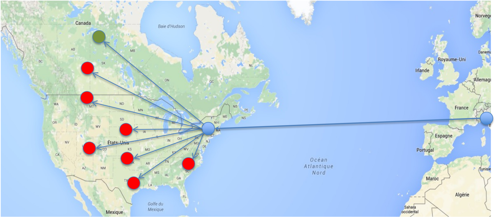

In OpenECPDS terminology, a **Continental Data Mover** is essentially a standard **OpenECPDS Data Mover** with limited functionalities and an alternative communication module designed to receive instructions from the **OpenECPDS Master Server**. To set up a **Continental Data Mover** within OpenECPDS, it is necessary to define a Proxy Host and associate it with a specific Destination. OpenECPDS will then use this Proxy Host to manage pre-replication tasks and facilitate communication with the **Continental Data Mover**.

## Notification System (MQTT)

### Functional Overview of the Notification System

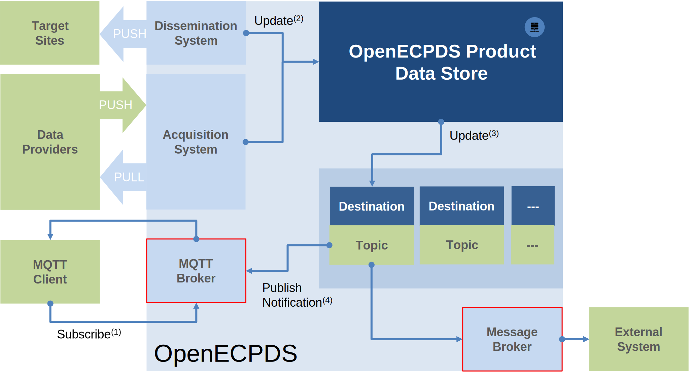

This functional view of the Notification System illustrates the key components involved in product notifications. The **Product Data Store** is depicted in dark blue at the top right, while the **Dissemination and Acquisition Systems** appear in sky blue at the top left. The **MQTT and Message Brokers** are shown at the bottom left and right, outlined in red.

Below the Data Store, **OpenECPDS Destinations** serve to organize and manage products for each customer. These Destinations include various configuration parameters, including an MQTT topic used for message identification and routing to the appropriate MQTT subscribers.

A **notification** is triggered each time a product is added to the Data Store via the Acquisition System. The product may either be made available through the Portal or pushed to a remote site by the Dissemination System. In both cases, the user receiving the notification will extract the product’s location from the message. If the product is on the Portal, the user must retrieve it before processing. If it has been pushed to a remote site, it is immediately available for processing.

The number of notifications triggered when a new product is added depends on the **Destination's configuration**:

- **No notification** is sent if the Destination is not configured to report updates.
- **One or two notifications** are sent if the Destination is configured to notify one or both Brokers.

If the **MQTT Broker** is notified, it checks whether any MQTT clients have subscribed to the Destination's topic. If a matching subscription exists, the client receives the notification along with the associated payload.

For the **Message Broker**, the process is simpler: upon receiving a notification, it directly forwards it to the configured clients.

### Typical Interaction in the OpenECPDS Notification System

The MQTT-based notification system follows a structured interaction between three key components: the **MQTT Client**, the **MQTT Broker**, and the **OpenECPDS Data Store**.

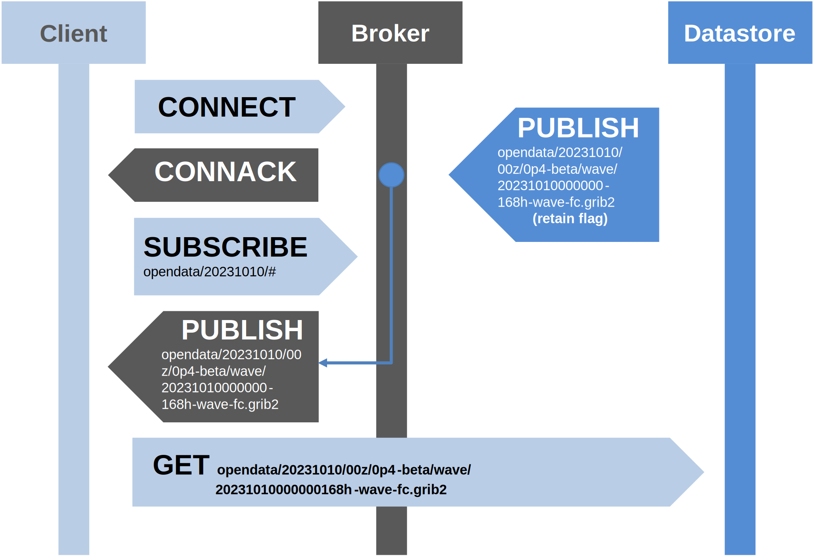

- **Connection Establishment**: The process begins with the Client initiating a connection to the Broker by sending a **CONNECT** message. The Broker acknowledges the connection by responding with a **CONNACK** message.

- **Subscription to a Topic**: Once connected, the Client registers its interest in a specific topic by sending a **SUBSCRIBE** message to the Broker. The Broker then listens for relevant **PUBLISH** messages from the Data Store that match the subscribed topic.

- **Message Delivery and Product Retrieval**: When the Data Store generates a **PUBLISH** message for a subscribed topic, the Broker forwards it to all Clients that have subscribed to that topic. The Client then extracts the file location from the message and proceeds to fetch the product using one of the available protocols on the OpenECPDS Portal: **HTTPS, S3, SFTP, or FTP**.

### Retained Messages and Late Client Connections

In this example, the **retain flag** is enabled in the MQTT message. This ensures that even if the Data Store sends a **PUBLISH** message before the Client is connected, the message remains available for delivery. As a result, when the Client connects later, it still receives the retained message, ensuring no critical notifications are missed.

### Configuration and Access Control

The MQTT configuration can be fine-tuned at the **Destination level**, allowing for greater flexibility in how notifications are handled. Additionally, **access control** mechanisms can be configured at the **data user** level, ensuring secure and controlled distribution of messages.

### MQTT Broker in OpenECPDS

A few key points about the MQTT Broker and Client:

- **Industry Standard Compliance**: MQTT is the de facto standard for IoT communication. Our Broker and Client are fully compliant with all three MQTT specifications, ensuring that OpenECPDS is compatible with all MQTT brokers and clients available on the market.
- **Integration with OpenECPDS**: The Broker and Client are embedded within OpenECPDS and are based on the [Community Edition of the HiveMQ Broker](https://github.com/hivemq/hivemq-community-edition) and the [Eclipse Paho Client](https://github.com/eclipse-paho/paho.mqtt.java).

## Event Logging in OpenECPDS

OpenECPDS generates structured event logs that capture key activities and transitions within the system, including data retrieval, replication, and dissemination processes. These logs are designed to provide insight into system operations and facilitate troubleshooting by recording events at different stages of the workflow.

At ECMWF, we are using Splunk to collect, index, and analyze these event logs, enabling efficient monitoring and alerting. However, OpenECPDS does not rely on Splunk specifically and these logs follow a format that can be parsed by any log management or analysis tool, such as ELK (Elasticsearch, Logstash, Kibana), Graylog, or Fluentd. This flexibility allows different users and organizations to integrate OpenECPDS logs into their own monitoring and analytics ecosystems.

The following sections describe the different types of events generated by OpenECPDS, along with their structure and key fields. These events provide detailed insights into the system’s operations and can be used for real-time monitoring, performance analysis, and incident investigation.

### Event Categories

OpenECPDS generates various types of events, each categorized based on the nature of the operation being recorded. Below are the event categories:

- **PRS** (PRoduct Status):
The PRS category tracks the status of products as they progress through OpenECPDS. The system maintains a top-level monitoring display, which can be updated using the `ecpds` command. Events in this category are logged at key stages, including when a set of files is scheduled for processing, when files start being registered in OpenECPDS, and when they are fully recorded in the system.

- **RET** (RETrieval):
The RET category corresponds to the retrieval process. Once a file is registered in OpenECPDS, it is handled by the Retrieval Scheduler, which attempts to retrieve the data. Upon completion, whether successful or not, an event of this category is recorded to reflect the retrieval outcome.

- **UPH** (UPload History):
The UPH category records events whenever a file is successfully disseminated from OpenECPDS to a remote site. These events track outbound file transfers and provide a history of completed uploads.

- **INH** (INcoming History):
The INH category logs incoming data transfers. This includes files that are either pushed to OpenECPDS or retrieved by users accessing the OpenECPDS data portal. These events help track the reception of external data.

- **ERR** (ERRor):
The ERR category captures error events, specifically when a file fails to be disseminated successfully. These records help in troubleshooting failed transfers and identifying potential system issues.

- **CPY** (CoPY / Replication):
The CPY category tracks file replication between different data movers in OpenECPDS. Each event records whether the replication was successful or if an issue occurred during the transfer.

### Fields by Category

Each event logged by OpenECPDS follows a structured format, with fields that provide detailed information about the recorded operation. The fields vary depending on the event category, capturing relevant attributes such as timestamps, file identifiers, processing statuses, and transfer details.

The following sections provide a breakdown of the specific fields recorded for each event category:

#### PRS (Product STatus) Fields

Each PRS event records a specific moment in the processing of a product, capturing key information about the product’s status and related attributes. The following fields are included in the PRS event:

```
PRS;StatusCode=EXEC;DataStream=GWAEF;TimeStep=144;TimeBase=2025-02-12 06:00:00.0;Type=EF;ScheduleTime=2025-02-12 13:04:00.0;LastUpdate=2025-02-12 12:28:44.353
```

- **StatusCode**: This field represents the status of the product at a given stage of processing, which can be one of three options: **expected** (indicating the product has been scheduled but not yet started), **started** (indicating the processing has begun), or **completed** (indicating the processing has finished). This status is determined based on the flags used with the `ecpds` command-line tool, namely `-expected`, `-started`, or `-completed`.

- **DataStream**: This field identifies the data stream associated with the product. It is used to group and identify the family of products being processed together, making it easier to categorize and manage them within the system.

- **TimeStep**: This field captures the time step associated with the product. The time step typically represents the temporal resolution of the data, such as hourly, daily, or based on a specific observational period.

- **TimeBase**: This field specifies the time base associated with the product. It represents the reference time or baseline from which the time steps are derived, helping to maintain synchronization across time-dependent datasets.

- **Type**: This field defines the type of the product. It helps categorize the product, often reflecting its role or the type of data it represents (e.g., forecast, observation, analysis, etc.).

- **ScheduleTime**: This field denotes the scheduled time when the data files related to the product are expected to be available in OpenECPDS for dissemination. It is typically set based on the timing of the data generation or when the product is ready to be shared with end-users.

- **LastUpdate**: This field records the last time the status of the product was updated. It provides the most recent timestamp when any change occurred in the processing of the product, helping track progress and status changes.

#### RET (RETrieval) Fields

The RET category includes the following fields, which provide detailed information about the data retrieval process:

```
RET;Monitored=true;DataTransferId=123456789;DestinationName=MyDestination;DestinationType=Gold;FileName=/my/home/datafile.bin;FileSize=9426076326;ScheduledTime=2025-02-12 13:04:00.0;StartTime=2025-02-12 12:29:43.98;MetaStream=GENFO;MetaType=EF;MetaTime=06;TimeBase=2025-02-12 06:00:00.0;TimeStep=144;Duration=40781;HostId=123456;HostLogin=login;HostAddress=my.host.it;TransferProtocol=sftp;MoverName=my.mover.name.it;UserId=uid;RequestAddress=X.X.X.X;DataOnlyDuration=40189;StandBy=false;RemoteHost=my.remote.host.it
```

- **Monitored**: A flag that indicates whether the destination responsible for processing the data transfer is monitored in the top monitoring display.
- **DataTransferId**: A unique identifier for the data transfer request. This ID is used to track and manage the progress of the transfer.
- **DestinationName**: The name of the OpenECPDS destination for this data transfer request.
- **DestinationType**: The type of Destination for the data transfer.
- **FileName**: The full name of the file being transferred, including its path and extension.
- **FileSize**: The size of the file in bytes, which helps assess the scope of the transfer.
- **ScheduledTime**: The scheduled time when the data transfer request is expected to start processing. This is based on the transfer schedule.
- **StartTime**: The actual time when the retrieval of the data file started, which helps monitor delays or discrepancies compared to the scheduled time.
- **MetaStream**: The meta stream associated with the data file, used for categorizing or identifying a specific subset of data.
- **MetaType**: The meta type associated with the data file, providing additional classification or type information related to the file.
- **MetaTime**: The meta time associated with the data file, which represents a specific timestamp or point in time relevant to the metadata.
- **TimeBase**: The time base associated with the data file.
- **TimeStep**: The time step associated with the data file.
- **Duration**: The total duration of the data retrieval process, which includes the time from initiation to completion.
- **HostId**: The identifier of the acquisition or source host that was used to retrieve the data file. This identifies where the file originated.
- **HostLogin**: The user ID associated with the host system used to retrieve the file.
- **HostAddress**: The address or hostname of the host from which the file is being retrieved.
- **TransferProtocol**: The protocol used to connect to the host for the data retrieval, such as FTP, SFTP, HTTPS, S3, or GCS.
- **MoverName**: The name of the Data Mover responsible for connecting to the host and processing the data retrieval.
- **UserId**: The user identifier associated with the destination of the data transfer, helping identify the user or service involved in the transfer.
- **RequestAddress**: The address of the host from where the registration of the data transfer was made, typically the host where the `ecpds` command was issued. If the registration was done through the Acquisition System this is the address of the host used for the discovery.
- **DataOnlyDuration**: The duration of the data retrieval process excluding protocol overhead, such as authentication or directory navigation. This helps distinguish between actual data transfer time and protocol-related delays.
- **StandBy**: A flag indicating whether the transfer request is in **standby** mode after the data retrieval has completed. If set, the file will remain inactive until further processing instructions are provided; otherwise, it will be in **queued** mode, awaiting dissemination.
- **RemoteHost**: The RemoteHost can either be the same as the HostAddress or different, particularly in scenarios where the host entity is configured for load balancing across a cluster. In such cases, the RemoteHost field will specify the actual host used to process the data retrieval, providing a more accurate representation of the system involved in the transfer.

In the case of a problem during retrieval, the following additional fields will be set to provide error details:

- **Status**: This field will be set to false if the transfer was unsuccessful, indicating an error in the retrieval process.
- **Message**: A description of the error or problem that occurred during the transfer, providing valuable information for troubleshooting and resolving the issue.

These fields give a comprehensive overview of the retrieval process and help monitor, manage, and troubleshoot data retrieval within OpenECPDS.

#### UPH (UPload History) Fields

The UPH category records events whenever a file is disseminated from OpenECPDS to a remote site. Each event captures details about the data transfer, including scheduling, execution, and completion status.

```
UPH;Monitored=false;DataTransferId=123456789;DestinationName=MyDestination;DestinationType=Gold;FileName=/my/home/datafile.bin;FileSize=131259312;MetaStream=GENFO;MetaType=EF;MetaTime=00;Priority=69;QueueTime=2025-02-13 06:53:10.0;RequeueCount=0;ScheduledTime=2025-02-13 06:53:10.0;StartTime=2025-02-13 09:00:53.139;PutTime=2025-02-13 09:00:56.015;Duration=16471;DurationOnClose=18534;BytesSent=131259312;StatusCode=DONE;RetrievalTime=2025-02-13 05:42:01.694;TimeBase=2025-02-13 00:00:00.0;TimeStep=79;FinishTime=2025-02-13 09:01:14.584;TransferProtocol=sftp;TransferServer=my.mover.name.it;NetworkCode=Internet;HostAddress=my.host.it;PreSchedule=false;ProxyHost=X.X.X.X;Proxied=true;SocketStatistics=start:1739437253611 end:1739437274560 0 0 [::ffff:X.X.X.X]:47699 [::ffff:X.X.X.X]:22 timer:(keepalive,119min,0) ino:760715359 sk:32bcfe cgroup:/ inet-sockopt: ( is_icsk mc_loop) sack cubic wscale:8,7 rto:411 rtt:210.21/10.545 ato:40 mss:1374 pmtu:1500 rcvmss:1374 advmss:1460 cwnd:3215 bytes_sent:131602845 bytes_acked:131602846 bytes_received:437502 segs_out:97675 segs_in:19212 data_segs_out:96883 data_segs_in:3763 send:168114172bps lastsnd:1866 lastrcv:8 lastack:8 pacing_rate:336228136bps delivery_rate:85580864bps delivered:96884 app_limited busy:18696ms rwnd_limited:6989ms(37.4%) reordering:6 rcv_rtt:1053.2 rcv_space:37632 rcv_ssthresh:296449 minrtt:203.539 snd_wnd:2598144;Compressed=-;CompressedOnTheFly=false
```

- **Monitored**: Indicates whether the destination responsible for the data transfer is tracked in the top monitoring display (same as in RET).
- **DataTransferId**: Unique identifier of the data transfer request (same as in RET).
- **DestinationName**: Name of the OpenECPDS destination for this data transfer request (same as in RET).
- **DestinationType**: Type of the destination (same as in RET).
- **FileName**: Full name of the file (same as in RET).
- **FileSize**: Size of the file (same as in RET).
- **MetaStream**: Metadata stream associated with the data file (same as in RET).
- **MetaType**: Metadata type associated with the data file (same as in RET).
- **MetaTime**: Metadata time associated with the data file (same as in RET).
- **Priority**: Priority level assigned to the data transfer request in the destination queue.
- **QueueTime**: The requested time for starting the dissemination. Initially set to the scheduled time but may change if the file has been re-queued or automatically retried.
- **RequeueCount**: The number of times the data transfer request has been re-queued.
- **ScheduledTime**: The scheduled time when the data transfer request is expected to be processed (same as in RET).
- **StartTime**: The most recent time when the dissemination process started.
- **PutTime**: The time when the connection to the destination was established, and the input stream was ready to be read.
- **Duration**: The total time taken for data dissemination from the moment the input stream started until it reached the end.
- **DurationOnClose**: The total time taken for data dissemination, considering the moment when the output stream was fully flushed and closed. This can be longer than Duration if the transfer module uses large buffers for output.
- **BytesSent**: The number of bytes sent during transmission. This may differ from the original file size if the transfer was incomplete, the file was compressed, or the transfer was resumed.
- **StatusCode**: The final status of the transfer request can be one of the following: **Done** - Transfer successfully completed, **Stopped** – Transfer was intentionally stopped, **Failed** – Transfer failed, **Requeued** – Transfer was re-queued for another attempt, **Interrupted** – Transfer was interrupted.
- **RetrievalTime**: The time when the data retrieval process started.
- **TimeBase**: The time base associated with the data file (same as in RET).
- **TimeStep**: The time step associated with the data file (same as in RET).
- **FinishTime**: The time when the data transmission was completed.
- **TransferProtocol**: The protocol used for the transfer (e.g., FTP, SFTP, HTTPS, S3, GCS).
- **TransferServer**: The name of the Data Mover responsible for connecting to the host and processing the data dissemination.
- **NetworkCode**: The network code has configured in the host entity (e.g., Internet, RMDCN).
- **HostAddress**: The address or hostname of the target host.
- **PreSchedule**: If set to true, the scheduled time is ignored, and the file is sent as soon as possible.
- **ProxyHost**: If the transfer request was handled by a Continental Data Mover, this field contains the identifier of the proxy host used.
- **Proxied**: Indicates whether the transfer request was processed through a Continental Data Mover.
- **SocketStatistics**: If the target host was configured to collect socket statistics before closing the data connection, this field contains the output of the SS command.
- **Compressed**: Specifies whether the file was sent in a compressed format.
- **CompressedOnTheFly**: Indicates whether the file was pre-compressed before transmission or compressed on the fly during the transfer.

If a problem occurs during dissemination, an **ERR** event will be triggered instead of a **UPH** event to provide error details.

#### INH (INcoming History) Fields

The INH event records details whenever a new file is pushed to or retrieved from OpenECPDS via the data portal, or pushed using the `ecpds` command-line tool. It captures information about the data transfer, including metadata, user details, and network parameters.

```
INH;Monitored=true;DataTransferId=123456789;DestinationName=MyDestination;DestinationType=Gold;FileName=/my/home/datafile.bin;FileSize=162392;ScheduledTime=2025-02-13 07:41:00.0;StartTime=2025-02-13 09:05:32.616;MetaStream=GENFO-GTS;MetaType=EP;MetaTime=00;TimeBase=2025-02-13 00:00:00.0;TimeStep=240;Duration=1;UserId=uid;CountryCode=uk;UserDescription=User description;BytesSent=162392;TransferProtocol=ftp;TransferServer=my.mover.name.it;HostAddress=my.host.it;Caller=/my/home/datafile.output;ExpiryTime=2025-03-15 07:41:00.0;FileSystem=20;Action=download
```

- **Monitored**: Indicates whether the destination responsible for the data transfer is monitored in the top-level display (same as RET).
- **DataTransferId**: Unique identifier of the data transfer request (same as RET).
- **DestinationName**: Name of the OpenECPDS destination handling the data transfer request (same as RET).
- **DestinationType**: Type of the destination (same as RET).
- **FileName**: Full name of the transferred file (same as RET).
- **FileSize**: Size of the transferred file (same as RET).
- **ScheduledTime**: Scheduled time for processing the data transfer request (same as RET).
- **StartTime**: Timestamp when the data transfer began (same as RET).
- **MetaStream**: Meta stream associated with the data file (same as RET).
- **MetaType**: Meta type associated with the data file (same as RET).
- **MetaTime**: Meta time associated with the data file (same as RET).
- **TimeBase**: Time base associated with the data file (same as RET).
- **TimeStep**: Time step associated with the data file (same as RET).
- **Duration**: Total duration of the data transmission, whether inbound or outbound.
- **UserId**: If the request originates from the `ecpds` command, this field contains the user who initiated the command. Otherwise, it holds the identifier of the underlying data user.
- **CountryCode**: Country code associated with the underlying data user.
- **UserDescription**: Description field associated with the underlying data user.
- **BytesSent**: Total number of bytes sent or received during the transfer.
- **TransferProtocol**: If the request originates from the `ecpds` command, this field is set to **ecpds**. Otherwise, it records the protocol used to connect to the data portal (e.g., FTP, SFTP, HTTPS).
- **TransferServer**: If the request was registered via the `ecpds` command-line tool, this field contains the Master Server name. Otherwise, it holds the name of the Data Mover handling the data processing.
- **HostAddress**: IP address of the client submitting the request. If the request was initiated via `ecpds`, this is the IP of the host where the command was executed. If it was submitted through the data portal, this is the address of the Master Server.
- **Caller**: If the request comes from the `ecpds` command-line, this field can be set using the `-caller` flag. If the flag is not provided, `ecpds` will attempt to retrieve the value from the system variable `EC_job_stdout`. If not found, or if the request originates from the data portal, this field remains empty.
- **ExpiryTime**: Expiry time associated with the data transfer request.
- **FileSystem**: Identifier of the file system allocated for storing the data file.
- **Action**: Specifies whether the transfer request was related to an upload or a download.

#### ERR (ERRor) Fields

The ERR event is triggered when a data transfer fails in the context of dissemination, providing detailed information about the failed operation. It records metadata about the transfer, including file details, network parameters, and user information, along with an error message describing the issue. This helps diagnose and troubleshoot dissemination failures within OpenECPDS.

```
ERR;Monitored=false;DataTransferId=123456789;DestinationName=MyDestination;DestinationType=Gold;FileName=/my/home/datafile.bin;FileSize=35850;ScheduledTime=2025-02-11 06:04:20.0;StartTime=2025-02-11 09:46:35.586;MetaStream=GOPER;MetaType=FC;MetaTime=00;TimeBase=2025-02-11 00:00:00.0;TimeStep=64;Duration=0;UserId=uid;CountryCode=fr;BytesSent=0;TransferProtocol=sftp;TransferServer=my.mover.name.it;HostAddress=my.host.it;Message=Module sftp error <- Failed to connect to X.X.X.X:22 (SSH_MSG_DISCONNECT: 11 Too many bad authentication attempts!) (Trying from DataMover=my.mover.name.it)
```

- **Monitored** – Indicates whether the destination responsible for the data transfer is tracked in the top-level monitoring display (same as REP).
- **DataTransferId** – Unique identifier of the data transfer request (same as REP).
- **DestinationName** – Name of the OpenECPDS destination handling the data transfer request (same as REP).
- **DestinationType** – Type of the destination (same as REP).
- **FileName** – Full name of the transferred file (same as REP).
- **FileSize** – Size of the transferred file (same as REP).
- **ScheduledTime** – Scheduled time for the data transfer to begin (same as REP).
- **StartTime** – Actual time when the transfer attempt started (same as REP).
- **MetaStream** – Metadata stream associated with the data file (same as RET).
- **MetaType** – Metadata type associated with the data file (same as RET).
- **MetaTime** – Metadata time associated with the data file (same as RET).
- **TimeBase** – Time base associated with the data file (same as RET).
- **TimeStep** – Time step associated with the data file (same as RET).
- **Duration** – Total duration of the failed data transmission attempt.
- **UserId** – Identifier of the user responsible for initiating the transfer request.
- **CountryCode** – Country code assigned to the destination entity.
- **BytesSent** – Number of bytes successfully sent before the transfer failure.
- **TransferProtocol** – Protocol used for the transfer (e.g., FTP, SFTP, HTTPS).
- **TransferServer** – Name of the Data Mover responsible for the transfer.
- **HostAddress** – IP address or hostname of the remote site for dissemination.
- **Message** – Detailed error message explaining the reason for the failure.

#### CPY (CoPY / Replication) Fields

The CPY event records details about file replication within OpenECPDS. It tracks when a file is duplicated either internally within an OpenECPDS Data Mover or transferred from an internal Data Mover to a Continental Data Mover. This event captures key metadata, transfer details, and any errors encountered during replication, ensuring traceability and monitoring of data movement across the system.

```
CPY;Monitored=true;DataTransferId=123456789;DestinationName=MyDestination;DestinationType=Gold;FileName=/my/home/datafile.bin;FileSize=196445574;ScheduledTime=2025-02-13 08:07:46.13;StartTime=2025-02-13 08:07:51.022;MetaStream=-;MetaType=-;MetaTime=00;TimeBase=2025-02-13 00:00:00.0;TimeStep=-1;Duration=1040;CountryCode=ec;Target=my.target.mover.name.it;TransferServer=my.source.mover.name.it;Caller=/my/home/datafile.output;ExpiryTime=2025-02-15 08:07:46.13;FileSystem=18;Status=true;Message=-;Action=replicate
```

- **Monitored** – Indicates whether the destination responsible for the data transfer is tracked in the top-level monitoring display (same as REP).
- **DataTransferId** – Unique identifier of the data transfer request (same as REP).
- **DestinationName** – Name of the OpenECPDS destination handling the data transfer request (same as REP).
- **DestinationType** – Type of the destination (same as REP).
- **FileName** – Full name of the transferred file (same as REP).
- **FileSize** – Size of the transferred file (same as REP).
- **ScheduledTime** – Scheduled time for processing the data transfer request (same as REP).
- **StartTime** – Timestamp when the data transfer began (same as REP).
- **MetaStream** – Metadata stream associated with the data file (same as RET).
- **MetaType** – Metadata type associated with the data file (same as RET).
- **MetaTime** – Metadata time associated with the data file (same as RET).
- **TimeBase** – Time base associated with the data file (same as RET).
- **TimeStep** – Time step associated with the data file (same as RET).
- **Duration** – Total duration of the data transmission.
- **CountryCode** – Country code assigned to the destination entity.
- **Target** – File name on the target site after dissemination.
- **TransferServer** – Name of the server handling the data transfer (same as RET).
- **Caller** – Identifies the caller initiating the transfer (same as INH).
- **ExpiryTime** – Expiry time associated with the data transfer request.
- **FileSystem** – Identifier of the file system allocated for storing the data file.
- **Status** – Indicates whether the replication was successful (`true`) or not (`false`).
- **Message** – Error message providing details in case of a replication failure.
- **Action** – Specifies whether the replication was internal within the OpenECPDS Data Mover (`replicate`) or between an internal Data Mover and a Continental Data Mover (`proxy`).

## Support Materials

You can access the Javadoc API documentation for OpenECPDS at the following link: [Javadocs](https://ecmwf.github.io/open-ecpds/apidocs/). This comprehensive documentation provides detailed information about the classes, methods, and functionalities available, serving as a valuable resource for developers.

Additionally, you can find the OpenECPDS options for various editors at this link: [OpenECPDS Options](Options.md). This documentation outlines the configurable options available in the OpenECPDS editors, helping users to customize their experience and optimize their workflow effectively.

## Notes


This project automates the downloading of specific tools (GraalVM, Maven, Docker, Kompose, Kubectl). Additionally, it uses external APIs that are downloaded via Maven. For licenses and details on these dependencies, please refer to their respective documentation. You can retrieve the licenses from the development container using:

```bash
make get-licenses
```

If successful, the licenses will be available in the `target/generated-resources` directory. These licenses are also included in the root directory of the container images, along with the `AUTHORS`, `LICENSE.txt`, `NOTICE` and `VERSION` files.