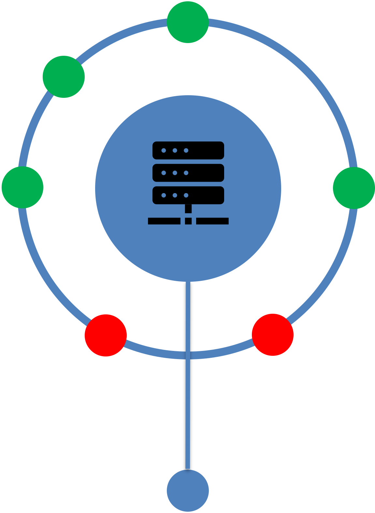

## Introduction

OpenPDS has been designed as a multi-purpose repository, hereafter referred to as the **Data Store**, delivering three strategic data-related services:

- **Data Acquisition**: the automatic discovery and retrieval of data from data providers.
- **Data Dissemination**: the automatic distribution of data products to remote sites.
- **Data Portal**: the pulling and pushing of data initiated by remote sites.

Data Acquisition and Data Dissemination are active services initiated by OpenPDS, whereas the Data Portal is a passive service triggered by incoming requests from remote sites. The Data Portal service provides interactive access to the Data Dissemination and Data Acquisition services.

- [Data Storage and Retrieval](#data-storage-and-retrieval)
- [Protocols and Connections](#protocols-and-connections)
- [Object Storage](#object-storage)
- [Additional Features](#additional-features)
- [Getting Started](#getting-started)
- [Support Materials](#support-materials)

OpenPDS enhances data services by integrating innovative technologies to streamline the acquisition, dissemination, and storage of data across diverse environments and protocols.

## Data Storage and Retrieval

Unlike a conventional data store, OpenPDS does not necessarily physically store the data in its persistent repository but rather works like a search engine, crawling and indexing metadata from data providers. However, OpenPDS can cache data in its Data Store to ensure availability without relying on instant access to data providers.

Data can be fed into the Data Store via:
- The **Data Acquisition** service, discovering and fetching data from data providers.
- Data providers actively pushing data through the **Data Portal**.
- Data providers using the **OpenPDS API** to register metadata, allowing asynchronous data retrieval.

Data products can be searched by name or metadata and either pushed by the Data Dissemination service or pulled from the Data Portal by users. OpenPDS streams data on the fly or sends it from the Data Store if it was previously fetched.

## Protocols and Connections

OpenPDS interacts with a variety of environments and supports multiple standard protocols:

- **Outgoing connections** (Data Acquisition & Dissemination): FTP, SFTP, FTPS, HTTP/S, AmazonS3, Azure and Google Cloud Storage.
- **Incoming connections** (Data Portal): FTP, HTTPS (SFTP and SCP soon available).

Protocol configurations vary based on authentication and connection methods (e.g., password vs. key-based authentication, parallel vs. serial connections).

The OpenPDS software is modular, supporting new protocols through extensions.

## Object Storage

OpenPDS stores data as objects, combining data, metadata, and a globally unique identifier. It employs a file-system-based solution with replication across multiple locations to ensure continuous data availability. For example, data can be replicated across local storage systems and cloud platforms to bring data closer to users and enhance performance.

The object storage system in OpenPDS is hierarchy-free but can emulate directory structures when necessary, based on metadata provided by data providers. OpenPDS presents different views of the same data, depending on user preferences.

## Additional Features

- **Notification System**: Provides an embedded MQTT broker to publish notifications and an MQTT client to subscribe to data providers.
- **Data Compression**: Supports various algorithms (lzma, zip, gzip, bzip2, lbzip2, lz4, snappy) to reduce dissemination time and enable faster access to data.
- **Data Checksumming**: Provides MD5 for data integrity checks on the remote sites, and ADLER32 for data integrity checks in the data store.
- **Garbage Collection**: Automatically removes expired data, with no limit on expiry dates.
- **Data Backup**: Can be configured to map data sets in OpenPDS to existing archiving systems.

## Getting Started

### Building and Running OpenPDS

OpenPDS requires Docker to be installed and fully functional, with the default Docker socket enabled (Settings -> Advanced -> "Allow the default Docker socket to be used"). The build and run process has been tested on Linux and macOS (Intel/Apple Silicon) using Docker Desktop v4.34.2. It has also been reported to work on Windows with the WSL 2 backend and the host networking option enabled.

A [Makefile](Makefile) located at the root of the directory can be used to create the development container that installs all the necessary tools for building the application. The Java classes are compiled, packaged into RPM files, and used to build Docker images for each OpenPDS component.

#### Creating and Logging into the Development Container

To build the development container:

```bash
make dev
```

If successful, you should be logged into the development container.

#### Building and Configuring OpenPDS

From there, you can run the following command to compile the Java classes, package the RPM files, and build the OpenPDS Docker images:

```bash
make build
```

Once the build process is complete, navigate to the following directory where another [Makefile](run/bin/ecpds/Makefile) is available:

```
cd run/bin/ecpds
```

The services are started using Docker Compose. The `docker-compose.yml` file contains all the necessary configurations to launch and manage the different components of OpenPDS. You can find this file in the appropriate directory for your OS ([Darwin-ecpds](run/bin/ecpds/Darwin-ecpds/docker-compose.yml) for macOS or [Linux-ecpds](run/bin/ecpds/Linux-ecpds/docker-compose.yml) for Linux).

To verify the configuration and understand how Docker Compose interprets the settings before running the services, use the following command:

```
make config
```

For advanced configurations, you can fine-tune the options by modifying the default values in the Compose file. Each parameter is documented within the file itself to provide a better understanding of its function and how it impacts the system's behavior. By reviewing the Compose file, you can tailor the setup to your environment’s specific requirements.

#### Starting OpenPDS

To start the application:

```
make up
```

This will start the OpenPDS master, monitor, mover, and database services.

It might take a few seconds for all the services to start. Once they are up, you can access the following URLs (please update them if you changed the configuration in the compose files):

>**Warning:** Certificate validation should be disabled, as the test environment uses a self-signed certificate. Also, a database update is in progress to add sample configurations with notification triggers.

##### Monitoring interface

**[https://127.0.0.1:3443](https://127.0.0.1:3443)**  
*(Log in using `admin/admin2021`)*

##### Data Portal

**[https://127.0.0.1:4443](https://127.0.0.1:4443)**  
*(Log in using `test/test2021`)*

##### MQTT Broker

**[mqtt://127.0.0.1:4883](mqtt://127.0.0.1:4883)**  
*(Log in using `test/test2021`)*

#### Checking the Containers and Logs

To verify that the containers are running, use:

```
make ps
```

To view the standard output (stdout) and standard error (stderr) streams generated by the containers, use:

```
make logs
```

To view the logs generated by OpenPDS, you can browse the following directories mounted to the containers:

```
run/var/log/ecpds/master
run/var/log/ecpds/monitor
run/var/log/ecpds/mover
```

#### Additional Makefile Options

To log in to the database:

```
make mysql
```

To log in to the master container (use the same for monitor, mover, and database):

```
make connect container=master
```

#### Stopping OpenPDS

To stop the application, run:

```
make down
```

To clean the logs and data:

```
make clean
```

## Support Materials

You can access the Javadoc API documentation for OpenPDS at the following link: [Javadocs](https://laurentgougeon.github.io/maven-ecpds/index.html) *(will be available when published to gh-pages)*. This comprehensive documentation provides detailed information about the classes, methods, and functionalities available, serving as a valuable resource for developers.

Additionally, you can find the OpenPDS options for various editors at this link: [OpenPDS Options](API.md). This documentation outlines the configurable options available in the OpenPDS editors, helping users to customize their experience and optimize their workflow effectively.