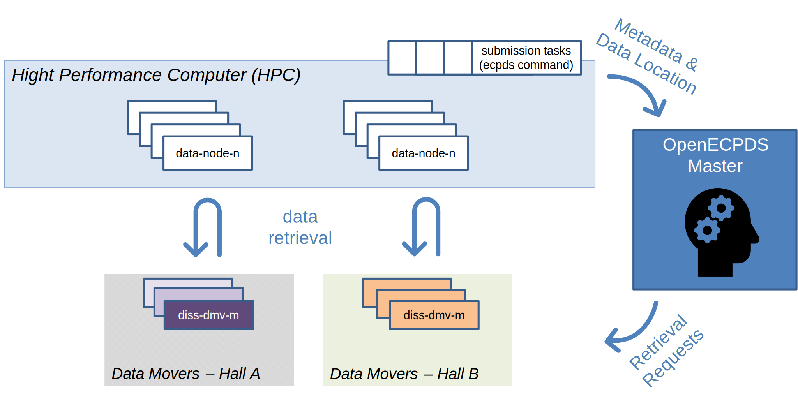
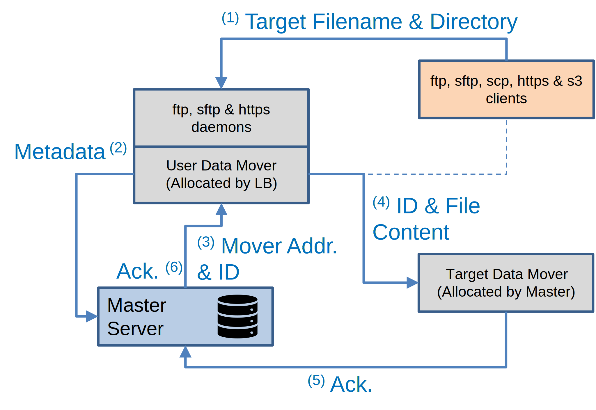
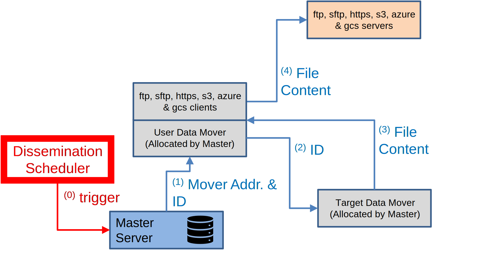

## Introduction

OpenECPDS has been designed as a multi-purpose repository, hereafter referred to as the **Data Store**, delivering three strategic data-related services:

- **Data Acquisition**: the automatic discovery and retrieval of data from data providers.
- **Data Dissemination**: the automatic distribution of data products to remote sites.
- **Data Portal**: the pulling and pushing of data initiated by remote sites.

Data Acquisition and Data Dissemination are active services initiated by OpenECPDS, whereas the Data Portal is a passive service triggered by incoming requests from remote sites. The Data Portal service provides interactive access to the Data Dissemination and Data Acquisition services.

- [Introduction to OpenECPDS](#introduction)
  - [Driving Forces](#driving-forces)
  - [Data Storage and Retrieval](#data-storage-and-retrieval)
  - [Protocols and Connections](#protocols-and-connections)
  - [Object Storage](#object-storage)
  - [Additional Features](#additional-features)
- [Getting Started](#getting-started)
  - [System Requirements and Setup](#system-requirements-and-setup)
  - [Creating and Logging into the Development Container](#creating-and-logging-into-the-development-container)
  - [Building and Configuring OpenECPDS](#building-and-configuring-openecpds)
  - [Starting OpenECPDS](#starting-openecpds)
  - [Checking the Containers and Logs](#checking-the-containers-and-logs)
  - [Additional Makefile Options](#additional-makefile-options)
  - [Stopping OpenECPDS](#stopping-openecpds)
- [IDE Setup for OpenECPDS Development](#ide-setup-for-openecpds-development)
  - [Visual Studio Code](#visual-studio-code)
  - [Eclipse](#eclipse)
- [Deployment](#deployment)
  - [Deploying OpenECPDS on Kubernetes](#deploying-openecpds-on-kubernetes)
  - [Illustrative Physical Infrastructure](#illustrative-physical-infrastructure)
- [Concepts for Users](#concepts-for-users)
  - [OpenECPDS Entities](#openecpds-entities)
  - [Failover Mechanism in Host Selection](#failover-mechanism-in-host-selection)
- [Workflow for various Use Cases](#workflow-for-various-use-cases)
  - [ECPDS command-line Tool](#ecpds-command-line-tool)
  - [Data Portal](#data-portal)
  - [Dissemination](#dissemination)
  - [Acquisition](#acquisition)
- [Notification System (MQTT)](#notification-system-mqtt)
  - [Functional Overview of the Notification System](#functional-overview-of-the-notification-system)
  - [Typical Interaction in the OpenECPDS Notification System](#typical-interaction-in-the-openecpds-notification-system)
  - [Retained Messages and Late Client Connections](#retained-messages-and-late-client-connections)
  - [Configuration and Access Control](#configuration-and-access-control)
  - [MQTT Broker in OpenECPDS](#mqtt-broker-in-openecpds)
- [Support Materials](#support-materials)
- [Notes](#notes)

OpenECPDS enhances data services by integrating innovative technologies to streamline the acquisition, dissemination, and storage of data across diverse environments and protocols.

### Driving Forces

To ensure ECMWF's forecasts reach Member and Co-operating States promptly, efficient data collection and dissemination are crucial. To address this, ECMWF has developed the ECMWF Product Data Store (ECPDS) in-house, which has been operational for many years. This mature solution has greatly enhanced the efficiency and productivity of data services, providing a portable and adaptable tool for various environments.

The picture below shows the essential role of ECPDS in the ECMWF Numerical Weather Prediction (NWP) system.


Recently, ECPDS has been rolled out to some Member States and is now in use within the United Weather Centers (UWC) West consortium. Building on the success of these deployments and following requests from our Member States, OpenECPDS was launched to encourage collaboration with other organizations, strengthen integration efforts, and enhance data service capabilities through community contributions.

OpenECPDS is using container technologies, simplifying application building and operation across different environments. This allows for easy testing on laptops with limited resources or scaling up for large deployments involving hundreds of systems and petabytes of data.

The software is designed for ease of building, using a development container that includes all necessary tools for compiling source code, building RPM files, creating container images, and deploying the application. Comprehensive documentation is available in the [Getting Started](#getting-started) section, guiding users through setup and execution, ensuring a smooth experience even for those new to container technologies.
 
The launch of OpenECPDS signifies a commitment to ongoing maintenance and updates, focusing on long-term sustainability and continuous improvement to meet evolving user needs.

### Data Storage and Retrieval

Unlike a conventional data store, OpenECPDS does not necessarily physically store the data in its persistent repository but rather works like a search engine, crawling and indexing metadata from data providers. However, OpenECPDS can cache data in its Data Store to ensure availability without relying on instant access to data providers.

Data can be fed into the Data Store via:
- The **Data Acquisition** service, discovering and fetching data from data providers.
- Data providers actively pushing data through the **Data Portal**.
- Data providers using the **OpenECPDS API** to register metadata, allowing asynchronous data retrieval.

Data products can be searched by name or metadata and either pushed by the Data Dissemination service or pulled from the Data Portal by users. OpenECPDS streams data on the fly or sends it from the Data Store if it was previously fetched.

### Protocols and Connections

OpenECPDS interacts with a variety of environments and supports multiple standard protocols:

- **Outgoing connections** (Data Acquisition & Dissemination): FTP, SFTP, FTPS, HTTP/S, AmazonS3, Azure and Google Cloud Storage.
- **Incoming connections** (Data Portal): FTP, HTTPS, S3 (SFTP and SCP soon available).

Protocol configurations vary based on authentication and connection methods (e.g., password vs. key-based authentication, parallel vs. serial connections).

The OpenECPDS software is modular, supporting new protocols through extensions.

### Object Storage

OpenECPDS stores data as objects, combining data, metadata, and a globally unique identifier. It employs a file-system-based solution with replication across multiple locations to ensure continuous data availability. For example, data can be replicated across local storage systems and cloud platforms to bring data closer to users and enhance performance.

The object storage system in OpenECPDS is hierarchy-free but can emulate directory structures when necessary, based on metadata provided by data providers. OpenECPDS presents different views of the same data, depending on user preferences.

### Additional Features

- **Notification System**: Provides an embedded MQTT broker to publish notifications and an MQTT client to subscribe to data providers.
- **Data Compression**: Supports various algorithms (lzma, zip, gzip, bzip2, lbzip2, lz4, snappy) to reduce dissemination time and enable faster access to data.
- **Data Checksumming**: Provides MD5 for data integrity checks on the remote sites, and ADLER32 for data integrity checks in the data store.
- **Garbage Collection**: Automatically removes expired data, with no limit on expiry dates.
- **Data Backup**: Can be configured to map data sets in OpenECPDS to existing archiving systems.

## Getting Started

### System Requirements and Setup

OpenECPDS requires Docker to be installed and fully functional, with the default Docker socket enabled (Settings -> Advanced -> "Allow the default Docker socket to be used"). The build and run process has been tested on Linux and macOS (Intel/Apple Silicon) using Docker Desktop v4.34.2. It has also been reported to work on Windows with the WSL 2 backend and the host networking option enabled.

To test the deployment of OpenECPDS containers to a Kubernetes cluster, Kubernetes must be enabled in Docker (Settings -> Kubernetes -> "Enable Kubernetes").

>**Warning:** If Kubernetes is properly installed, your `$HOME/.kube/config` file should point to `https://kubernetes.docker.internal:6443`. If not, you can manually update the file.

The default setup needs a minimum of 3GB of available RAM. The disk space required depends on the size of the data you expect to handle, but at least 15GB is essential for the development and application containers.

To download the latest distribution, run the following command:

```bash
curl -L -o master.zip https://github.com/ecmwf/open-ecpds/archive/refs/heads/master.zip && unzip master.zip
```

A [Makefile](Makefile) located in the `open-ecpds-master` directory can be used to create the development container that installs all the necessary tools for building the application. The Java classes are compiled, packaged into RPM files, and used to build Docker images for each OpenECPDS component.

### Creating and Logging into the Development Container

To build the development container:

```bash
make dev
```

If successful, you should be logged into the development container.

### Building and Configuring OpenECPDS

Once inside the development container, you can run the following command to compile the Java classes, package the RPM files, and build the OpenECPDS Docker images:

```bash
make build
```
>**Warning:** In a production environment, ENV should be avoided in Dockerfiles for sensitive data like MYSQL_ROOT_PASSWORD for the [Database](docker/ecpds/database/Dockerfile) or KEYSTORE_PASSWORD for the [Monitor](docker/ecpds/monitor/Dockerfile) and [Mover](docker/ecpds/mover/Dockerfile). Docker secrets or environment variable files should be used instead.

Once the build process is complete, navigate to the following directory where another [Makefile](run/bin/ecpds/Makefile) is available:

```
cd run/bin/ecpds
```

The services are started using Docker Compose. The `docker-compose.yml` file contains all the necessary configurations to launch and manage the different components of OpenECPDS. You can find this file in the appropriate directory for your OS ([Darwin-ecpds](run/bin/ecpds/Darwin-ecpds/docker-compose.yml) for macOS or [Linux-ecpds](run/bin/ecpds/Linux-ecpds/docker-compose.yml) for Linux and Windows).

To verify the configuration and understand how Docker Compose interprets the settings before running the services, use the following command:

```
make config
```

For advanced configurations, you can fine-tune the options by modifying the default values in the Compose file. Each parameter is documented within the file itself to provide a better understanding of its function and how it impacts the system's behavior. By reviewing the Compose file, you can tailor the setup to your environment’s specific requirements.

### Starting OpenECPDS

To start the application:

```
make up
```

This will start the OpenECPDS master, monitor, mover, and database services.

It might take a few seconds for all the services to start. Once they are up, you can access the following URLs (please update them if you changed the configuration in the compose files):

>**Warning:** Certificate validation should be disabled when relevant, as the test environment uses a self-signed certificate.

| Interface             | URL                                              | Login Details         |
|-----------------------|--------------------------------------------------|-----------------------|
| Monitoring            | [https://127.0.0.1:3443](https://127.0.0.1:3443) | admin/admin2021       |
| Data Portal           | [https://127.0.0.1:4443](https://127.0.0.1:4443) | test/test2021         |
|                       | [ftp://127.0.0.1:4021](ftp://127.0.0.1:4021)     | test/test2021         |
| MQTT Broker           | [mqtt://127.0.0.1:4883](mqtt://127.0.0.1:4883)   | test/test2021         |
| Virtual FTP Server    | [ftp://127.0.0.1:2021](ftp://127.0.0.1:2021)     | admin/admin2021       |
| JMX Interfaces        | [http://127.0.0.1:2062](http://127.0.0.1:2062)   | master/admin          |
|                       | [http://127.0.0.1:3062](http://127.0.0.1:3062)   | monitor/admin         |
|                       | [http://127.0.0.1:4062](http://127.0.0.1:4062)   | mover/admin           |

### Checking the Containers and Logs

To verify that the containers are running, use:

```
make ps
```

To view the standard output (stdout) and standard error (stderr) streams generated by the containers, use:

```
make logs
```

To view the logs generated by OpenECPDS, you can browse the following directories mounted to the containers:

```
run/var/log/ecpds/master
run/var/log/ecpds/monitor
run/var/log/ecpds/mover
```

### Additional Makefile Options

To log in to the database:

```
make mariadb
```

To log in to the master container (use the same for monitor, mover, and database):

```
make connect container=master
```

### Stopping OpenECPDS

To stop the application, run:

```
make down
```

To clean the logs and data:

```
make clean
```

## IDE Setup for OpenECPDS Development

OpenECPDS includes configuration files for both **Visual Studio Code** and **Eclipse**, so you can choose the development environment you are most comfortable with. Simply select your preferred IDE, and you will find ready-to-use settings tailored to streamline your work with OpenECPDS.

Before following the guidelines to start OpenECPDS in your IDE, ensure that an instance of the OpenECPDS database is running. This can be done either within or outside the development container. To set it up, run:

```
make start-db
```

This command will start only the database service, while the Master, Monitor, and Mover services can be launched directly from the IDE.

### Visual Studio Code

When working with OpenECPDS in Visual Studio Code, the **Dev Containers extension** is required and will automatically detect the presence of a `.devcontainer` directory within the project folder. This directory contains key configuration files, such as [devcontainer.json](.devcontainer/devcontainer.json) and a [Dockerfile](.devcontainer/Dockerfile), which collectively define the development environment for OpenECPDS.

Before opening the project, make sure to edit `.devcontainer/devcontainer.json` to update the DOCKER_HOST_OS environment parameter according to your Docker host operating system (the default is set to Darwin for macOS).

Once you open the OpenECPDS folder, VS Code will prompt you to reopen the project within a container: **Reopen in Container**. If this option is selected, VS Code uses the `.devcontainer/Dockerfile` to build the container image, adding necessary tools and dependencies specified for OpenECPDS. The `.devcontainer/devcontainer.json` file configures additional settings, such as environment variables and workspace mounting, ensuring the container is fully tailored to the project. This setup provides a consistent and fully-equipped development environment from the start.

For more information on working with development containers in Visual Studio Code, please visit the [Visual Studio Code website](https://code.visualstudio.com/docs/devcontainers/containers).

To access the Debug and Run configurations:

- Open the **Command Palette** by pressing Ctrl+Shift+P (Windows/Linux) or Cmd+Shift+P (Mac).
- Type **Run and Debug** in the **Command Palette** to find the **Run and Debug** view.
- Select **Run and Debug** in the sidebar or access it through the **Debug icon** in the Activity Bar on the left side of VS Code.

This view displays the available **Run and Debug** configurations: **OpenECPDS Master Server**, **OpenECPDS Mover Server**, **OpenECPDS Monitor Server**, or **OpenECPDS Stack** to start them all at once.

To build the OpenECPDS Docker images, open a terminal in the development container by selecting **Terminal > New Terminal** from the top menu, and follow the instructions provided in the [Building and Configuring OpenECPDS](#building-and-configuring-openecpds) section.

### Eclipse

To open the OpenECPDS project in Eclipse:

- Go to **File > Import...**
- In the import dialog, select **Existing Maven Projects** under the **Maven category** and click **Next**.
- Browse to the location of your OpenECPDS project folder on your system and select it. Eclipse will automatically detect the project files.
- Once the project is detected, click **Finish** to complete the import.

To build the application from the source, follow these steps:

- Select the [pom.xml](pom.xml) file in the **Project Explorer** view.
- In the contextual menu, choose **Run As > OpenECPDS Clean Compile**

The application can now be started within Eclipse using the preconfigured Debug and Run options available: **OpenECPDS Master Server**, **OpenECPDS Mover Server**, and **OpenECPDS Monitor Server**. These configurations are accessible under **Run > Run Configurations...** and **Run > Debug Configurations...**

After completing these steps, the OpenECPDS project should be ready to work with in Eclipse, with access to any required dependencies and configurations.

Eclipse does not natively support development containers, and this is not required for simply running and debugging OpenECPDS within Eclipse. To build the OpenECPDS Docker images, the development container can be manually created as outlined in the [Getting Started](#getting-started) section.

## Deployment

### Deploying OpenECPDS on Kubernetes

If you have successfully built the OpenECPDS containers and enabled Kubernetes in Docker, navigate to the following directory where a [Makefile](deploy/kubernetes/Makefile) is available:

```
cd deploy/kubernetes
```

To convert the [docker-compose.yml](deploy/kubernetes/docker-compose.yml) file into Kubernetes YAML files in the  `k8s-configs` directory and start the pods, run:

```
make build
```

If successful, use the following command to get the port mappings needed to connect from outside the cluster:

```
make ports
```

If the default port for the monitoring interface has not been updated in the `docker-compose.yml` file, you can find the external port by checking the redirection for port 3443, for example:

3443 -> 32034/TCP

You can then use your browser to access the monitoring interface at:

https://127.0.0.1:32034

To get the YAML files for all pods, PVs, and PVCs (you can redirect the output to capture the full configuration), run:

```
make yaml
```

To delete all Kubernetes resources and stop the pods:

```
make delete
```

### Illustrative Physical Infrastructure

This section provides a high-level overview of the physical infrastructure supporting OpenECPDS at ECMWF. The deployment consists of three distinct services: Acquisition (ACQ), Dissemination (DISS), and Auxiliary (AUX). While this serves as an example of a possible physical infrastructure, the actual setup may vary depending on the specific requirements of each site.


Each service is dedicated to a specific function but retains the same core capabilities. This separation primarily helps distribute workloads based on peak usage periods. For instance, the Acquisition service operates continuously, while the Dissemination and Auxiliary services experience peak activity three times a day, particularly during forecast deliveries.

The current infrastructure comprises 80 bare-metal systems with a total storage capacity of 2 petabytes. Storage capacity is regularly reassessed, especially when new processing cycles are introduced.

## Concepts for Users

### OpenECPDS Entities

Understanding some key OpenECPDS concepts will help users to benefit fully from the tool’s capabilities:

- **data files**
- **data transfers**
- **destinations** and **aliases**
- **dissemination** and **acquisition hosts**

A user connecting to the OpenECPDS web interface will come across each of these entities, which are related to each other through the different services.

A **data file** is a record of a product stored in the OpenECPDS Data Store with a one-to-one mapping between the data file and the product. The data file contains information on the physical specifications of the product, such as its size, type, compression and entity tag (ETag) in the Data Store, as well as the metadata associated with it by the data provider (e.g. meteorological parameters, name or comments concerning the product).

A **data transfer** is linked to a unique data file and represents a transfer request for its content, together with any related information (e.g. schedule, priority, progress, status, rate, errors, history). A single data file can be linked to several data transfers as many remote sites might be interested in obtaining the same products from the Data Store.

A **destination** should be understood as a place where data transfers are queued and processed in order to deliver data to a unique remote place, hence the name ‘destination’. It specifies the information the Data Dissemination service needs to disseminate the content of a data file to a particular remote site.


A breadcrumb trail at the top shows where a user currently is in the tool. In this case, a user has created a destination called EC1. Users with the right credentials can see the status of this destination and can review the progress of data transmission. They can manage the destination by, for example, requesting data transfers, changing priorities and stopping or starting data transmissions.

Each destination implements a transfer scheduler with its own configuration parameters, which can be fine-tuned to meet the remote site’s needs. These settings make it possible to control various things, such as how to organise the data transmission by using data transfer priorities and parallel transmissions, or how to deal with transmission errors with a fully customisable retry mechanism.

In addition, a destination can be associated with a list of **dissemination hosts**, with a primary host indicating the main target system where to deliver the data, and a list of fall-back hosts to switch to if for some reason the primary host is unavailable.

A dissemination host is used to connect and transmit the content of a data file to a target system. It enables users to configure various aspects of the data transmission, including which network and transfer protocol to use, in which target directory to place the data, which passwords, keys or certificates to use to connect to the remote system, and more.

If the data transfers within a destination are retrieved by remote users through the Data Portal service, then there will be no dissemination hosts attached to the destination. In this particular case, the destination can be seen as a ‘bucket’ (in Amazon S3 terms) or a ‘blob container’ (in Microsoft Azure terms). The transfer scheduler will be deactivated, and the data transfers will stay idle in the queue, waiting to be picked up through the Data Portal.

A destination can also be associated with a list of **acquisition hosts**, indicating the source systems where to discover and retrieve files from remote sites. Like their dissemination counterparts, the acquisition hosts contain all the information required to connect to the remote site, including which network, transfer protocol, source directory and credentials to use for the connection. In addition, the acquisition host also contains the information required to select the files at the source. Complex rules can be defined for each source directory, type, name, timestamp and protocol, to name just a few options.

A destination can be a dissemination destination, an acquisition destination or both. It will be a dissemination destination as long as at least one dissemination host is defined, and it will be an acquisition destination as long as at least one acquisition host is defined. When both are defined, then the destination can be used to automatically discover and retrieve data from one place and transmit it to another, with or without storing the data in the Data Store, depending on the destination configuration. This is a popular way of using OpenECPDS. For example, this mechanism is used for the delivery of some regional near-real-time ensemble air quality forecasts produced at ECMWF for the EU-funded Copernicus Atmospheric Monitoring Service implemented by the Centre.

There is also the concept of destination **aliases**, which makes it possible to link two or more destinations together, so that whatever data transfer is queued to one destination is also queued to the others. This mechanism enables processing the same set of data transfers to different sites with different schedules and/or transfer mechanisms defined on a destination basis. Conditional aliasing is also possible in order to alias only a subset of data transfers.

### Failover Mechanism in Host Selection

The diagram below illustrates how the system manages failures by dynamically switching between available hosts. OpenECPDS sequentially attempts to connect to each host in the list, moving to the next one if a failure occurs.


The behavior of the failover mechanism depends on the configuration of the transfer scheduler:

- It can either continue using the first successfully connected host or revert to the primary host once it becomes available.
- The switch can occur immediately after a successful transfer or after a predefined time interval.

## Workflow for various Use Cases

### ECPDS command-line Tool

The `ecpds` command-line is designed to submit local data files to a specified destination on OpenECPDS. It provides several options to fine-tune transfer requests, monitor transfer statuses, and manage scheduled transfers. In this section, we will examine the workflow for submitting a local file in both synchronous and asynchronous modes.

#### Synchronous Push

This is the default mode for submitting data files to OpenECPDS. It allows both file transfer and metadata registration in a single execution of the `ecpds` command-line. Once OpenECPDS has successfully processed the file, it returns a DataFileID, which can be used to track the file via the OpenECPDS monitoring interface. The returned DataFileID guarantees that the file has been correctly registered and stored in the Data Store.


1) The `ecpds` command connects to the Master Server, authenticates, and sends metadata (e.g., source hostname, user ID, filename, location, size) to the Master Server.
2) The Master Server allocates a **DataFileID** for the file and assigns a Data Mover to receive its content. It then returns the hostname and port of the selected Data Mover, along with the **DataFileID**, to the `ecpds` command.
3) The `ecpds` command connects to the Data Mover using the provided hostname and port and transfers the file content.
4) The Data Mover sends an acknowledgment of file reception to the Master Server.
5) The Master Server sends the acknowledgment to the `ecpds` command, including the **DataFileID**.

#### Asynchronous Push

The asynchronous mode is recommended when handling a large number of data files or high data volumes. In the first phase, metadata, including the file location and the source host for retrieval, is registered in OpenECPDS. In the second phase, OpenECPDS initiates the file downloads from the Data Movers. Typically, multiple files are registered at once, organised into groups, and retrieved in parallel streams managed by OpenECPDS. This approach enhances performance by using a load-balancing mechanism to distribute the workload across Data Movers and source hosts.


The workflow for submitting the request is as follows (in blue):

1) The `ecpds` command connects to the Master Server, authenticates, and sends metadata (e.g., source hostname, user ID, filename, location, size) to the Master Server.
2) The Master Server allocates a **DataFileID** for the file and assigns a Data Mover to receive its content. It then sends an acknowledgment to the `ecpds` command, including the **DataFileID**.

The workflow for retrieving the file content is triggered by the Transfer Scheduler and is as follows (in red):

3) The Master contact the allocated Data Mover and request for the data file to be retrieved.
4) Using the provided metadata, the Data Mover connects to the source host with the user ID and retrieves the content of the file based on its filename and location.
4) After the retrieval is successfully completed, the Data Mover sends an acknowledgment to the Master Server.

After submitting the request with the `ecpds` command, the status can be checked using the `ecpds` command and the **DataFileID** to track the data file retrieval. Tracking can also be done through the OpenECPDS monitoring interface.

The diagram below provides a complete overview of the retrieval mechanism used in OpenECPDS at ECMWF.



The forecast is produced and stored on the supercomputer (HPC) across multiple data nodes. Some submission tasks register these files with the OpenECPDS Master. The Master then records the requests, and the transfer scheduler asynchronously load-balances the data file retrievals across multiple data movers in each hall. This enables high parallelism between the HPC data nodes and the OpenECPDS data movers, maximizing the use of the local network. The maximum number of simultaneous data retrievals is configurable in OpenECPDS.

Data submission requests to OpenECPDS are grouped under a specific name. At the end of a batch submission, an `ecpds` command is executed to track the retrieval of all files in the group. Once all files have been successfully retrieved, the `ecpds` command returns.

### Data Portal

The `ftp`, `sftp`, `scp`, and `wget/curl` command-line tools can be used to transfer data to and from OpenECPDS. These standard tools facilitate connections and file transfers via the OpenECPDS data portal. In this section, we examine the workflow for uploading and downloading files using these methods.

#### Synchronous Push



In this workflow:

 - The **User Data Mover** is the server where the customer connects using FTP, SFTP, SCP, or wget/curl to upload a file.
 - The **Target Data Mover** is the server where the file will be stored.

In a multi-mover setup:

 - The **User Data Mover** is selected by a Load Balancer, which distributes requests across available Data Movers.
 - The **Target Data Mover** is allocated by the Master Server, considering available storage and system load.

Thus, the **User Data Mover** and **Target Data Mover** may not be the same.

Workflow Steps:

1) The client connects to the **User Data Mover** via FTP, SFTP, SCP, or HTTPS and uploads a file.
2) The **User Data Mover** extracts the target path, filename, and metadata (e.g., user ID) and sends a request to the Master Server.
3) The Master Server determines the target destination based on the filename and user configuration. It then assigns a DataFileID and selects a **Target Data Mover**.
4) The **User Data Mover** connects to the **Target Data Mover** and streams the file directly from the client.
5) Once the transfer is complete, the **Target Data Mover** sends an acknowledgment to the Master Server.
6) The Master Server notifies the **User Data Mover**, which then closes the connection with the client.

#### Synchronous Pull


### Dissemination



### Acquisition

#### Discovery


#### Pull


## Notification System (MQTT)

### Functional Overview of the Notification System


This functional view of the Notification System illustrates the key components involved in product notifications. The **Product Data Store** is depicted in dark blue at the top right, while the **Dissemination and Acquisition Systems** appear in sky blue at the top left. The **MQTT and Message Brokers** are shown at the bottom left and right, outlined in red.

Below the Data Store, **OpenECPDS Destinations** serve to organize and manage products for each customer. These Destinations include various configuration parameters, including an MQTT topic used for message identification and routing to the appropriate MQTT subscribers.

A **notification** is triggered each time a product is added to the Data Store via the Acquisition System. The product may either be made available through the Portal or pushed to a remote site by the Dissemination System. In both cases, the user receiving the notification will extract the product’s location from the message. If the product is on the Portal, the user must retrieve it before processing. If it has been pushed to a remote site, it is immediately available for processing.

The number of notifications triggered when a new product is added depends on the **Destination's configuration**:

- **No notification** is sent if the Destination is not configured to report updates.
- **One or two notifications** are sent if the Destination is configured to notify one or both Brokers.

If the **MQTT Broker** is notified, it checks whether any MQTT clients have subscribed to the Destination's topic. If a matching subscription exists, the client receives the notification along with the associated payload.

For the **Message Broker**, the process is simpler: upon receiving a notification, it directly forwards it to the configured clients.

### Typical Interaction in the OpenECPDS Notification System

The MQTT-based notification system follows a structured interaction between three key components: the **MQTT Client**, the **MQTT Broker**, and the **OpenECPDS Data Store**.


- **Connection Establishment**: The process begins with the Client initiating a connection to the Broker by sending a **CONNECT** message. The Broker acknowledges the connection by responding with a **CONNACK** message.

- **Subscription to a Topic**: Once connected, the Client registers its interest in a specific topic by sending a **SUBSCRIBE** message to the Broker. The Broker then listens for relevant **PUBLISH** messages from the Data Store that match the subscribed topic.

- **Message Delivery and Product Retrieval**: When the Data Store generates a **PUBLISH** message for a subscribed topic, the Broker forwards it to all Clients that have subscribed to that topic. The Client then extracts the file location from the message and proceeds to fetch the product using one of the available protocols on the OpenECPDS Portal: **HTTPS, S3, SFTP, or FTP**.

### Retained Messages and Late Client Connections

In this example, the **retain flag** is enabled in the MQTT message. This ensures that even if the Data Store sends a **PUBLISH** message before the Client is connected, the message remains available for delivery. As a result, when the Client connects later, it still receives the retained message, ensuring no critical notifications are missed.

### Configuration and Access Control

The MQTT configuration can be fine-tuned at the **Destination level**, allowing for greater flexibility in how notifications are handled. Additionally, **access control** mechanisms can be configured at the **data user** level, ensuring secure and controlled distribution of messages.

### MQTT Broker in OpenECPDS

A few key points about the MQTT Broker and Client:

- **Industry Standard Compliance**: MQTT is the de facto standard for IoT communication. Our Broker and Client are fully compliant with all three MQTT specifications, ensuring that OpenECPDS is compatible with all MQTT brokers and clients available on the market.
- **Integration with OpenECPDS**: The Broker and Client are embedded within OpenECPDS and are based on the [Community Edition of the HiveMQ Broker](https://github.com/hivemq/hivemq-community-edition) and the [Eclipse Paho Client](https://github.com/eclipse-paho/paho.mqtt.java).

## Support Materials

You can access the Javadoc API documentation for OpenECPDS at the following link: [Javadocs](https://ecmwf.github.io/open-ecpds/apidocs/). This comprehensive documentation provides detailed information about the classes, methods, and functionalities available, serving as a valuable resource for developers.

Additionally, you can find the OpenECPDS options for various editors at this link: [OpenECPDS Options](Options.md). This documentation outlines the configurable options available in the OpenECPDS editors, helping users to customize their experience and optimize their workflow effectively.

## Notes


This project automates the downloading of specific tools (GraalVM, Maven, Docker, Kompose, Kubectl). Additionally, it uses external APIs that are downloaded via Maven. For licenses and details on these dependencies, please refer to their respective documentation. You can retrieve the licenses from the development container using:

```bash
make get-licenses
```

If successful, the licenses will be available in the `target/generated-resources` directory. These licenses are also included in the root directory of the container images, along with the `AUTHORS`, `LICENSE.txt`, `NOTICE` and `VERSION` files.