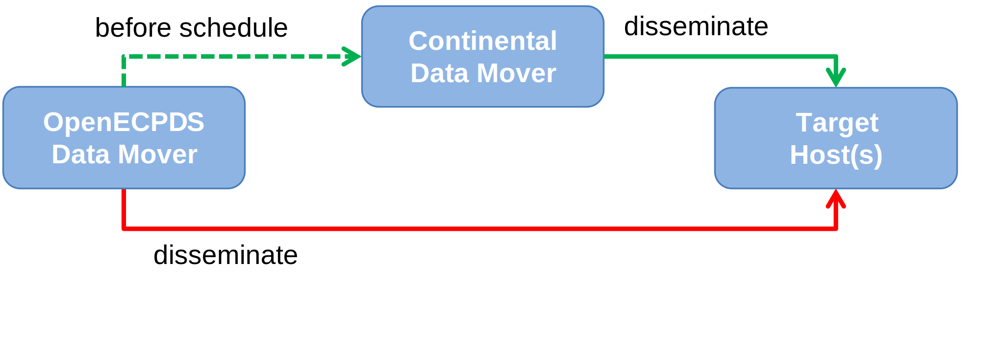
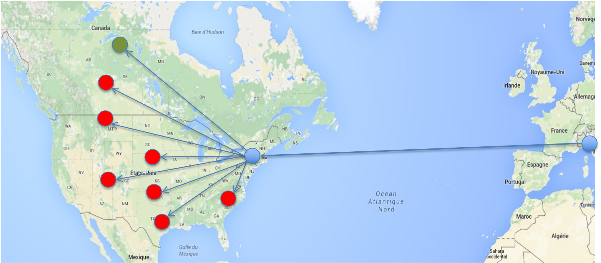

# Continental Data Movers

Efficient data dissemination is crucial for ensuring timely access to critical
information, especially when dealing with large datasets and geographically distributed
users. A **Continental Data Mover** helps optimise data transfers by reducing network
latency, balancing server load, and improving overall reliability. To maximise its
benefits, several key strategies are implemented, including strategic deployment, network
optimisation and pre-replication of data.

## Main factors affecting data transfer speeds

Several key factors influence the speed at which data is transferred:

- **Data File Size & Network Capability** — The larger the file and the more limited the
  network bandwidth, the longer the transfer duration.
- **Geographic Proximity** — The physical distance between the source and destination
  impacts transfer latency. The farther the data must travel, the greater the potential
  delay.
- **Early Data Availability** — In most cases, data products become available before
  their scheduled dissemination time, allowing for potential optimisations in the
  transfer process.

## Key functionalities of a Continental Data Mover

Continental Data Movers play a crucial role in the OpenECPDS dissemination system by
ensuring reliable and efficient data transfers across multiple locations. Their main
functionalities include:

- **Seamless Dissemination Across Supported Protocols** — Continental Data Movers
  support all transfer protocols used within OpenECPDS, ensuring compatibility across
  different network environments and client systems.
- **Efficient Connection Management** — Control connections to the OpenECPDS Master
  Server are load-balanced through OpenECPDS Movers, optimising accessibility and
  reliability. Communication occurs via secure HTTPS requests using a REST/JSON
  interface, ensuring robust and scalable data handling.

## Steps to optimise data transfers

To ensure efficient and timely data dissemination, a Continental Data Mover is set up
and optimised through the following key steps:

1. **Deploying a Continental Data Mover Near the Target Sites** — A Continental Data
   Mover is installed geographically closer to the intended recipients (e.g., in the US
   for North American users) to reduce latency and improve transfer speeds by minimising
   long-distance network hops. The chosen location must have reliable infrastructure to
   support high-speed data transfers.

2. **Optimising Internet Connectivity to the Continental Data Mover** — High-bandwidth,
   low-latency network connections are used to link the OpenECPDS Master Server to the
   Continental Data Mover, ensuring fast and stable transfers. Redundant network paths
   are established to minimise the risk of disruptions. Where possible, direct peering
   agreements with major Internet providers or dedicated network links (e.g., RMDCN for
   institutional users) are used to enhance performance.

3. **Pre-Replicating Data Before Peak Times** — Data is replicated onto the Continental
   Data Mover before the official schedule time to avoid congestion and delays. This
   ensures availability ahead of peak demand, reducing competition for bandwidth during
   dissemination. Replication is ideally scheduled during off-peak hours to take
   advantage of lower network usage.

4. **Disseminating Data Directly from the Continental Mover** — Users receive data from
   the Continental Data Mover instead of the OpenECPDS Data Movers, reducing the load on
   the primary dissemination system and improving delivery speeds. The Continental Data
   Mover is configured to support all required OpenECPDS dissemination protocols (e.g.,
   FTP, SFTP, HTTPS, S3) to ensure seamless access.

## Data transfer flows

The data files are proactively replicated from one of the **OpenECPDS Data Movers** to
the **Continental Data Mover** ahead of the scheduled dissemination time. This
pre-replication ensures that the data is readily available, minimising delays when
dissemination begins.

{ width="450" }

Once the scheduled time arrives, the **OpenECPDS Master Server** instructs the
**Continental Data Mover** to initiate the transfer to the designated target host. This
is the primary dissemination workflow.

However, if the **Continental Data Mover** encounters an issue, such as a disconnection
or malfunction, a **fallback mechanism** is in place. In such cases, the dissemination
is automatically handled by one of the **OpenECPDS Data Movers**, ensuring continuity of
service.

{ width="450" }

## Setting up a Continental Data Mover

In OpenECPDS terminology, a **Continental Data Mover** is essentially a standard
**OpenECPDS Data Mover** with limited functionalities and an alternative communication
module designed to receive instructions from the **OpenECPDS Master Server**.

To set up a Continental Data Mover within OpenECPDS, it is necessary to define a **Proxy
Host** and associate it with a specific [Destination](../concepts/entities.md#destinations-and-aliases).
OpenECPDS will then use this Proxy Host to manage pre-replication tasks and facilitate
communication with the Continental Data Mover.

The CPY (Copy/Replication) event records replication between an internal Data Mover and a
Continental Data Mover with the `proxy` action — see
[CPY fields](../event-logging/cpy-fields.md). The
[Replication, Source, Backup & Proxy Directory](../host-directory/replication.md) page
describes the related host configuration.

## Related

- [Components](components.md) — Mover Server
- [Global Reach](../global-reach.md)
- [Replication, Source, Backup & Proxy Directory](../host-directory/replication.md)
