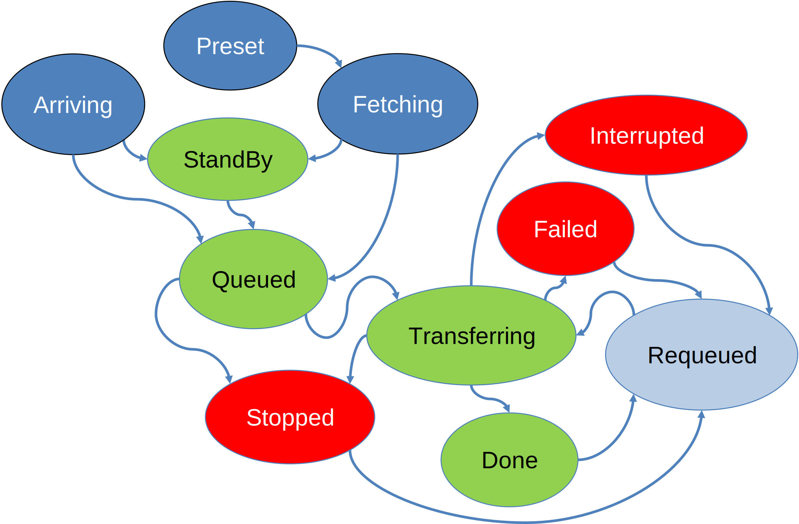

# Lifecycle of a Data Transfer

{ width="400" }

Each data transfer in OpenECPDS follows a well-defined lifecycle, transitioning through
different statuses from initiation to completion — including successful deliveries,
retries, and failure handling. Understanding these transitions helps in diagnosing
issues, optimising performance, and ensuring reliable data distribution across the
system.

## Submission

This phase involves submitting a data file to the OpenECPDS Data Store and registering a
data transfer request for it. There are two submission modes, each with its associated
statuses.

### Push Mode

Both the metadata and the file content are pushed directly.

- **Arriving** — The metadata has been registered, and the file content is currently
  being uploaded to the Data Store.

### Fetch Mode

The metadata is submitted first, and the file content is retrieved asynchronously.

- **Preset** — The metadata has been registered, and the data retrieval has been
  scheduled, awaiting processing by the **Data Retrieval Scheduler**.
- **Fetching** — The **Data Retrieval Scheduler** is actively retrieving the file
  content into the Data Store.

## Processing

Once a data transfer request has been registered, it is processed by various schedulers
and transitions through multiple statuses. The associated data file can either be
downloaded through the Data Portal or disseminated to a remote site. Each mode has its
own set of statuses.

### Data Portal

The file is in the destination queue, waiting to be retrieved.

- **StandBy** — The data transfer request was submitted with the standby option, causing
  it to be ignored by the **Data Transfer Scheduler**.
- **Done** — The data file has been successfully downloaded.

### Dissemination to a Remote Site

The data transfer request is in the queue, waiting for the scheduled time to pass.

- **Queued** — The data transfer request is waiting to be picked up by the **Data
  Transfer Scheduler**.
- **Transferring** — The data is currently being disseminated to the remote site.
- **Done** — The data transmission has been successfully completed.

## Failure Handling

At every stage of processing, an error can occur. When an error occurs, the data
transfer request is assigned a specific status depending on the nature of the error.
Once the error has been recorded, the transfer scheduler has two options: either retry
the request or remain in the error state, depending on the destination or host
configuration (e.g., maximum number of retries, unrecoverable error).

### Error State

The file has failed to complete the processing phase successfully.

- **Failed** — The dissemination to the remote site has failed.
- **Interrupted** — The processing has been interrupted (e.g., destination or OpenECPDS
  restart).
- **Stopped** — The processing was stopped either manually through the monitoring
  interface, due to an unrecoverable error, or because the maximum number of retries was
  reached.

### Retry The Request

Automatic or manual.

- **Requeued** — The file has entered an error state but was requeued because the error
  was not considered unrecoverable. A file can also be manually requeued by a user
  through the monitoring interface. In the case of an automatic retry, the file can be
  rescheduled for a later time to prevent retries from occurring too frequently. A
  maximum number of retries can also be configured, with settings available at both the
  destination and host levels.

## Related

- [Failover Mechanism](failover.md)
- [Event Logging](../event-logging/overview.md) — records the outcomes of these
  transitions.
- [OpenECPDS Entities](../concepts/entities.md)
