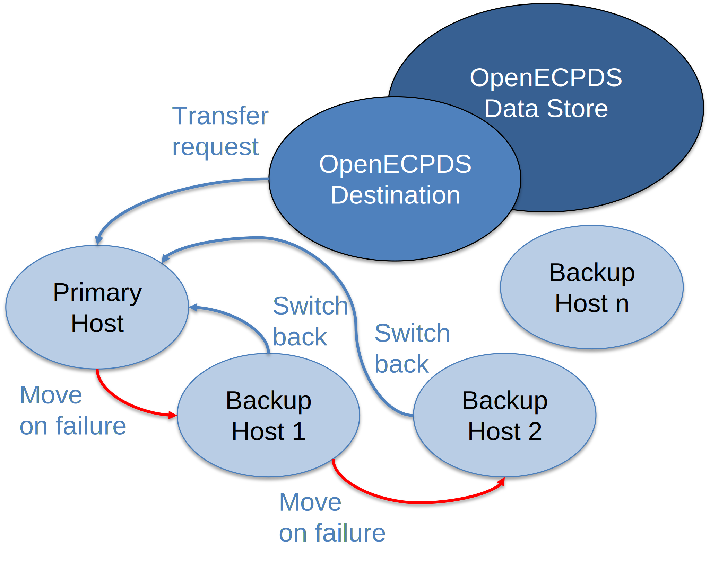

# Failover Mechanism in Host Selection

OpenECPDS manages failures by dynamically switching between available hosts. It
sequentially attempts to connect to each host in the list, moving to the next one if a
failure occurs.

A [destination](../concepts/entities.md#destinations-and-aliases) can be associated with
a list of [dissemination hosts](../concepts/entities.md#dissemination-and-acquisition-hosts),
with a **primary host** indicating the main target system where to deliver the data, and
a list of **fall-back hosts** to switch to if for some reason the primary host is
unavailable.

## Behaviour

The behaviour of the failover mechanism depends on the configuration of the transfer
scheduler:

- It can either **continue using the first successfully connected host** or **revert to
  the primary host** once it becomes available.
- The switch can occur **immediately after a successful transfer** or **after a
  predefined time interval**.

## How it works

1. OpenECPDS attempts to connect to the primary host.
2. If the connection fails, it moves to the next host in the configured list.
3. It continues down the list until a host connects successfully.
4. Depending on configuration, it either stays on the connected host or reverts to the
   primary host when it becomes available again — immediately or after a time interval.

This mechanism ensures continuity of service even when individual target systems become
temporarily unavailable.

{ width="400" }

## Related

- [Components](components.md)
- [Lifecycle of a Data Transfer](data-transfer-lifecycle.md)
- [OpenECPDS Entities](../concepts/entities.md)
