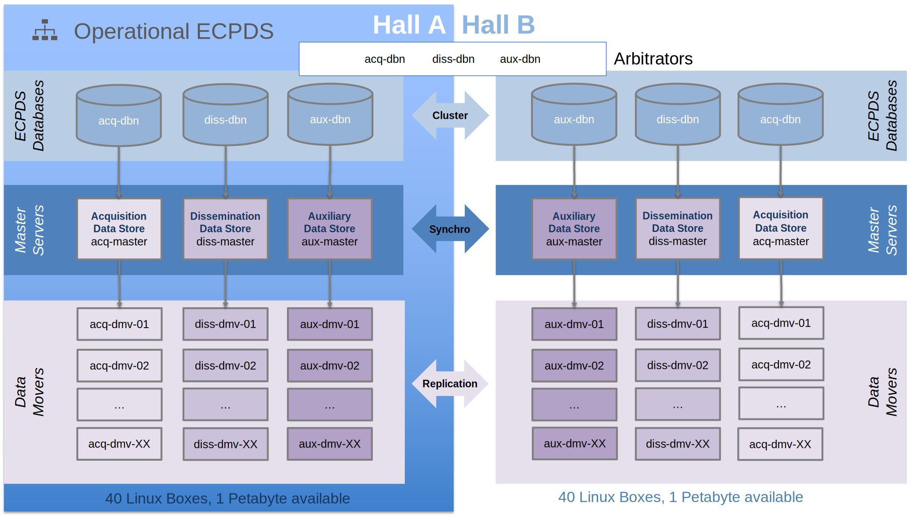
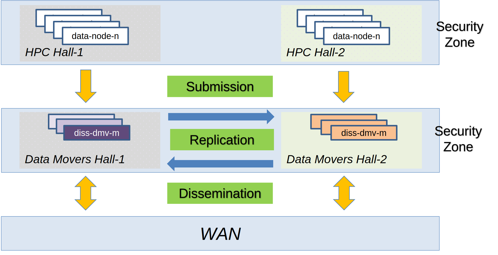

# Architecture Overview

OpenECPDS is a distributed system composed of cooperating services that together
acquire, store, and disseminate data. Unlike a conventional data store, OpenECPDS does
not necessarily store data physically in its persistent repository — instead it works
like a search engine, crawling and indexing metadata from data providers, while
optionally caching content in its **Data Store**.

## High-level design

{ width="650" }

Data can be fed into the Data Store via:

- The **Data Acquisition** service, discovering and fetching data from data providers.
- Data providers actively pushing data through the **Data Portal**.
- Data providers using the **OpenECPDS API** to register metadata, allowing asynchronous
  data retrieval.

Data products can be searched by name or metadata and either pushed by the **Data
Dissemination** service or pulled from the **Data Portal** by users. OpenECPDS streams
data on the fly or sends it from the Data Store if it was previously fetched.

## Core components

| Component | Responsibility |
|-----------|----------------|
| [Master Server](components.md#master-server) | Central coordinator: authentication, metadata registration, scheduling, and Data Mover allocation. |
| [Mover Server (Data Mover)](components.md#mover-server-data-mover) | Connects to remote systems via [transfer modules](../transfer-modules/index.md), stores and streams file content. |
| [Monitor Server](components.md#monitor-server) | Web-based monitoring and management interface. |
| [Data Portal](components.md#data-portal) | Passive, incoming access (FTP/HTTPS/S3) for remote sites. |
| Database | Persists destinations, hosts, transfers, and history. |

See [Components](components.md) for a detailed description of each.

## Key cross-cutting mechanisms

{ width="650" }

- **[Failover in host selection](failover.md)** — dynamically switching between
  available hosts when a connection fails.
- **[Lifecycle of a data transfer](data-transfer-lifecycle.md)** — the statuses a
  transfer passes through from submission to completion, including retries and failures.
- **[Continental Data Movers](continental-data-movers.md)** — geographically
  distributed movers that optimise dissemination by reducing latency and pre-replicating
  data.

## Modularity & protocols

The OpenECPDS software is modular, supporting new protocols through extensions. It
interacts with a variety of environments and supports multiple standard protocols:

- **Outgoing connections** (Data Acquisition & Dissemination): FTP, SFTP, FTPS, HTTP/S,
  Amazon S3, Azure and Google Cloud Storage.
- **Incoming connections** (Data Portal): FTP, HTTPS, S3 (SFTP and SCP are available
  exclusively through a Commercial API).

See [Protocols & Connections](../concepts/protocols.md) and the
[Transfer Modules](../transfer-modules/index.md) reference for details.

## Object storage

OpenECPDS stores data as objects, combining data, metadata, and a globally unique
identifier. It employs a file-system-based solution with replication across multiple
locations to ensure continuous data availability. The object storage system is
hierarchy-free but can emulate directory structures when necessary. See
[Object Storage](../concepts/object-storage.md).
