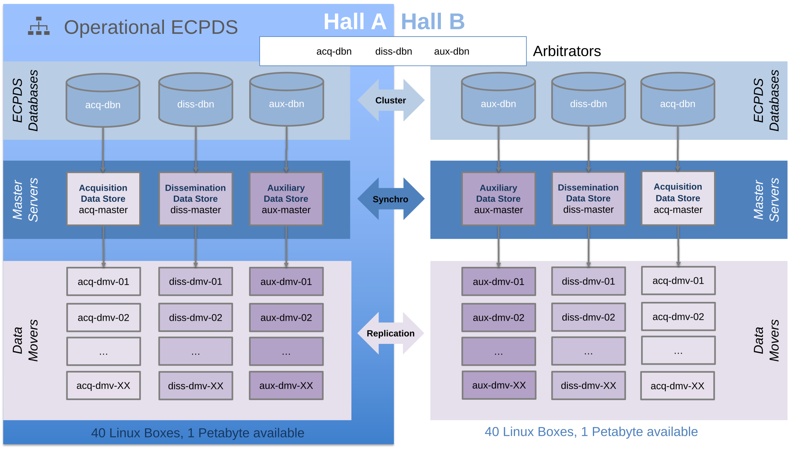
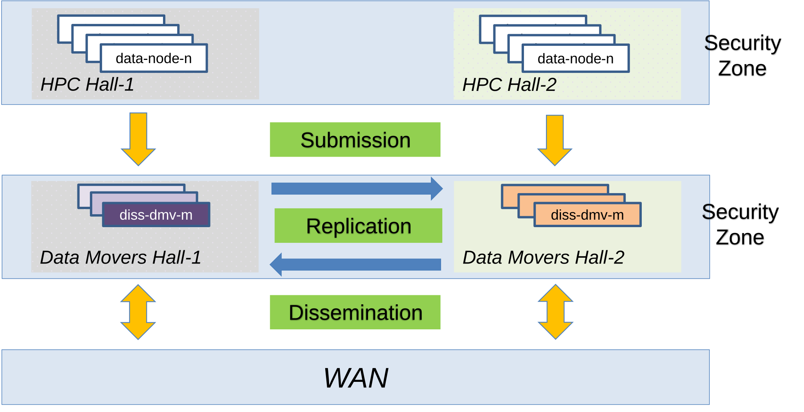

# Architecture Overview

OpenECPDS is a distributed system composed of cooperating services that together
acquire, store, and disseminate data. Unlike a conventional data store, OpenECPDS does
not necessarily store data physically in its persistent repository — instead it works
like a search engine, crawling and indexing metadata from data providers, while
optionally caching content in its **Data Store**.

## High-level design

{ width="650" }

Data can be fed into the Data Store via:

- The **Data Acquisition** service, discovering and fetching data from data providers.
- Data providers actively pushing data through the **Data Portal**.
- Data providers using the **OpenECPDS API** to register metadata, allowing asynchronous
  data retrieval.

Data products can be searched by name or metadata and either pushed by the **Data
Dissemination** service or pulled from the **Data Portal** by users. OpenECPDS streams
data on the fly or sends it from the Data Store if it was previously fetched.

## ECPDS infrastructure at ECMWF

The high-level design above describes the logical services and data paths. At ECMWF,
those services are deployed with two complementary objectives: **predictable
performance** for sustained data movement, and **resilience** against machine and
data-hall failures. Understanding the physical deployment helps explain how the
logical design meets those objectives.

This section describes **ECMWF's production infrastructure**, not a requirement for
every OpenECPDS installation. Development containers and other virtualised
deployments remain valid ways to run the software.

### Three independent services: ACQ, DISS and AUX

ECMWF operates **three separate ECPDS infrastructures**, organised as independent
services:

| Service | Primary purpose | Operational profile |
|---------|-----------------|---------------------|
| **ACQ (Acquisition)** | Acquisition of data | Continuous **24/7** operation: acquisition is required around the clock. |
| **DISS (Dissemination)** | Dissemination of data | Several well-defined daily peaks corresponding to the main dissemination windows, with substantially different workloads between those windows. |
| **AUX (Auxiliary)** | Other projects and specific use cases | Project-specific and specialised workloads, with operational and performance requirements that can differ considerably from ACQ and DISS. |

These names describe each service's **primary role**, not a limitation of its
software. All three are technically capable of acquisition, dissemination and
Data Portal access. They share the underlying ECPDS technology and architectural
principles, but each has its **own infrastructure, operational procedures and
teams**.

The separation is therefore an **operational and availability boundary**, rather
than a need for three different ECPDS implementations. Each service can be
configured, operated and evolved according to its own workload and availability
requirements, without depending on the operation or release schedule of another
ECPDS service.

Software upgrades, infrastructure maintenance, configuration changes and
potentially disruptive performance tests can consequently be scheduled
independently. There is no single global ECPDS maintenance window that all three
services must use. For example, a maintenance opportunity between DISS's main
dissemination windows may be unsuitable for ACQ's continuous acquisition workload;
AUX activities can follow the constraints of the projects it supports.

A lower-load period is not automatically an outage allowance: each service's
procedures and availability requirements still determine which activities are
acceptable and when. Independence allows those decisions to be made at the
appropriate service level.

**Common technology, independent services.** Service separation and the physical
resilience mechanisms described below address different scopes: the first
provides operational autonomy between ACQ, DISS and AUX; the second protects
components within an individual infrastructure against machine and data-hall
failures. The three services are not replicas or failover partners of one another.

### Performance and scalability

The core ECPDS infrastructure at ECMWF runs exclusively on **bare-metal systems**.
The Data Movers, which implement Data Portal access and move file content, run on
dedicated physical machines. This gives them predictable access to CPU, memory,
storage and network resources, without the additional overhead or contention with
other guests that can occur on shared virtualisation hosts.

For a data-intensive service, predictable throughput matters as much as peak
throughput: storage and network capacity must remain available during sustained
transfers and periods of high demand. Dedicated hardware makes resource allocation
and capacity planning more direct, although actual throughput still depends on
storage performance, network links, protocols and workload.

**Application Delivery Controllers (ADCs)** load-balance incoming Data Portal
traffic across the available Data Movers. This distributes connection workloads
rather than concentrating them on a single portal machine, allowing capacity to
scale across the mover infrastructure.

ADC load balancing and the Master Server's allocation decisions operate at
different levels. The ADC selects the **User Data Mover** that accepts a client's
connection; the Master allocates the **Target Data Mover** where content is stored
or retrieved. These need not be the same machine. See
[Components](components.md#mover-server-data-mover) and the
[Data Portal workflow](../use-cases/data-portal.md).

### High availability across two data halls

The infrastructure is distributed across **two physically separate data halls**.
Data Movers are organised into pairs called **transfer groups**, with the two
members of each pair placed in different halls.

Each transfer group replicates data between its two Data Movers. If one machine
fails, its partner can take over the corresponding data-mover service. Placing
partners in separate halls extends that protection beyond individual hardware
failures: losing an entire hall does not also remove both members of a transfer
group.

The distinction between *having two machines* and *placing them in independent
failure domains* is important. Two replicas in the same hall would still be
exposed to the same hall-level incident. Cross-hall placement is intended to
avoid either a single physical mover or a single data hall becoming a point of
failure for the corresponding mover service.

Replication protects the availability of file content, while ADC load balancing
distributes incoming access across available movers. Neither mechanism alone
provides the whole availability model: clients also need working network paths
and the coordinating services. During a failure, surviving machines must absorb
additional work, so resilience planning includes enough remaining capacity as
well as redundant copies of data.

!!! note
    High availability does not imply that every in-flight connection survives
    a failure. Clients may need to reconnect or retry, and replicated content
    must be available on the surviving mover. Replication is also not a substitute
    for backups or recovery procedures.

### Database redundancy and quorum

ECPDS databases use **MariaDB Galera clusters**. Each cluster has three nodes,
all on physical machines, distributed as follows:

| Location | Database placement |
|----------|--------------------|
| First data hall | One Galera node |
| Second data hall | One Galera node |
| Separate DHS zone | A third Galera node |

The third location is not simply another copy in one of the two halls. It provides
an additional failure domain and allows the two surviving nodes to retain a
majority when either data hall is lost, provided they can still communicate.

Quorum matters because redundant database nodes must agree on which part of the
cluster can continue accepting writes. In a three-node cluster, two connected
nodes can form the majority; a lone isolated node cannot safely provide the same
write availability. Thus, cross-location placement provides both redundant
database state and a quorum arrangement designed to tolerate a data-hall failure.
It does not guarantee availability under every combination of node failures and
network partitions.

The database holds coordination metadata, configuration and transfer history;
file content is held by the Data Movers. Galera redundancy and transfer-group
replication therefore protect **different parts of the service** and complement
one another.

### Dedicated Masters and separated monitoring access

ECPDS Masters run on their own **fully dedicated physical machines**, separating
coordination and scheduling resources from the machines handling bulk data
movement. These Master machines also host the monitoring services used for
**internal ECMWF access**.

External monitoring access follows a different deployment pattern: externally
accessible monitoring interfaces run on **dedicated VMs in the appropriate
external-access zone**. They are deliberately separated from the internal
infrastructure rather than exposing the internal monitoring services directly.

This is an intentional boundary, not a contradiction of the bare-metal core:
the external monitoring interfaces are an access layer, while the core Masters,
Data Movers and database nodes run on physical machines. Network-zone separation
addresses exposure and access control; it is distinct from both throughput
provisioning and data replication.

### Performance is not the same as availability

Bare metal and high availability solve different problems:

| Design choice | Primary concern |
|---------------|-----------------|
| Dedicated bare-metal Data Movers and Masters | Predictable resources and sustained performance |
| ADC distribution across available Data Movers | Sharing incoming workloads and scaling portal capacity |
| Transfer-group replication | Keeping file content available when a mover fails |
| Cross-hall placement of mover pairs | Avoiding a shared hall-level failure for both replicas |
| Three-node Galera clusters across two halls and the DHS zone | Database redundancy and majority quorum across locations |
| Separate external monitoring VMs | Separating external access from the internal infrastructure |

**Performance comes from how individual components are provisioned and how work
is distributed; availability comes from multiple independent components,
replication and placement across failure domains.** A powerful bare-metal machine
alone remains a single point of failure. Conversely, redundant machines do not
automatically provide sufficient throughput when one of them, or an entire hall,
is unavailable.

These choices should therefore be evaluated together: normal-operation capacity,
surviving capacity during failures, replication health, database quorum and
network reachability all contribute to the service users actually experience.

## Core components

| Component | Responsibility |
|-----------|----------------|
| [Master Server](components.md#master-server) | Central coordinator: authentication, metadata registration, scheduling, and Data Mover allocation. |
| [Mover Server (Data Mover)](components.md#mover-server-data-mover) | Connects to remote systems via [transfer modules](../transfer-modules/index.md), stores and streams file content. |
| [Monitor Server](components.md#monitor-server) | Web-based monitoring and management interface. |
| [Data Portal](components.md#data-portal) | Passive, incoming access (FTP/SFTP/SCP/HTTPS/WebDAV/S3) for remote sites. |
| Database | Persists destinations, hosts, transfers, and history. |

See [Components](components.md) for a detailed description of each.

## Key cross-cutting mechanisms

{ width="650" }

- **[Failover in host selection](failover.md)** — dynamically switching between
  available hosts when a connection fails.
- **[Lifecycle of a data transfer](data-transfer-lifecycle.md)** — the statuses a
  transfer passes through from submission to completion, including retries and failures.
- **[Continental Data Movers](continental-data-movers.md)** — geographically
  distributed movers that optimise dissemination by reducing latency and pre-replicating
  data.
- **[Centralised vs. Federated](federation-vs-centralization.md)** — how a centrally
  operated OpenECPDS service compares to organisations running their own independent
  instances, and why the two are compatible rather than competing.
- **[Data Ownership & Catalogue](data-ownership-and-catalogue.md)** — how OpenECPDS'
  product/destination metadata and end-to-end traceability complement (rather than
  replace) dedicated product catalogue systems.

## Modularity & protocols

The OpenECPDS software is modular, supporting new protocols through extensions. It
interacts with a variety of environments and supports multiple standard protocols:

- **Outgoing connections** (Data Acquisition & Dissemination): FTP, SFTP, FTPS, HTTP/S, WebDAV,
  Amazon S3, Azure and Google Cloud Storage.
- **Incoming connections** (Data Portal): FTP, SFTP, SCP, HTTPS, WebDAV, S3.

See [Protocols & Connections](../concepts/protocols.md) and the
[Transfer Modules](../transfer-modules/index.md) reference for details.

## Object storage

OpenECPDS stores data as objects, combining data, metadata, and a globally unique
identifier. It employs a file-system-based solution with replication across multiple
locations to ensure continuous data availability. The object storage system is
hierarchy-free but can emulate directory structures when necessary. See
[Object Storage](../concepts/object-storage.md).
