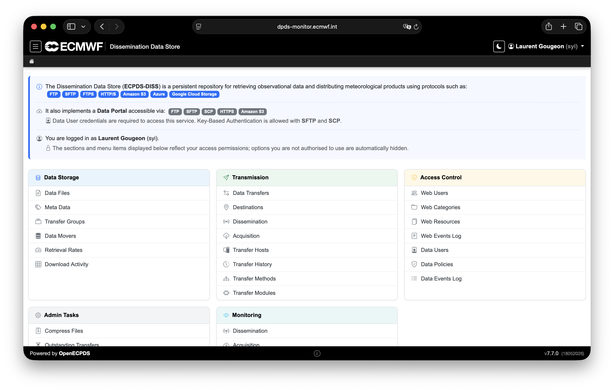
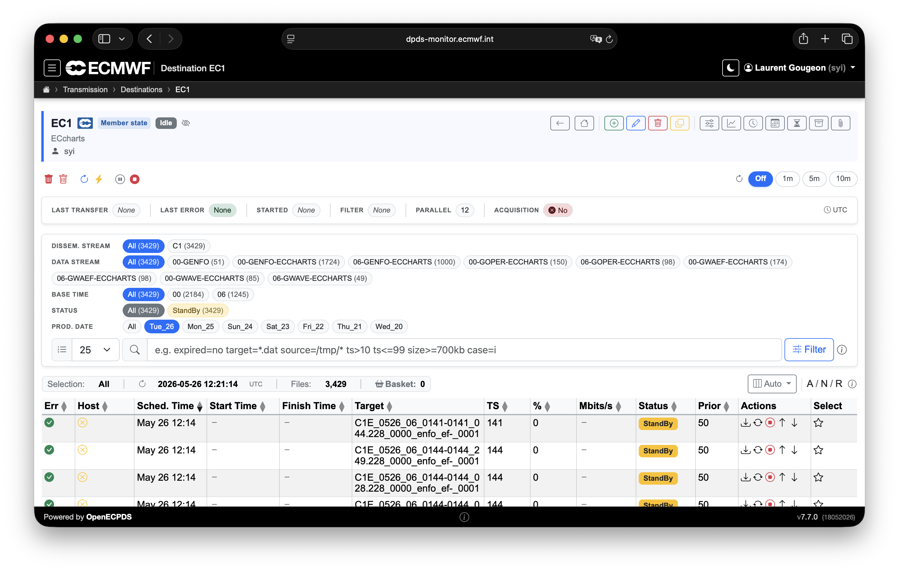
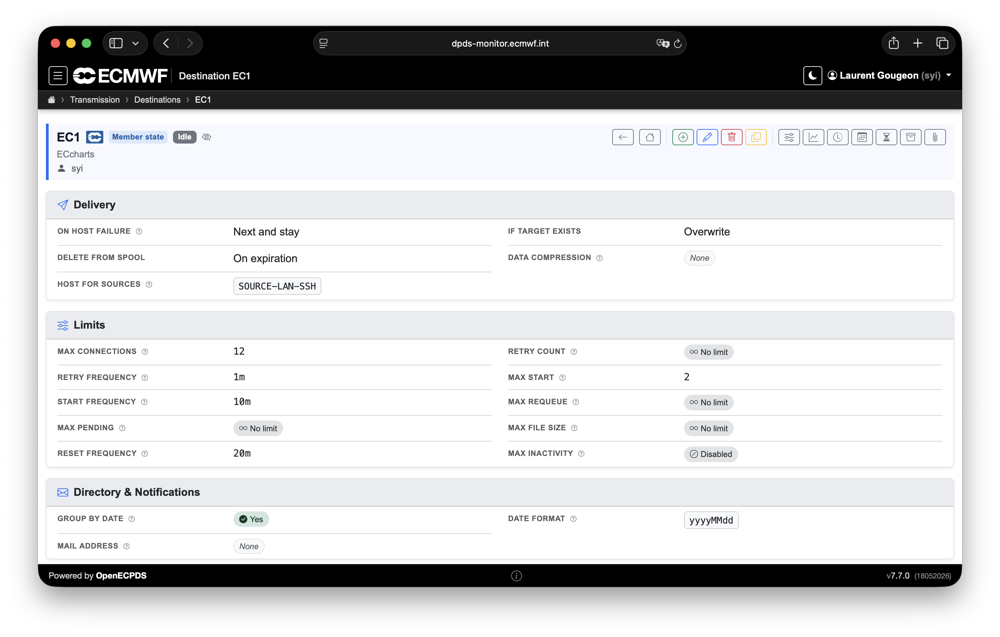

# OpenECPDS Entities

Understanding some key OpenECPDS concepts will help users benefit fully from the tool's
capabilities:

- **data files**
- **data transfers**
- **destinations** and **aliases**
- **dissemination** and **acquisition hosts**

A user connecting to the OpenECPDS web interface will come across each of these entities,
which are related to each other through the different services.

{ width="600" }

## Data files and data transfers

A **data file** is a record of a product stored in the OpenECPDS Data Store with a
one-to-one mapping between the data file and the product. The data file contains
information on the physical specifications of the product, such as its size, type,
compression and entity tag (ETag) in the Data Store, as well as the metadata associated
with it by the data provider (e.g. meteorological parameters, name or comments concerning
the product).

A **data transfer** is linked to a unique data file and represents a transfer request for
its content, together with any related information (e.g. schedule, priority, progress,
status, rate, errors, history). A single data file can be linked to several data
transfers, as many remote sites might be interested in obtaining the same products from
the Data Store.

The statuses a data transfer passes through are described in the
[Lifecycle of a Data Transfer](../architecture/data-transfer-lifecycle.md).

## Destinations and aliases

A **destination** should be understood as a place where data transfers are queued and
processed in order to deliver data to a unique remote place — hence the name
'destination'. It specifies the information the Data Dissemination service needs to
disseminate the content of a data file to a particular remote site.

A breadcrumb trail at the top of the interface shows where a user currently is in the
tool. For example, a user may create a destination called `EC1`. Users with the right
credentials can see the status of this destination and review the progress of data
transmission. They can manage the destination by, for example, requesting data
transfers, changing priorities, and stopping or starting data transmissions.

{ width="600" }

Each destination implements a **transfer scheduler** with its own configuration
parameters, which can be fine-tuned to meet the remote site's needs. These settings make
it possible to control various things, such as how to organise the data transmission by
using data transfer priorities and parallel transmissions, or how to deal with
transmission errors with a fully customisable retry mechanism.

{ width="600" }

A destination can be:

- A **dissemination destination** — as long as at least one dissemination host is defined.
- An **acquisition destination** — as long as at least one acquisition host is defined.
- **Both** — used to automatically discover and retrieve data from one place and transmit
  it to another, with or without storing the data in the Data Store, depending on the
  destination configuration. This is a popular way of using OpenECPDS. For example, this
  mechanism is used for the delivery of some regional near-real-time ensemble air quality
  forecasts produced at ECMWF for the EU-funded Copernicus Atmospheric Monitoring Service.

If the data transfers within a destination are retrieved by remote users through the
[Data Portal](../use-cases/data-portal.md), then there will be no dissemination hosts
attached to the destination. In this particular case, the destination can be seen as a
'bucket' (in Amazon S3 terms) or a 'blob container' (in Microsoft Azure terms). The
transfer scheduler will be deactivated, and the data transfers will stay idle in the
queue, waiting to be picked up through the Data Portal.

### Aliases

There is also the concept of destination **aliases**, which makes it possible to link two
or more destinations together, so that whatever data transfer is queued to one
destination is also queued to the others. This mechanism enables processing the same set
of data transfers to different sites with different schedules and/or transfer mechanisms
defined on a destination basis. **Conditional aliasing** is also possible in order to
alias only a subset of data transfers.

## Dissemination and acquisition hosts

A destination can be associated with a list of **dissemination hosts**, with a primary
host indicating the main target system where to deliver the data, and a list of fall-back
hosts to switch to if for some reason the primary host is unavailable (see
[Failover Mechanism](../architecture/failover.md)).

A **dissemination host** is used to connect and transmit the content of a data file to a
target system. It enables users to configure various aspects of the data transmission,
including which network and transfer protocol to use, in which target directory to place
the data, which passwords, keys or certificates to use to connect to the remote system,
and more.

A destination can also be associated with a list of **acquisition hosts**, indicating the
source systems where to discover and retrieve files from remote sites. Like their
dissemination counterparts, the acquisition hosts contain all the information required to
connect to the remote site, including which network, transfer protocol, source directory
and credentials to use for the connection. In addition, the acquisition host also
contains the information required to **select the files at the source**. Complex rules can
be defined for each source directory, type, name, timestamp and protocol, to name just a
few options. See [Acquisition Directory](../host-directory/acquisition.md).

## Transfer Methods

A host references a **Transfer Method**, which determines the
[transfer module](../transfer-modules/index.md) (protocol implementation) used for the
connection — for example FTP, SFTP, FTPS, HTTP/S, Amazon S3, Azure or Google Cloud
Storage. The selected module exposes a set of configuration options that fine-tune the
connection. See the [Transfer Modules](../transfer-modules/index.md) reference and
[Protocols & Connections](protocols.md).

The **Directory** field of a host controls *where* on the remote system data is read from
or written to. Its behaviour is host-type-specific — see
[Host Directory Field](../host-directory/index.md).

## Related

- [Protocols & Connections](protocols.md)
- [Object Storage](object-storage.md)
- [Transfer Modules](../transfer-modules/index.md)
- [Lifecycle of a Data Transfer](../architecture/data-transfer-lifecycle.md)
