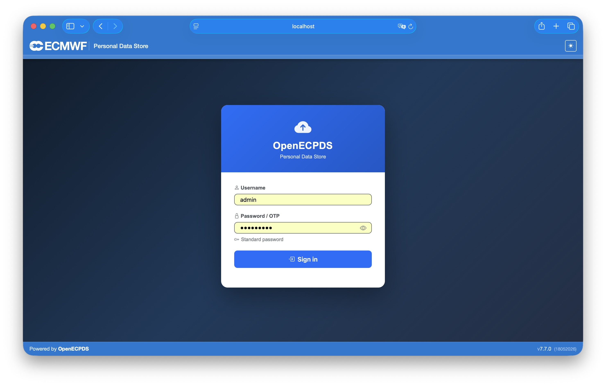

# First Run

After [building OpenECPDS](installation.md), you can start the services, access the
interfaces, and check the containers and logs.

## Starting OpenECPDS

To start the application:

```bash
make up
```

This starts the OpenECPDS **master**, **monitor**, **mover**, and **database** services.

It might take a few seconds for all the services to start. Once they are up, you can
access the following URLs (update them if you changed the configuration in the compose
files):

!!! warning
    Certificate validation should be disabled when relevant, as the test environment
    uses a self-signed certificate.

| Interface | URL | Login Details |
|-----------|-----|---------------|
| Monitoring | [https://127.0.0.1:3443](https://127.0.0.1:3443) | admin/admin2021 |
| Data Portal | [https://127.0.0.1:4443](https://127.0.0.1:4443) | test/test2021 |
| | [ftp://127.0.0.1:4021](ftp://127.0.0.1:4021) | test/test2021 |
| MQTT Broker | mqtt://127.0.0.1:4883 | test/test2021 |
| Virtual FTP Server | [ftp://127.0.0.1:2021](ftp://127.0.0.1:2021) | admin/admin2021 |
| JMX Interfaces | [http://127.0.0.1:2062](http://127.0.0.1:2062) | master/admin |
| | [http://127.0.0.1:3062](http://127.0.0.1:3062) | monitor/admin |
| | [http://127.0.0.1:4062](http://127.0.0.1:4062) | mover/admin |

The Monitoring interface is available on port **3443** and presents a login screen prior
to authentication.

{ width="600" }

## Checking the containers and logs

To verify that the containers are running:

```bash
make ps
```

To view the standard output (stdout) and standard error (stderr) streams generated by
the containers:

```bash
make logs
```

To view the logs generated by OpenECPDS, browse the following directories mounted to the
containers:

```text
run/var/log/ecpds/master
run/var/log/ecpds/monitor
run/var/log/ecpds/mover
```

For details on the structured events written to these logs, see
[Event Logging](../event-logging/overview.md).

## Additional Makefile options

To log in to the database:

```bash
make mariadb
```

To log in to the master container (use the same for monitor, mover, and database):

```bash
make connect container=master
```

## Stopping OpenECPDS

To stop the application:

```bash
make down
```

To clean the logs and data:

```bash
make clean
```

## Next steps

- Explore the [Architecture Overview](../architecture/overview.md).
- Learn the [Key Concepts](../concepts/entities.md).
- Try a [Use Case workflow](../use-cases/ecpds-cli.md).
- Publish images with the [Release guide](../deployment/release.md).
