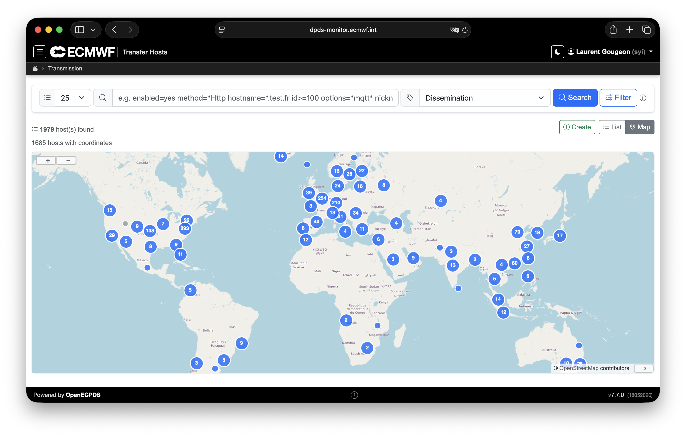
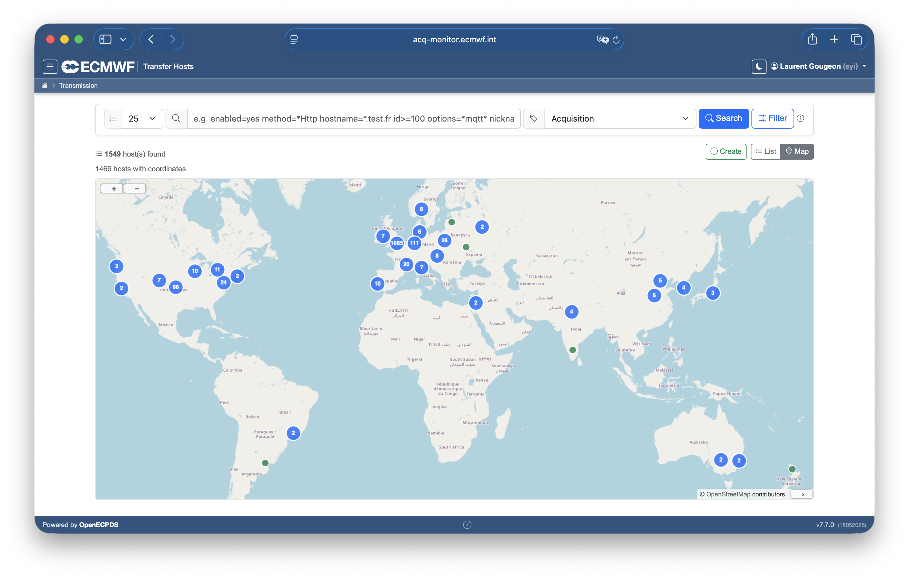
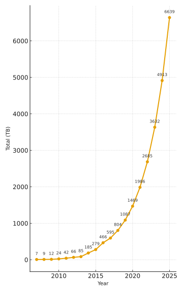

# Global Reach of OpenECPDS

The OpenECPDS infrastructure supports a vast network of **over 1,000 destinations** for
acquisition and dissemination, marking a significant milestone in its expansion. Spanning
more than **80 countries**, this network enables continuous, around-the-clock data
exchange. A live map, available through the OpenECPDS Web Interface, provides real-time
monitoring of both dissemination and acquisition activities.

To further optimise performance and reduce latency for transatlantic transfers, a
[Continental Data Mover](architecture/continental-data-movers.md) has been deployed in the
United States, strategically positioned to enhance data delivery to North American
recipients.

The OpenECPDS Web Interface provides global infrastructure maps for both data
dissemination and data acquisition, highlighting all served destinations and providing a
clear visual representation of the system's extensive reach.

{ width="550" }

A corresponding view is available for the acquisition service:

{ width="550" }

!!! warning
    Map pins may represent multiple destinations in dense areas. When applicable, the
    number of hosts is shown inside the pin.

!!! note
    Geolocation in OpenECPDS is based on the
    [GeoLite2-City database](https://github.com/wp-statistics/GeoLite2-City), which
    performs IP-to-location mapping. The resulting locations are approximate and accuracy
    may vary depending on the IP data available.

## Long-term data volume trend

In addition to the global view, it is useful to observe how data volumes have evolved
over time. The annual average monthly data volume (in terabytes) handled by OpenECPDS from
**2007 to 2025** highlights the steady and continuous growth of data transfers over
eighteen years, reflecting both an expanding user base and the increasing scale of
operational activities.

{ width="250" }

## Related

- [Continental Data Movers](architecture/continental-data-movers.md)
- [Illustrative Physical Infrastructure](deployment/infrastructure.md)
