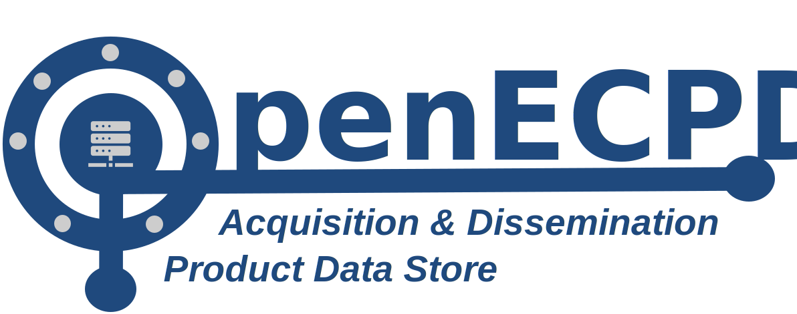
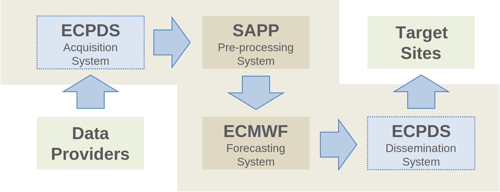

# OpenECPDS Documentation

{ width="420" }

> **Our mission with OpenECPDS is to keep data moving.**
>
> Inspired by operational excellence. Powered by open-source innovation. Acquire from
> anywhere. Deliver everywhere. Connect with confidence. Share without limits.

OpenECPDS is a multi-purpose data repository — the **Data Store** — that delivers three
strategic data-related services:

- **Data Acquisition** — the automatic discovery and retrieval of data from data providers.
- **Data Dissemination** — the automatic distribution of data products to remote sites.
- **Data Portal** — the pulling and pushing of data initiated by remote sites.

Data Acquisition and Data Dissemination are active services initiated by OpenECPDS,
whereas the Data Portal is a passive service triggered by incoming requests from remote
sites. The Data Portal provides interactive access to the Dissemination and Acquisition
services.

OpenECPDS enhances data services by integrating innovative technologies to streamline
the acquisition, dissemination, and storage of data across diverse environments and
protocols.

## Why OpenECPDS

- :material-cloud-sync: **Acquire from anywhere**

    Automatically discover and retrieve data from providers over FTP, SFTP, FTPS,
    HTTP/S, Amazon S3, Azure and Google Cloud Storage.

- :material-share-variant: **Deliver everywhere**

    Disseminate products to more than 1,000 destinations across 80+ countries with a
    fully customisable, retry-aware transfer scheduler.

- :material-database: **Object Data Store**

    Store data as objects with metadata and a globally unique identifier, with
    replication across local storage and cloud platforms.

- :material-bell-ring: **Real-time notifications**

    An embedded MQTT broker and client enable instant notifications and integration
    with the WMO WIS2 infrastructure.

- :material-docker: **Container-native**

    Build and run with Docker and a development container; scale from a laptop to
    hundreds of systems and petabytes of data.

- :material-source-branch: **Open and extensible**

    A modular architecture supports new protocols through extensions, backed by a
    commitment to long-term maintenance.

## Quick links

- **New here?** Start with [System Requirements](getting-started/requirements.md) →
  [Installation](getting-started/installation.md) → [First Run](getting-started/first-run.md).
- **Understand the system:** [Architecture Overview](architecture/overview.md) and
  [Key Concepts](concepts/entities.md).
- **Configure transfers:** [Transfer Modules](transfer-modules/index.md) and the
  [Host Directory Field](host-directory/index.md).
- **Operate & monitor:** [Event Logging](event-logging/overview.md) and the
  [MQTT Notification System](notifications/mqtt-overview.md).

## Architecture at a glance

{ width="450" }

| Component | Role |
|-----------|------|
| [Master Server](architecture/components.md#master-server) | Central coordinator — authentication, metadata, scheduling, Data Mover allocation. |
| [Mover Server (Data Mover)](architecture/components.md#mover-server-data-mover) | Moves bytes — connects to remote systems via transfer modules, stores/streams content. |
| [Monitor Server](architecture/components.md#monitor-server) | Web monitoring interface for destinations, transfers and hosts. |
| [Data Portal](architecture/components.md#data-portal) | Incoming FTP/HTTPS/S3 access for remote sites to push and pull data. |
| Database | Persists metadata, destinations, hosts, transfers and history. |

See the [Architecture Overview](architecture/overview.md) for how these components work
together, and [Continental Data Movers](architecture/continental-data-movers.md) for
geographically distributed dissemination.

## Core capabilities

- **Multiple protocols** — FTP, SFTP, FTPS, HTTP/S, Amazon S3, Azure Blob and Google
  Cloud Storage. See [Protocols & Connections](concepts/protocols.md).
- **Object storage** — hierarchy-free storage that can emulate directory structures.
  See [Object Storage](concepts/object-storage.md).
- **Notification system** — embedded MQTT broker and client. See
  [MQTT Overview](notifications/mqtt-overview.md).
- **Data compression** — lzma, zip, gzip, bzip2, lbzip2, lz4, snappy.
- **Data checksumming** — MD5 for remote integrity, ADLER32 in the Data Store.
- **Garbage collection** — automatic removal of expired data.
- **Data backup** — map data sets to existing archiving systems.

See [Additional Features](concepts/additional-features.md) for details.

## Support & resources

- [Javadoc API documentation](https://ecmwf.github.io/open-ecpds/apidocs/)
- [Support Materials](support.md)
- [Glossary](glossary.md) of key terms
- [Contributing](contributing.md) and [Changelog](changelog.md)
