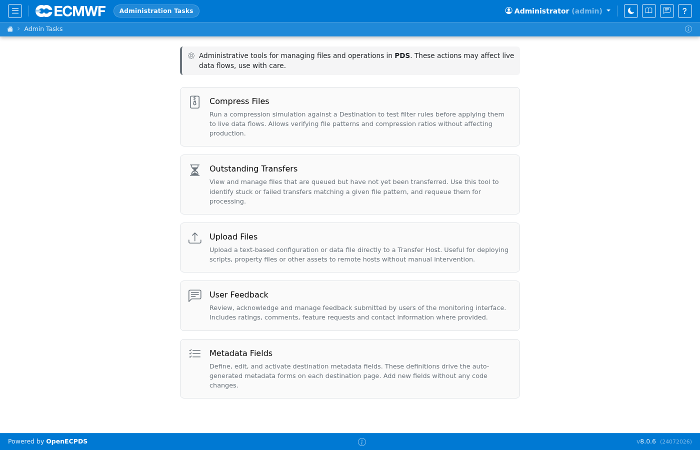

# Administration

The Administration section provides system-wide management tools
available to users with administrator privileges.

## Administration

The admin home page provides access to: metadata field configuration (defining custom key/value fields attachable to destinations), transfer requeue (bulk re-scheduling of failed transfers), file upload (injecting files directly into the data store), the audit/feedback log, [TLS certificate management](../administration/certificates.md), [Critical Action Password](../administration/critical-password.md) setup, and the destructive [Purge All Data](../administration/purge.md) reset tool.

