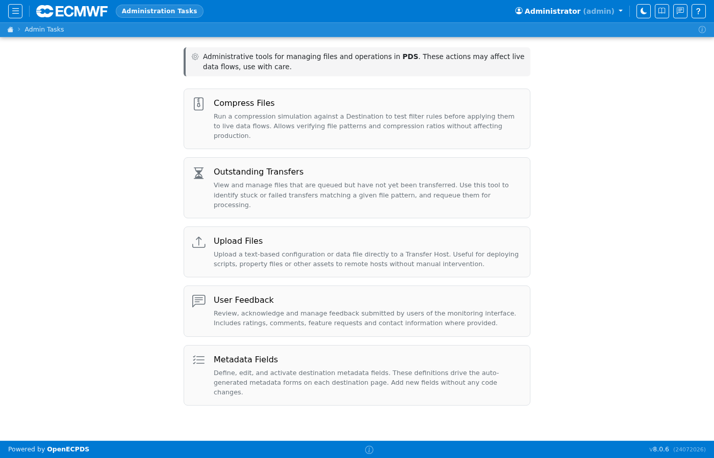

# Administration

The Administration section provides system-wide management tools
available to users with administrator privileges.

## Administration

The admin home page provides access to: [Destination Metadata](../administration/destination-metadata.md) field configuration (defining custom fields attachable to destinations, e.g. contacts, procedures, Opsview notes), transfer requeue (bulk re-scheduling of failed transfers), file upload (injecting files directly into the data store), the audit/feedback log, [Product Descriptions](../administration/product-descriptions.md) (per-product/type Tips and Descriptions), [TLS certificate management](../administration/certificates.md), [Critical Password](../administration/critical-password.md) setup, and the destructive [Purge All Data](../administration/purge.md) reset tool.

## Scheduler Traffic

**Scheduler Traffic** (`/do/admin/schedulertraffic`), linked from Administration
Tasks, the start page and the administration menu, monitors the Master's current
**Proxy**, **Backup** and **Replication** workers. Switch between the three types
using the buttons above the table. The read-only page uses the same card/table
style as Outstanding Transfers, with local filtering, sorting, pagination,
manual refresh and a selectable auto-refresh interval (5 seconds by default).

Each row represents one current worker per data file, identified by the transfer
that started it; aliases can share a file. It shows destination, transfer/data-file
links where permitted, requested Target, worker phase, transfer status, source
Mover when known, target Host, file size, start time and elapsed time.
**Starting**, **Processing** and **Finalizing** describe the scheduler worker;
the separate **Transfer status** describes dissemination, not whether this
background copy has succeeded.

Completed workers disappear. This is neither a waiting queue nor an outcome
history; consult the transfer history for completed or failed operations. Disabled
schedulers are explicitly identified, and connection errors are shown rather
than reported as an empty successful snapshot. Replication can involve several
members of a Mover group; Proxy/Backup select the source internally and Proxy
Host selection may change during an attempt. File size is not bytes moved:
these blocking operations do not expose reliable live percentage or throughput.

Refresh retrieves detached in-memory worker snapshots through the management
interface. It performs no database scans, Mover probes or transfer-path I/O and
does not change scheduler behaviour. Access follows the normal administration
URL permissions (`/do/admin/schedulertraffic`); deploy the updated Master and
Monitor together.

