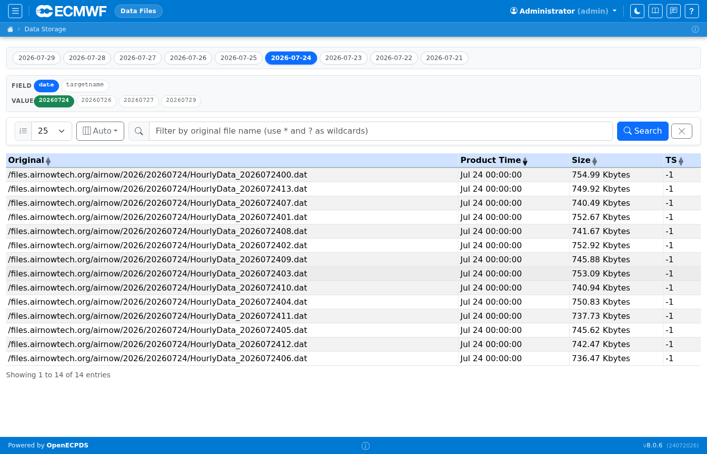
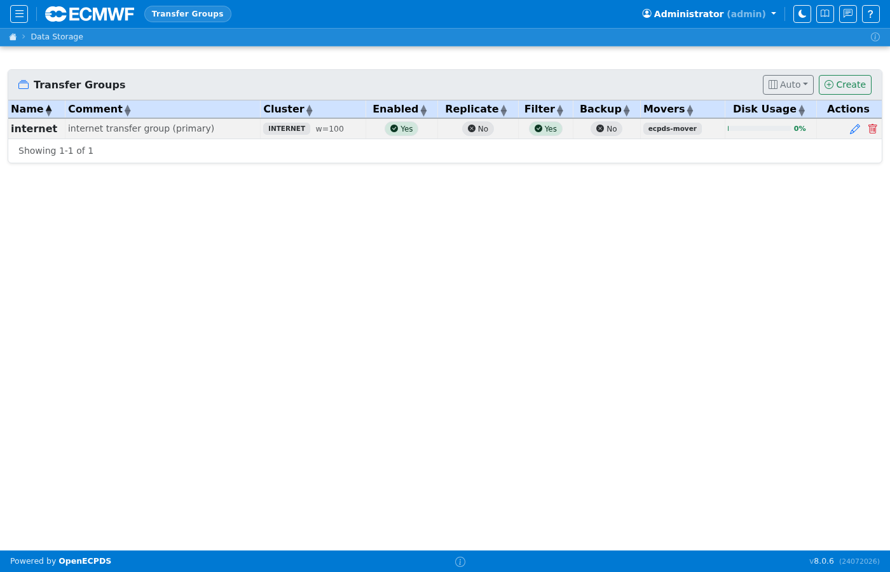
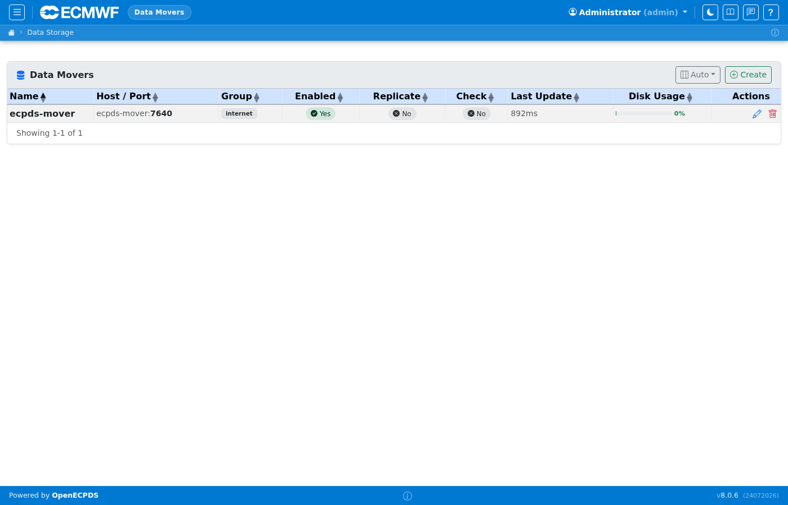
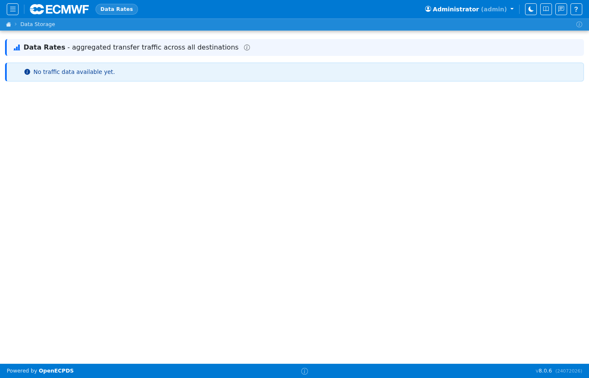
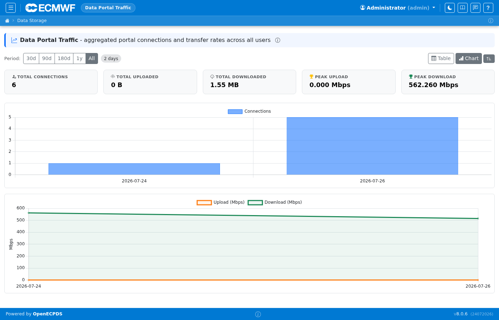
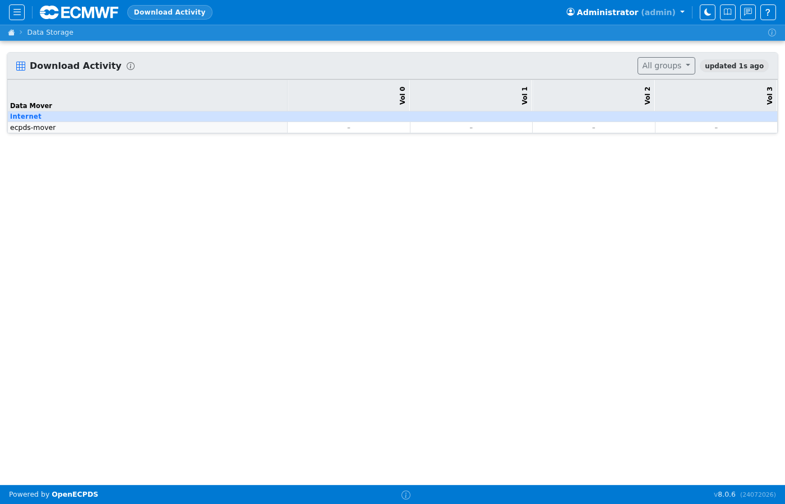

# Data Files & Infrastructure

The Data Files section provides visibility into the data objects stored by
OpenECPDS and the infrastructure components (Data Movers, Transfer Groups) that
handle them.

## Data Files

Lists all data files in the system with their unique identifier, size, checksum (ADLER32), storage volume, and creation time. Each file can have multiple associated transfer requests across different destinations. Use the date selector in the left-hand panel to browse files by ingestion date, or apply filters on target name or field values to narrow the results.

## Transfer Groups

Transfer groups pool Data Movers. When a transfer is scheduled, the master selects an available mover from the group. This page shows all groups, their member movers, and current load.

## Data Movers

Lists all registered Data Mover servers with their host address, disk usage, active connections, and operational status. A mover shown as inactive will not receive new transfer assignments until it re-registers.

## Data Rates

Shows throughput charts per Data Mover and per destination over a configurable time window. Useful for capacity planning and spotting performance degradation.

## Portal Traffic

Displays upload and download activity through the Data Portal, broken down by Data User and destination. Helps identify heavy users and quota candidates.

## Mover Downloads

Shows live download sessions active on each Data Mover. Each row shows the remote client IP, the file being transferred, bytes sent so far, and elapsed time.

