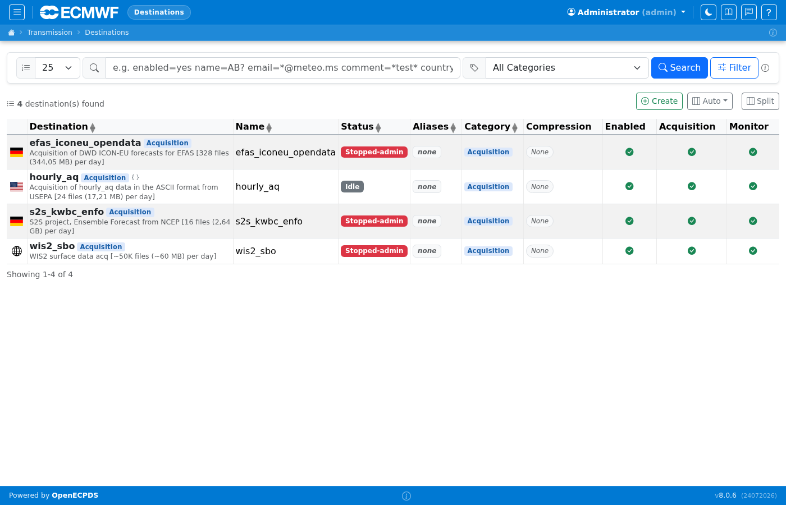
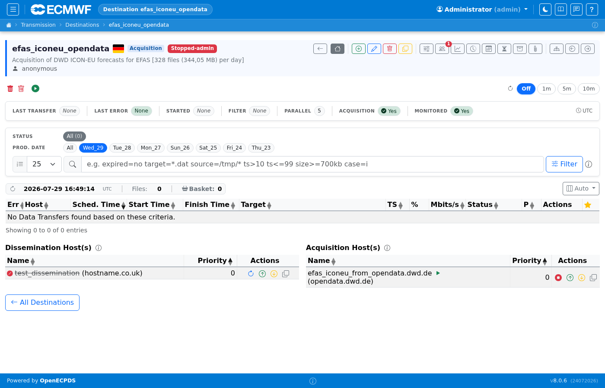

# Destinations

A **Destination** is the core scheduling unit in OpenECPDS. It represents a
named data feed — either a dissemination target (data is pushed to it) or an acquisition
source (data is pulled from it). Each destination has a queue of transfer requests,
one or more associated hosts, and a set of options that control scheduling behaviour.

## Destination List

The destination list shows all configured destinations with their type (Acquisition, Dissemination, Time Critical, or any custom type defined in the server configuration), status (active/stopped/held), queue depth, and last transfer time. Click a destination name to open its detail page.

!!! note "Standalone container"
    All four sample destinations (`efas_iconeu_opendata`, `hourly_aq`, `s2s_kwbc_enfo`, `wis2_sbo`) are of type **Acquisition** — they pull data from external sources.

## Destination Detail

The destination detail page shows the current queue for that destination: pending, running, done, and failed transfers. The toolbar provides actions to hold, release, flush, or reconfigure the destination. The Properties tab shows the destination's scheduler and incoming options.

