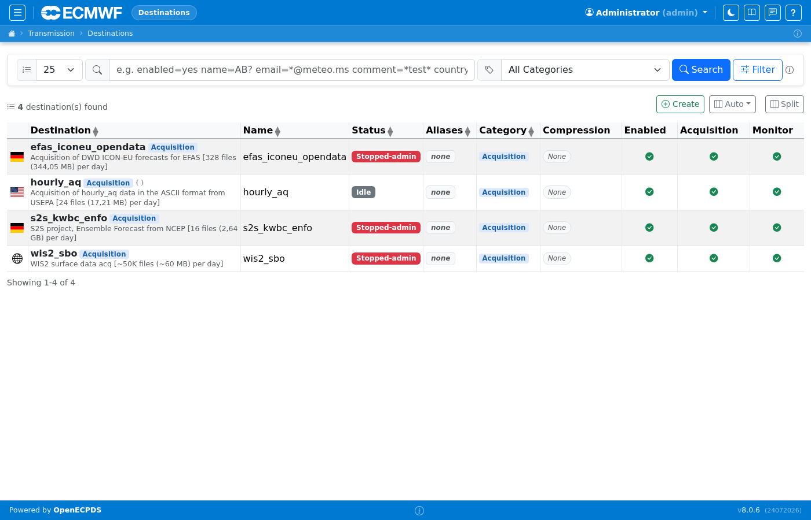
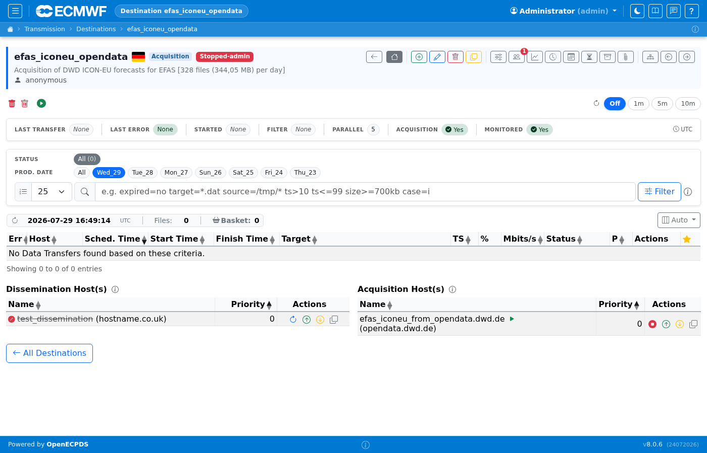

# Destinations

A **Destination** is the core scheduling unit in OpenECPDS. It represents a
named data feed — either a dissemination target (data is pushed to it) or an acquisition
source (data is pulled from it). Each destination has a queue of transfer requests,
one or more associated hosts, and a set of options that control scheduling behaviour.

## Destination List

The destination list shows all configured destinations with their type (Acquisition, Dissemination, Time Critical, or any custom type defined in the server configuration), status (active/stopped/held), queue depth, and last transfer time. Click a destination name to open its detail page.

!!! note "Standalone container"
    All four sample destinations (`efas_iconeu_opendata`, `hourly_aq`, `s2s_kwbc_enfo`, `wis2_sbo`) are of type **Acquisition** — they pull data from external sources.

## Destination Detail

The destination detail page shows the current queue for that destination: pending, running, done, and failed transfers. The toolbar provides actions to hold, release, flush, or reconfigure the destination. The Properties tab shows the destination's scheduler and incoming options.

### Delivered filename

**Target** remains the requested filename. Host settings can change the filename
or path actually used by a delivery module. The transfer detail page shows
**Delivered name** when the module reports a different name after successful
delivery. It is shown only for transfers whose current status is **DONE**.
The display falls back to **Target** when no different name is recorded.
Comparison is exact and case-sensitive; names are not inferred from comments.

In the destination queue, choose **Cols → Custom** and enable **Delivered**
to display it immediately after **Target**. The column is not included in Auto, All, Compact or Small modes.
Existing saved column selections are preserved.

Use `delivered=*/in/*` to search this field, or combine it with other conditions,
for example `target=*.dat delivered=archive/* case=i`. Wildcards, quoting and
`case=` work as for `target=`. The same filter applies to transfer rows, counts
and filtered basket selection. Only **DONE** transfers match `delivered=`.
When their stored delivered name is NULL, `delivered=` searches **Target** instead.
Sorting uses the same effective filename. This does not change stored values.
Failed, queued, running and other non-DONE transfers show an empty Delivered
value and do not match a delivered filename filter, even if an older name remains
stored. Historical DONE transfers and modules that do not report a name use the
Target fallback; this does not recover an unrecorded historical remote filename.

The field describes the latest delivery attempt, not a history of remote names.
It is cleared when a new Mover delivery attempt starts and populated on success.
Historical transfers are not backfilled.

!!! warning "Database upgrade required"
    Before starting the updated Master, apply
    `docker/ecpds/database/add-delivered-name.sql` once to the existing ECPDS
    database. It adds nullable `DATA_TRANSFER.DAT_DELIVERED_NAME` as `TEXT`, so
    transformed paths are not truncated to Target's length. Review ALTER TABLE
    locking and supported online-DDL options for your MariaDB version and table
    size before scheduling the upgrade. New databases already contain this field.
    Deploy the updated Master, Movers, Continental relays (if used) and Monitor
    together, then restart the services.

Recording the name uses the existing transfer update path: there is no additional
database request per transfer or parsing of history messages. No index is added
for the new text field. Searching or sorting it can cost more on large result
sets; destination and time/status filters still constrain the existing queries.
