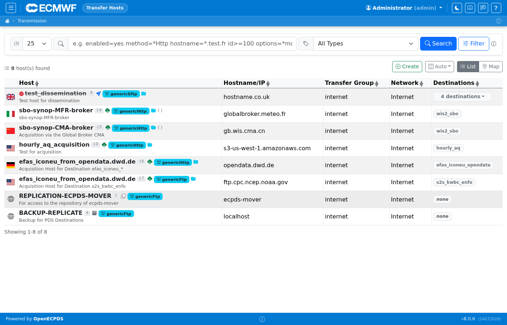
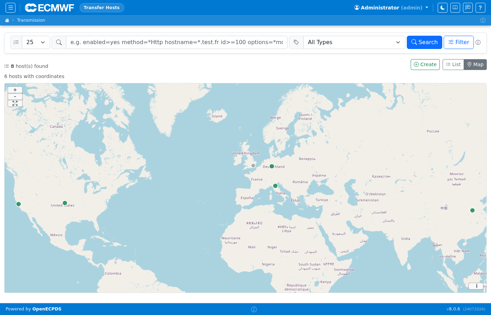
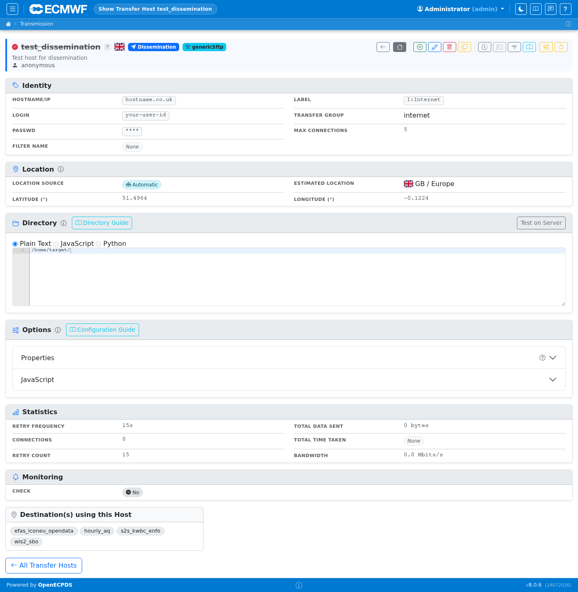
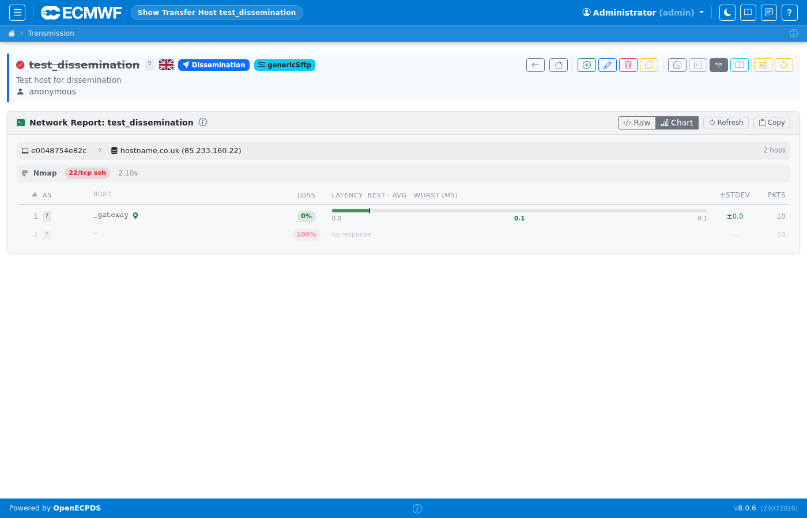

# Transfer Hosts

A **Host** defines the connection parameters for reaching a remote system.
It pairs a hostname/address with a transfer method (protocol) and login credentials.
Hosts are associated with destinations and are selected by the scheduler when a transfer
request needs to be dispatched.

## Host List

The host list shows all configured hosts with their type, associated transfer method, current status, and last-used time. Hosts can be filtered by type (Acquisition, Dissemination, Replication, Backup — the types present in the standalone container). Production deployments may define additional types.

## Host Map View

The host list also provides a **Map** view (toggle with the List/Map buttons in the toolbar). Each host is plotted on a world map at its resolved geographic location, colour-coded by status. This gives a quick visual overview of where your remote endpoints are distributed globally.

## Host Detail

The host detail page shows connection parameters, the associated method, current transfer statistics, and recent transfer history. The Properties editor allows configuring per-host ECtrans options. Use the icon bar to edit, delete, duplicate, or view the network report for this host.

## Host Network Report

The network report page tests connectivity from the Data Mover to the remote host and displays latency, DNS resolution, and port reachability. This is useful for diagnosing connection problems without leaving the UI.

