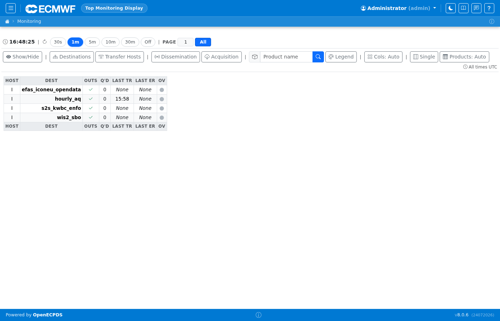

# Monitoring

The Monitoring section provides a real-time overview of the OpenECPDS system.
It is the first page shown after login and the primary operational dashboard.

## Dashboard (admin view)

The dashboard shows all destinations and their current transfer status. Each row represents a destination with colour-coded status indicators for queued, running, done, and failed transfers. The toolbar at the top provides quick access to filtering and refresh controls.

