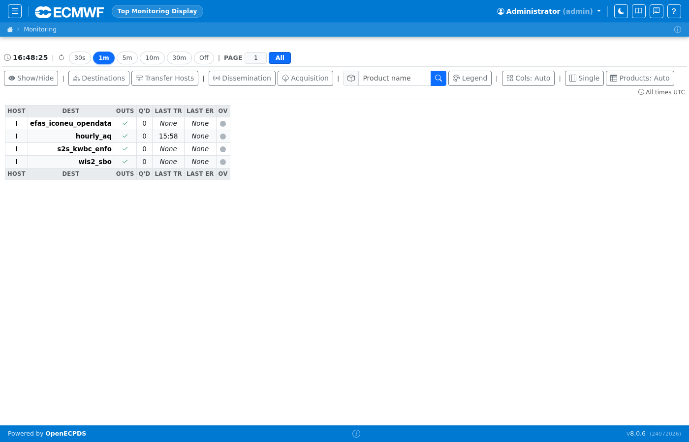

# Monitoring

The Monitoring section provides a real-time overview of the OpenECPDS system.
It is the first page shown after login and the primary operational dashboard.


## Dashboard (admin view)

The dashboard shows all destinations and their current transfer status. Each row represents a destination with colour-coded status indicators for queued, running, done, and failed transfers. The toolbar at the top provides quick access to filtering and refresh controls.





## Live Earth

Nearby Proxy and Target Hosts share a counted marker when their screen positions
are within 28 pixels. The host count is centred inside the marker bubble.
Click the bubble to select a host from the
details pane. Groups split as you zoom in; hosts at identical coordinates remain
individually selectable. A Proxy Host that is also a transfer target is counted
once, with its transfer activity included in its details.
Grouped markers retain status colours: failed transfers take precedence over
active transfers; otherwise a Proxy-only group is violet, dimmed when all members
are disconnected. Groups without transfers in progress that include Target Hosts
use the completed-transfer green.

The scrollable details pane sits beside the globe on desktop, leaving the country
table and KPIs in the globe area. On narrow screens it becomes a bottom sheet,
with the globe above it. Close the pane to restore the full globe area.

Hovering over a Proxy Host's Continental Mover marker shows `HOS_NICKNAME (ID)`,
falling back to the ID when no nickname is configured, with its existing connection
or transfer-status suffix.

**Live Earth** is a real-time 3D globe visualisation of the transfers currently in progress across every Data Mover, available from the Monitoring card on the start page (`/do/monitoring/globe`). An in-page **ⓘ** button next to the page title expands a short built-in explanation of the whole page — the globe itself, its view/filter controls, and every figure shown in the stats panel described below — so this reference doc and the page stay in sync without needing to be read side-by-side. Transfers are aggregated per destination Host: each Host with at least one active transfer is drawn as a single pulsing arc/marker from its origin to that Host, coloured by status (blue while active, red if any of its transfers is failing, green fading out just after completion), with the arc's thickness reflecting the Host's combined throughput and the marker growing slightly with its number of concurrent transfers. A **Host Type filter** (top-right, arrows icon) lets any combination of Dissemination, Acquisition, Replication, Source, Backup and Proxy be shown or hidden independently — Replication/Backup/Proxy Host pushes behave like an ordinary Dissemination push and show as arcs the same way, but are often only relevant when specifically looking for them, since they are usually internal-network/redundancy traffic rather than the final delivery. Clicking a Host marker opens a panel summarising its aggregate activity (active transfer count, protocol(s) in use, total throughput, total bytes transferred, longest-running transfer) together with a per-transfer breakdown table (Data Mover, protocol, rate, bytes, status).

The globe is powered by a lightweight WebSocket feed (`/ws/globe`) pushed from the
Master Server, which aggregates live visualization samples reported periodically
by every Data Mover while at least one globe page is open (or force-enabled).
The continuous byte accounting described below runs independently of these samples.

Live events are identified by transfer, Mover, Host, traffic type and attempt, so
successive replication/dissemination legs and retries do not overwrite one
another. Movers coalesce progress per movement, retain unsent events for at most
60 seconds, and remove only the exact delivered versions after successful
delivery. A newer event arriving during delivery remains queued; transient
delivery/interest-check failures are logged and retried without transfer-thread
network calls. Each Mover queue and Master registry is limited to 20,000
movements; overflow evicts older terminal events first (otherwise the oldest
movement), with a rate-limited warning.

The Master keeps recent DONE/FAILED events visible to all Monitor polls for
15 seconds after their original timestamp, including transfers that finish
between polls. REST relays preserve that timestamp and attempt identity.
Terminal state remains internally for up to 60 seconds to prevent delayed active
updates from reviving finished attempts. On each browser, completion/failure
arcs show for **2.5 seconds from first observation**, then disappear even if
subsequent polls repeat the event. Filtering or switching views does not restart
that interval; terminal events do not contribute to active-transfer counts or
throughput. Visualization delivery is bounded best-effort, not durable history:
old events expire during extended outages and pending state is discarded when
the Master explicitly reports no viewers. Transfer accounting is unaffected.
Replication/Backup/Proxy pushes still report completion/failure only, not
in-progress arcs; the normal 2-second dissemination sampling/delivery,
5-second acquisition progress delivery and 3-second Monitor polling remain unchanged.

Transfers relayed through a ProxyHost (a Continental Data Mover — a Data Mover with no direct RMI connection to the Master Server, reachable only via another Data Mover's REST interface, see [Continental Data Movers](../architecture/continental-data-movers.md)) are included as well: their samples are relayed to the Master Server through that intermediary Data Mover's REST endpoint, exactly like their transfer status and progress updates already are. A Destination associated with a Proxy-type Host has its files replicated from the local Data Movers to that Continental Data Mover first (shown as an arc from the origin to the Proxy Host, under the **Proxy** filter), then disseminated onward from the Continental Data Mover when possible — falling back to a local Data Mover otherwise — shown as a second arc, from the Continental Data Mover to the real target Host, under **Dissemination**. Every currently *enabled* Proxy-type Host gets its own persistent marker (a distinct violet dot) regardless of current traffic, shown dimmed while its Continental Data Mover is not currently connected rather than not shown at all — so a configured-but-offline one stays visible as "known but not currently reachable". For this to work, the Proxy Host's `proxy.root` option must be set to its Continental Data Mover's own `[Login]` `root` value (see [Host Options — `proxy.*`](../concepts/host-options.md#proxy-continental-data-mover-proxy)) — required to tell which Continental Data Mover a given Proxy Host actually points to, since a Continental Data Mover's self-reported identity does not have to match its Proxy Host's own name; with more than one enabled Proxy Host, this must be set on every one of them, or the unconfigured ones simply will not get a marker. A Proxy Host's location on the globe prefers its own stored `HostLocation` (manually entered, or previously auto-resolved and cached — see the [Host Map view](hosts.md#host-map-view)) over a live GeoIP lookup, since `proxy.root`/a Continental Data Mover's root identifier is very often not a resolvable hostname on its own; setting the Host's location manually there is picked up here automatically, typically within a few minutes (the resolved-location cache expires every 5 minutes). Ordinary, directly-connected local Data Movers are not shown as separate markers, since they are considered co-located with the Master Server itself. The map imagery and 3D rendering are provided by a self-hosted copy of [CesiumJS](https://cesium.com/platform/cesiumjs/); no external network access or account/token is required.

A floating stats panel in the bottom-right corner shows active transfers and hosts,
combined throughput, and **24h total**. The latter sums recorded bytes for the
selected Host Types: Dissemination, Acquisition, Replication, Source, Backup and
Proxy. Changing filters updates it immediately, without a database query.
Data Portal uploads and downloads are accounted for separately.

The 24-hour KPI uses **continuous application-stream accounting**, independently
of the viewer-driven samples used for arcs and instantaneous rates.
`[Server] liveTransferMonitoringForceEnabled=yes` is **not required** for this
counter. Every upgraded Mover keeps six fixed-size sets of 1,440 minute buckets.
Bytes from retries and partial failed attempts count when observed at the stream
boundary, rather than being inferred from completed file sizes or progress deltas.
Resume offsets are not added again. Host type determines the bucket, including
replication to Proxy Hosts; onward dissemination is a separate movement.
The rolling window has minute precision (up to one minute shorter than 24 hours).

Transfer threads update memory only: no disk, database or remote calls.
A background scheduler atomically checkpoints the Mover's cumulative buckets,
then sends only changed absolute buckets, every **10 seconds** by default.
The Master merges maxima per producer/minute/type and persists changed type rows
under `SYS_CONFIG` group `ActualTraffic` before acknowledging. Duplicate deliveries,
lost acknowledgements and out-of-order updates do not add bytes twice.
Failed delivery is retried from the retained local cumulative state.
Only checkpointed values are sent, so the Master's acknowledged history cannot
run ahead of the Mover's recovery file. Separate type rows fit the existing TEXT
column; there are at most six changed-row writes per producer per scheduler cycle,
not per transfer. Monitor instances retrieve cached totals in one shared call,
not one database query per browser. Counter arrays are fixed-size per producer;
producer identities survive ordinary restarts. An hourly background sweep removes
expired producer state and its database rows after all its bytes leave the window.
Legacy `liveTransferBytesScheduler` settings and `LiveTransfer` rows no longer
drive this KPI.

Configure each **Mover**, including Continental Movers, as follows:

```ini
[Server]
trafficAccountingFile=/persistent/ecpds/traffic-accounting.json

[Scheduler]
trafficAccounting=10s
trafficAccountingJammedTimeout=5m
```

The default file is `var/traffic-accounting.json`, relative to the Mover's working
directory. Use a unique writable file per Mover on persistent storage outside
content-file garbage collection; mount that directory persistently in containers.
Do not copy the file to another Mover or change the Mover's login root while reusing
it. A missing file starts a new producer identity, preserving earlier Master
history without masking newly collected bytes. A corrupt existing file prevents
Mover startup rather than silently resetting accounting. Local checkpoint/delivery
failures are logged and retried; shutdown attempts a final checkpoint.

!!! warning "Accuracy and deployment"
    Upgrade and restart the Master, **all** Movers (including Continental Movers
    and their REST relays), and Monitor together. Unupgraded Movers do not
    contribute; legacy sample-based history is not mixed into this counter.
    Allow 24 hours of continuous collection for a full window. Keep host clocks
    synchronized: future-minute snapshots are rejected until time catches up.
    A process crash can lose increments after the last successful local checkpoint
    (normally about 10 seconds; longer during disk failures or scheduler delays).
    A connection outage delays the displayed totals; recovery beyond 24 hours
    cannot recover bytes already outside the rolling window.
    Losing the checkpoint file loses any bytes not yet delivered to the Master.
    This is periodic durability, not a power-loss-proof per-I/O journal.

    Standard streams count bytes before input filters/after output filters;
    optimized modules count bytes consumed/emitted at their supplied streams.
    Module-internal filtering, buffering, prefetching and SDK retries that replay
    internal buffers can differ from the observed stream volume.
    A write that partially succeeds then throws cannot expose its partial
    count through Java's OutputStream API. TCP retransmissions and protocol/TLS
    overhead are not counted, nor does a counted write prove remote receipt.
    External get/put handlers bypass these streams and are excluded with an
    explicit warning in the Mover log. Portal publication's local consume-only
    operation and simulated Test-module transfers are excluded; actual Data Portal
    user traffic remains separate.
    A Monitor receiving no authoritative totals displays **N/A**, not a legacy
    sample total presented as reliable accounting.

A second row of that same panel, **Data Portal**, covers the separate world of end-user Data Portal traffic (FTP, HTTP, SFTP, S3, WebDAV) that the transfer arcs above do not — since incoming/outgoing user sessions are not tied to a specific destination Host and so cannot be drawn as an arc. It shows the number of currently open Data Portal sessions across every Data Mover, plus a data-in and a data-out speed-meter computed from a live 5-second rolling average of bytes uploaded/downloaded by those sessions, all refreshed by the same WebSocket feed and requiring no extra configuration. A fourth tile, **Storage**, uses the same semicircular speed-meter style (rather than a literal capacity/percentage gauge) to show the aggregate used/total disk space across every volume of every Data Mover as a percentage — reusing the same cached figures already shown per-Mover on the Data Movers page, so it never triggers extra disk I/O of its own; hovering the tile reveals the exact used/total figures, and it only turns amber/red once the aggregate crosses 75%/90% respectively, as an early warning that some Data Movers may be running low on space.

By default, the globe is centred on the Master Server's own location, auto-detected via a GeoIP lookup of its hostname. If this location is inaccurate or cannot be resolved (for example, when the Master Server runs behind NAT/VPN or in a cloud/datacenter network range), it can be pinned explicitly with a `forced.<ip-or-prefix>` entry in the `[GeoIP]` section of the **Master Server's** `ecmwf.properties` — the same mechanism already used to force the location of any Host (e.g. for the traceroute/Nmap map on a Host's report page), so no separate/duplicate setting is needed. For example:

```ini
[GeoIP]
forced.<master-hostname-or-ip>=51.505,-0.09,Europe,GB,Reading
```

Because the globe's origin is resolved once by the Master Server itself (not by the Monitor plugin), it stays consistent even when several Monitor plugins are connected to the same Master Server.

The base map imagery is the low-resolution "Natural Earth II" imagery bundled with CesiumJS — sharp for a whole-Earth view, but it blurs once zoomed into a country/region, since no extra detail is bundled. Optionally, the Monitor plugin can transparently build and serve a sharper, higher-resolution layer (Natural Earth's 50m-resolution hypsometric/relief/water raster) instead: on the first "Live Earth" page opened after the Monitor starts, it downloads the (public-domain) source raster and tiles it locally — in pure Java, no GDAL or other native dependency required — into a small (a few MB) tile pyramid cached on disk. This happens entirely in the background and never blocks the page: it simply keeps using the bundled low-resolution imagery until the higher-resolution one finishes building, and silently falls back to it again if it can never be built (e.g. no internet access). If it fails (typically because the Monitor server has no internet access at the time), it keeps retrying every 15 minutes indefinitely, so connectivity becoming available only later is still picked up automatically without needing a restart. The cache location defaults to a subdirectory of the JVM's temp directory, and can be pointed at a persistent location (so it survives restarts and isn't rebuilt every time) with a `globeImageryCacheDir` entry in the `[Server]` section of the **Monitor's** `ecmwf.properties`:

```ini
[Server]
globeImageryCacheDir=/var/lib/ecpds/monitor/globe-imagery
```

Building the higher-resolution tile pyramid briefly needs a few hundred MB of heap (to hold the full source raster and the largest resized zoom level at once), on top of whatever the Monitor plugin otherwise uses. To avoid this optional enhancement ever destabilising a memory-constrained deployment (e.g. the standalone all-in-one image's default 512MB heap per service), it is automatically skipped — falling back to the bundled low-resolution imagery, with a one-off log message — if the JVM's max heap is below a configurable threshold (1024MB by default), set via `globeImageryMinHeapMB` in the same `[Server]` section:

```ini
[Server]
globeImageryMinHeapMB=1024
```

Country and major city names can similarly be shown on the globe, using the same lazy/background/no-account approach: the Monitor plugin downloads Natural Earth's small (public-domain) country boundary and populated-place datasets on first use and converts them into a compact labels file, cached on disk (a few tens of KB). The default whole-globe view shows no names at all to stay uncluttered; country names join in first as the view zooms in a little, then city names join in even later as it zooms in further still (largest cities first, progressively smaller/less populated ones as it gets closer) - the same progressive-reveal technique used by most web map providers, shown as bold, uppercase, amber-bordered pills for countries versus plainer grey pills for cities so the two kinds of labels are easy to tell apart at a glance. Like the imagery layer, this never blocks the page — labels simply appear once (if ever) the background download finishes — and retries indefinitely every 15 minutes if it fails. They are hidden by default; a small tag icon next to the fullscreen button opens a dropdown with independent "Country names" / "Town names" switches, so each user can show either, both, or neither, remembered separately on their browser between visits. Its cache location can likewise be pointed at a persistent path with a `globeLabelsCacheDir` entry in the same `[Server]` section:

```ini
[Server]
globeLabelsCacheDir=/var/lib/ecpds/monitor/globe-labels
```


## System Topology

**System Topology** is a live node/edge diagram of the OpenECPDS deployment itself, available from the Monitoring card on the start page (`/do/monitoring/topology`), right next to Live Earth. Where Live Earth visualises data in transit, System Topology visualises the infrastructure that moves it: the Master Server, the database it relies on, every registered Data Mover, and the Monitor instance you are currently using — grouped visually into dashed boxes by host, so it is easy to see at a glance which components share a machine (or container) and which run on separate ones, whatever your specific deployment layout happens to be. An in-page **ⓘ** button next to the title explains the diagram in full, including every symbol and colour used.

Components are drawn as coloured boxes (blue for the Master, cyan for this Monitor, purple for the database, green for an up Data Mover, grey/dashed for a down one), connected by labelled arrows showing the direction of each control connection (Monitor → Master over RMI, Master → Database over JDBC, Master → each Data Mover, labelled with its registration port). Clicking any component opens a details panel with its host, port(s) and status; for the Master and this Monitor, every network plugin currently loaded in that JVM (e.g. `ecpds`, `ftp`, `http`) is listed together with its live port and status, read directly from that JVM's own plugin container — no extra configuration needed. A `15s`/`30s`/`1m`/`5m`/`Off` pill selector (defaulting to `30s`, remembered per-browser) controls how often the diagram re-fetches itself in the background with no page reload; a manual refresh button is also available regardless of that setting. The diagram follows the page's light/dark theme like the rest of the Monitor UI.

All the data behind the diagram is fetched by the Monitor from the Master over the same RMI management interface already used elsewhere in the UI (e.g. for the Data Movers page) — the Monitor never contacts a Data Mover directly. Figures shown for a Data Mover (host, port, enabled flag, up/down state, plus its live per-plugin port list when connected) are all obtained by the Master itself: the up/down state reuses the same per-minute availability snapshots (`MOVER_AVAILABILITY_SNAPSHOT` table) already powering the uptime history on the Data Movers page, while the plugin/port list is read by the Master over its existing control connection to that Data Mover — the same connection it already uses for every other management operation, so this page adds no extra channel and no meaningful extra load. One thing is not yet shown, as a first iteration: a list of every other connected Monitor instance if more than one is deployed — this would need new dedicated RMI plumbing between the Master and its Monitors and is left for a future iteration.

## Related

- [Product Descriptions](../administration/product-descriptions.md)
- [System Messages](../administration/system-messages.md)
- [Data Ownership & Catalogue](../architecture/data-ownership-and-catalogue.md)
- [REST API — Monitoring](../rest-api.md#monitoring)
- [Data Files & Infrastructure](data-files.md)
- [Transfer History](transfer-history.md)
