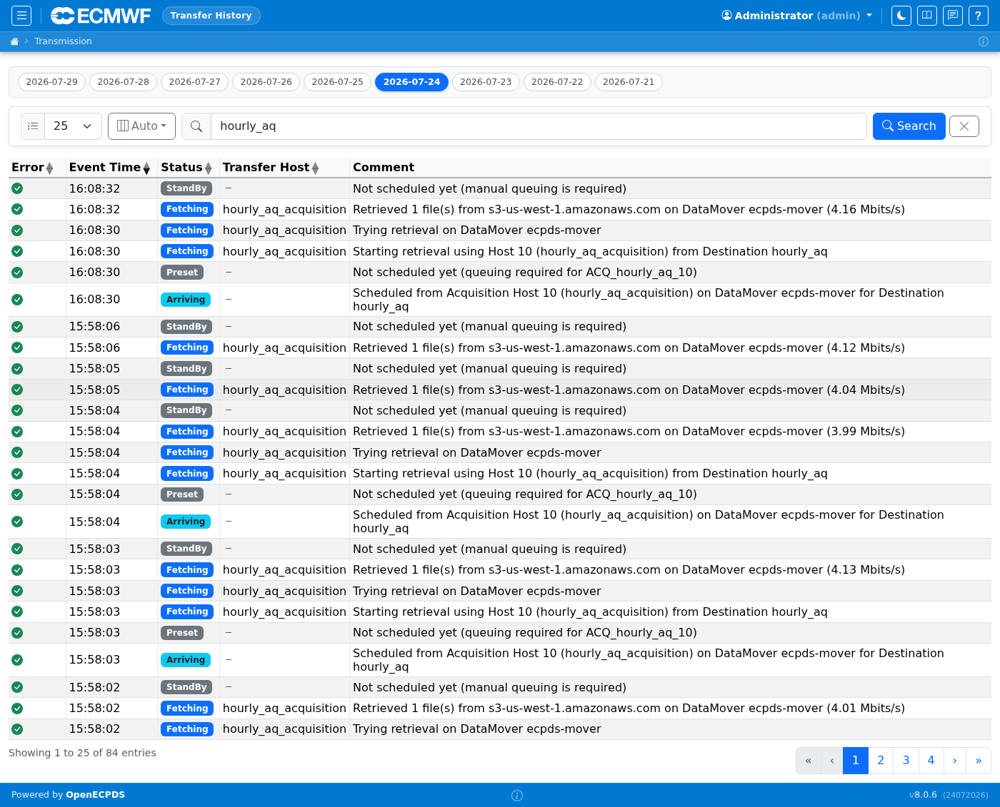

# Transfer History

The Transfer History section provides a searchable, filterable log of all
transfer requests that have been processed by OpenECPDS. It covers both successful
and failed transfers across all destinations.

## Transfer History

The history page lists completed transfer requests with their destination, target filename, size, duration, status, and Data Mover. Use the filters at the top to narrow by date range, destination, or status. Click a row to see the full transfer detail including error messages for failures. The screenshot below shows transfers for the `hourly_aq` destination on 2026-07-24.

