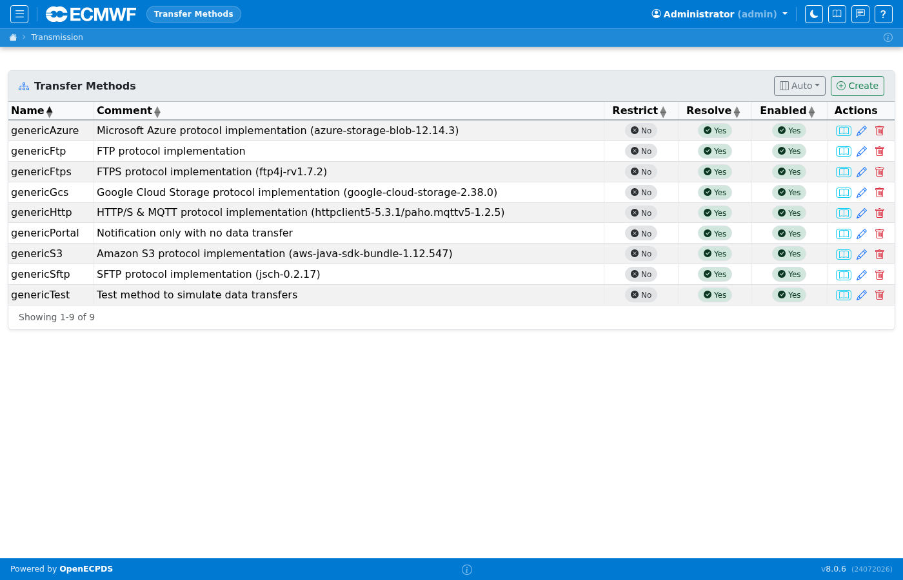
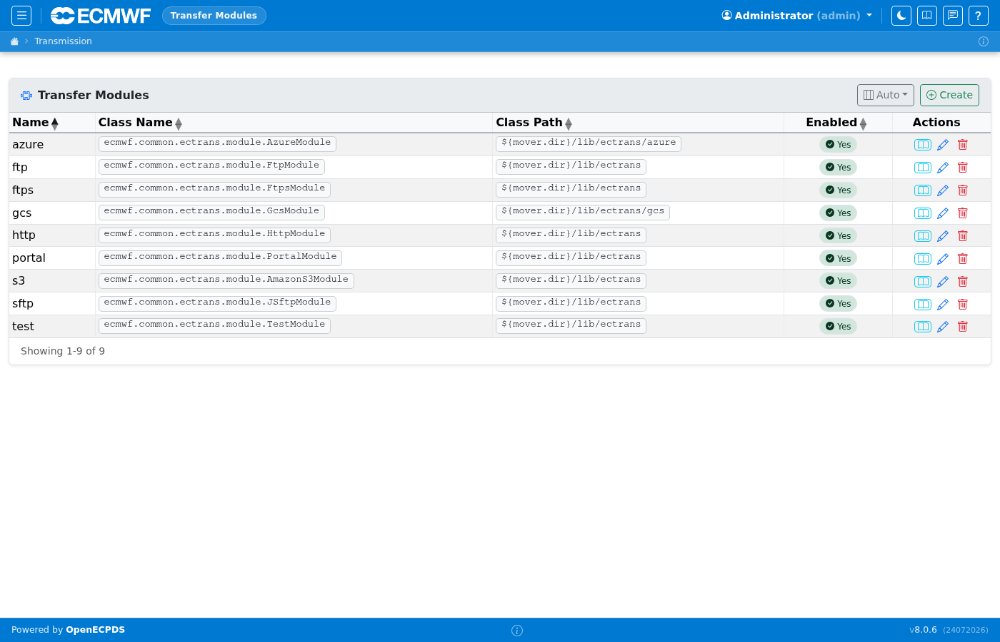

# Transfer Methods & Modules

Transfer methods and modules define the protocol layer used for outgoing
connections. A **module** is the Java implementation of a protocol adapter; a
**method** links a named configuration to a specific module.

## Transfer Methods

Lists all defined transfer methods. Each method has a name (e.g. `SFTP-password`), an associated module (e.g. `SFTP`), and default properties. Hosts reference a method to determine how they connect.

## Transfer Modules

Lists the installed ECtrans modules (FTP, FTPS, SFTP, HTTP, S3, Azure, GCS, ECauth, Portal, Test). Each entry shows the module class name and available configuration properties.

