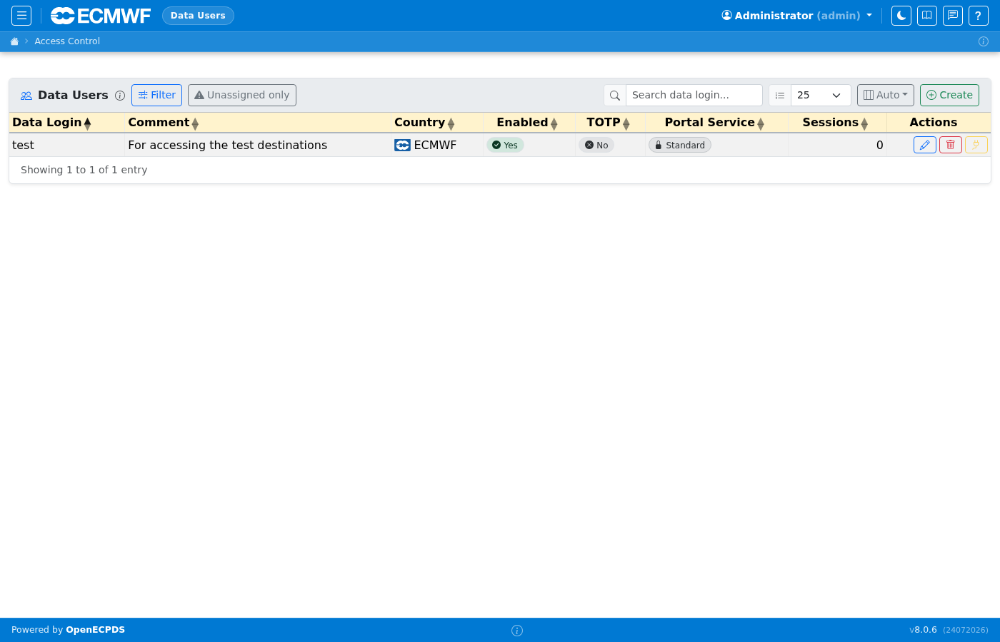
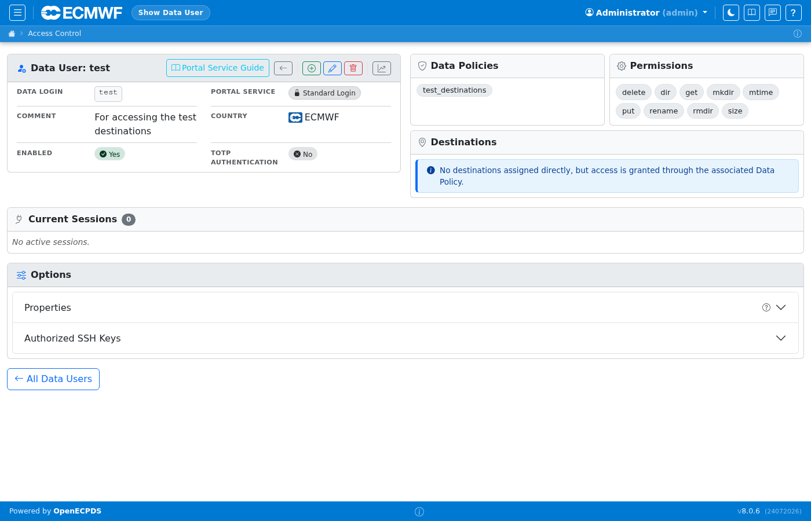
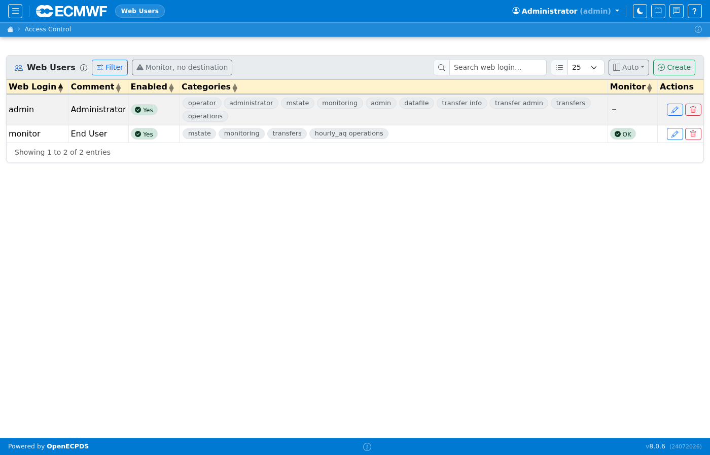
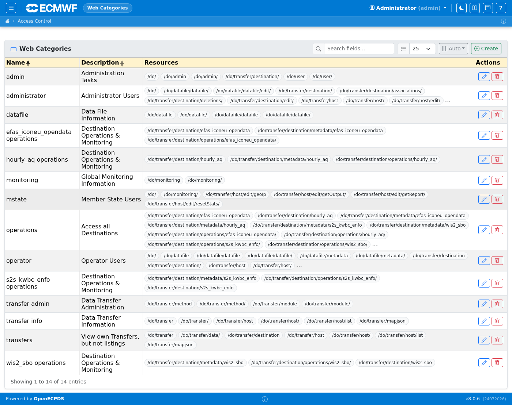
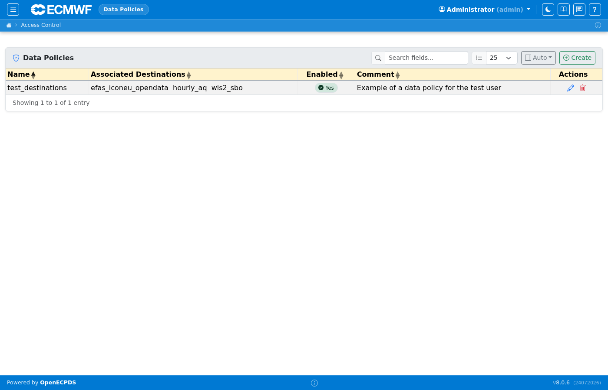
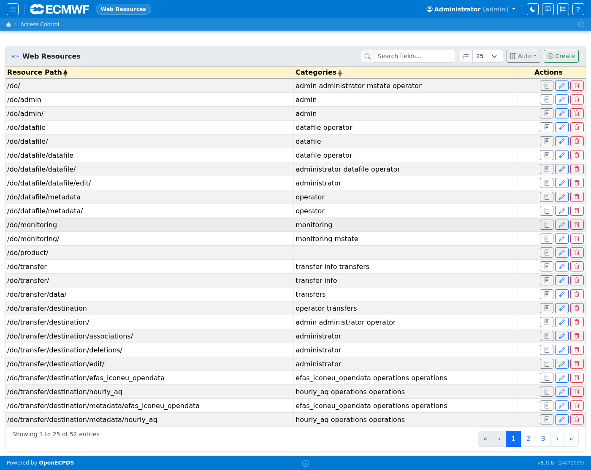

# Users & Access Control

OpenECPDS has two distinct user types:

- **Data Users** (`IncomingUser`) — external users who access data through the Data Portal
- **Web Users** — operators and administrators who access the monitoring interface

Access is further controlled by **Categories**, **Policies**, and **Resources**.

## Data Users

Lists all Data Portal users. Each user has a login, associated destinations (their accessible data), a portal service mode (Standard Login, Open Access, or Self-Service Registration), and optional quotas and geo-blocking rules. Click a user to edit their properties and destination associations.

## Data User Detail

The detail page shows the user's current portal settings, associated destinations, connection history, and subscriber list (for MQTT notification subscriptions). The Properties editor accepts `portal.*` options to configure quotas, CORS, branding, and path permissions.

## Web Users

Lists all monitoring interface users. Each user belongs to one or more categories that determine which destinations they can see and which management actions they can perform.

## Categories

Categories are the primary access-control mechanism for Web Users. A category grants access to a set of destinations and a set of resources (URL paths). Users assigned to a category inherit all its permissions.

## Policies

Policies group destinations for assignment to Data Portal users. Instead of assigning destinations one by one, an operator creates a policy and assigns it to a Data User.

## Resources

Resources map URL path patterns to access-control entries. They are assigned to categories to grant Web Users access to specific monitoring pages or management actions.

