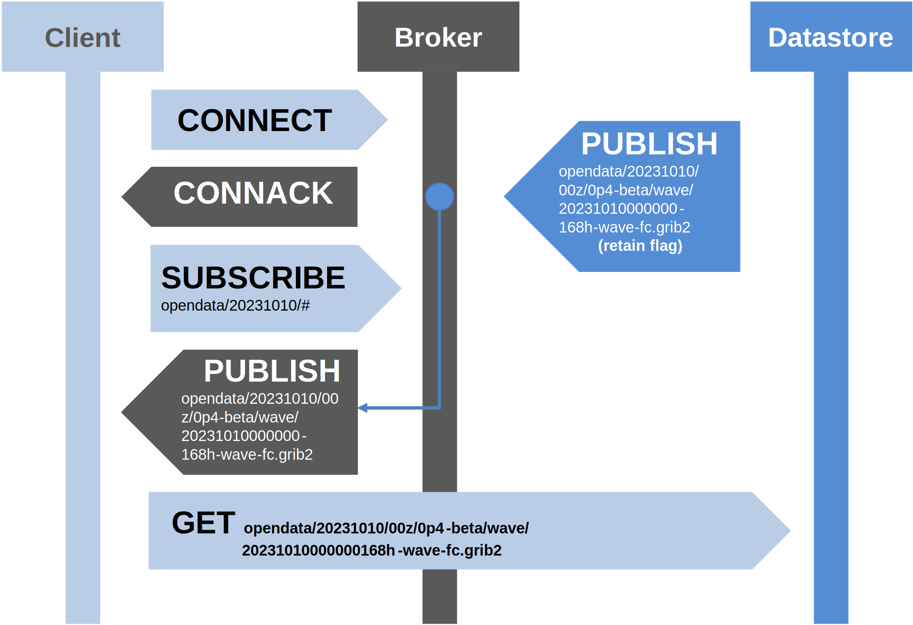

# MQTT Integration & Implementation Details

This page collects configuration, access control, and implementation details for the
OpenECPDS MQTT subsystem.

## Configuration and access control

The MQTT configuration can be fine-tuned at the **destination level**, allowing for
greater flexibility in how notifications are handled. Additionally, **access control**
mechanisms can be configured at the **data user** level, ensuring secure and controlled
distribution of messages.

For the MQTT client used in acquisition, dedicated MQTT configuration parameters allow
fine-tuning of protocol options such as connection settings, message handling behaviour,
and retry mechanisms. These are exposed through the
[HTTP/HTTPS Transfer Module](../transfer-modules/http.md).

## Implementation details

A few key points about the MQTT Broker and Client:

{ width="550" }

- **Industry Standard Compliance** — MQTT is the de facto standard for IoT communication.
  The OpenECPDS Broker and Client are fully compliant with all three MQTT specifications,
  ensuring that OpenECPDS is compatible with all MQTT brokers and clients available on the
  market.
- **Integration with OpenECPDS** — The Broker and Client are embedded within OpenECPDS and
  are based on the
  [Community Edition of the HiveMQ Broker](https://github.com/hivemq/hivemq-community-edition)
  and the [Eclipse Paho Client](https://github.com/eclipse-paho/paho.mqtt.java).

## Connecting to the broker (default setup)

In the default development setup, the embedded MQTT Broker is available at
`mqtt://127.0.0.1:4883` with the credentials `test/test2021` (see
[First Run](../getting-started/first-run.md)).

## Related

- [MQTT Overview](mqtt-overview.md)
- [Real-Time Data Dissemination with MQTT Broker](mqtt-dissemination.md)
- [Automated Data Acquisition with MQTT Client](mqtt-acquisition.md)
- [WMO WIS2 Integration](wmo-wis2.md)
