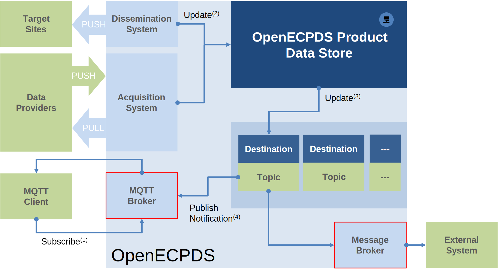

# MQTT Notification System

OpenECPDS integrates both an **MQTT Broker** and an **MQTT Client** to enhance data
dissemination and acquisition workflows.

- **The MQTT Broker** — enables users of the dissemination service to subscribe to
  notifications, ensuring they are alerted as soon as new products become available in the
  Data Store. This allows for efficient and automated downstream processing.
- **The MQTT Client** — facilitates data acquisition by registering with external data
  providers. When new data becomes available, the client processes the received
  notifications and automatically retrieves the data into the Data Store, ensuring
  seamless integration with external sources.

{ width="600" }

By supporting MQTT, OpenECPDS improves real-time data distribution and acquisition,
enhancing overall system efficiency and responsiveness. Notifications are sent instantly
when new data becomes available, allowing for immediate processing and reducing delays.

## Understanding MQTT concepts using a filesystem analogy

Let's use a filesystem analogy to explain MQTT topics, wildcards, and the retain flag.

Imagine a directory structure where you can register interest in files stored within a
specific directory, or even within that directory and all its subdirectories. To do this,
you specify the full path of the directory. MQTT works similarly, but instead of file
paths, we use **topics**. Topics allow clients to subscribe to messages, and they can
include **wildcards** to match multiple levels:

- `+` (single-level wildcard): Matches any one directory level.
- `#` (multi-level wildcard): Matches everything from that point downward in the
  hierarchy.

Instead of files, MQTT deals with **notifications**, each carrying a **payload**. This
payload may contain the actual data (like the file itself) or a link (`href`) that allows
the subscriber to retrieve the content elsewhere. These notifications are published by a
data provider that wants to share information, and each one is sent to a specific topic.

Now, let's go back to our filesystem analogy. If a file is saved again in the same
directory with the same name, the previous version is overwritten and lost. There is no
way to retrieve the old file unless:

- The directory name includes a timestamp or version number.
- The file itself has a unique name with a timestamp or version number.

With MQTT, the same principle applies: if the topic name includes a timestamp or unique
identifier, each notification remains distinct, allowing subscribers to access different
versions.

## Retained Messages in MQTT

A key feature of MQTT is the **retain flag**. When a message is published with this flag
enabled, it remains available for new subscribers, even if they connect later. This
ensures that when a subscriber reconnects, it immediately receives the most recent
retained message for that topic.

However, retained messages do **not** provide a history log; only the most recent
retained message is stored. If a subscriber disconnects and multiple messages are
published in the meantime, it will not receive all missed messages upon reconnecting. For
true message history, persistent sessions with QoS 1 or QoS 2 should be used instead.

That said, if a topic includes a timestamp or unique identifier, it can function as a form
of history log. Each message is stored under a distinct topic (e.g.,
`forecasts/data/20250320T1200`), allowing clients to subscribe to specific time-based
patterns to retrieve past messages.

Additionally, **MQTT 5.0** introduces **message expiration**. Once a message expires, it
is automatically deleted from the broker, ensuring outdated information is not delivered.

## Related

- [Real-Time Data Dissemination with MQTT Broker](mqtt-dissemination.md)
- [Automated Data Acquisition with MQTT Client](mqtt-acquisition.md)
- [WMO WIS2 Integration](wmo-wis2.md)
- [MQTT Integration & Implementation Details](implementation.md)
