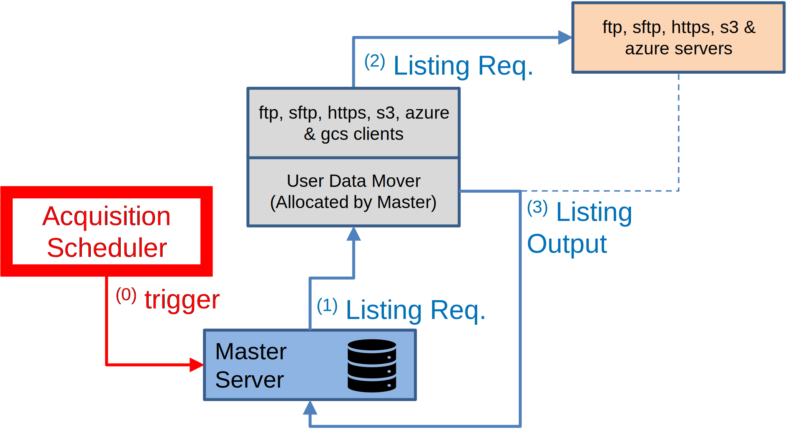
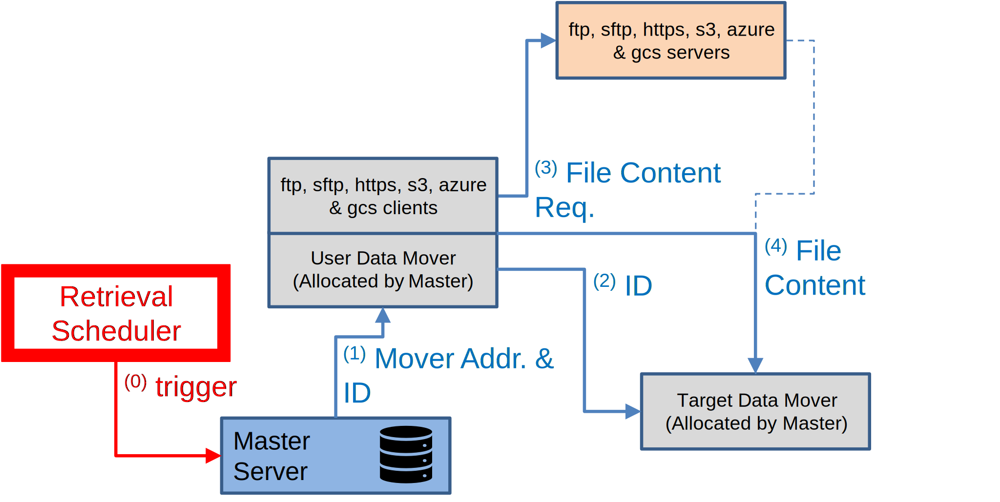

# Acquisition

The **Acquisition System** is designed to connect to data providers to first discover the
available data, then select the relevant data, and finally retrieve it in a second phase.
Each phase occurs asynchronously: first, the **Discovery** phase, followed by the
**Retrieval** phase.

Acquisition is configured through [acquisition hosts](../concepts/entities.md#dissemination-and-acquisition-hosts)
attached to a [destination](../concepts/entities.md#destinations-and-aliases). The
selection of files at the source is controlled by the
[Acquisition Directory](../host-directory/acquisition.md) field.

## Discovery

The **Acquisition Scheduler** checks each acquisition host and triggers a discovery of
remote files based on a timeline configured at the destination and host level.

{ width="450" }

When a discovery is triggered, the following steps occur:

1. The Master allocates a Data Mover and connects to it to initiate a connection to the
   remote host and request a file listing.
2. The Data Mover selects the appropriate [transfer module](../transfer-modules/index.md)
   based on the protocol defined in the host configuration, and using the selected
   module, connects to the remote site and issues a listing request.
3. The listing output is sent back to the Master Server, which registers the selected
   data transfers.

## Retrieval

The **Retrieval Scheduler** processes all files registered in OpenECPDS during the
Discovery phase and triggers the retrieval of their content from the Data Providers.

{ width="450" }

When a retrieval is triggered, the following steps occur:

1. The **Master Server** allocates a **User Data Mover** to connect to the remote site
   and forwards the **Data File ID** and the address of the **Target Data Mover**, which
   was allocated for storing the data file.
2. The **User Data Mover** connects to the **Target Data Mover**, forwards the Data File
   ID, and requests a stream for storing the file's content.
3. The User Data Mover locates the transfer module configured for the remote site,
   initiates a connection, and requests the file content.
4. The file content is streamed from the remote site to the Target Data Mover.

## Automated acquisition via MQTT

OpenECPDS includes an embedded MQTT client within its HTTP transfer module, enabling
automated acquisition triggered by real-time notifications from remote providers. See
[Automated Data Acquisition with MQTT Client](../notifications/mqtt-acquisition.md).

## Related

- [Dissemination](dissemination.md)
- [Acquisition Directory](../host-directory/acquisition.md)
- [RET event fields](../event-logging/ret-fields.md) — retrieval records
- [HTTP/HTTPS Transfer Module](../transfer-modules/http.md)
