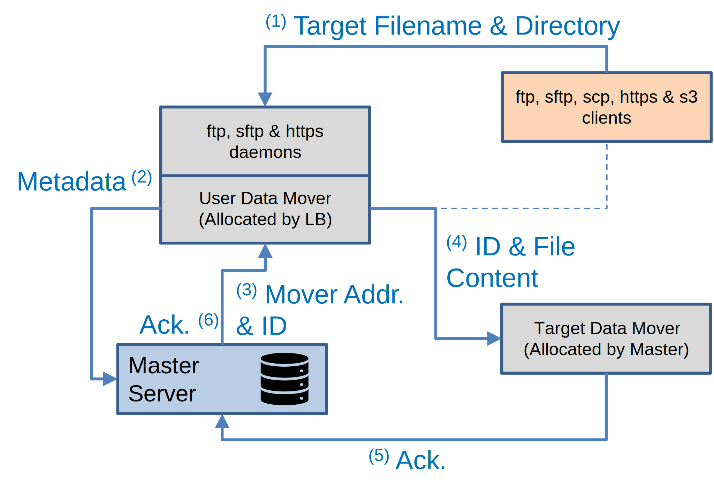
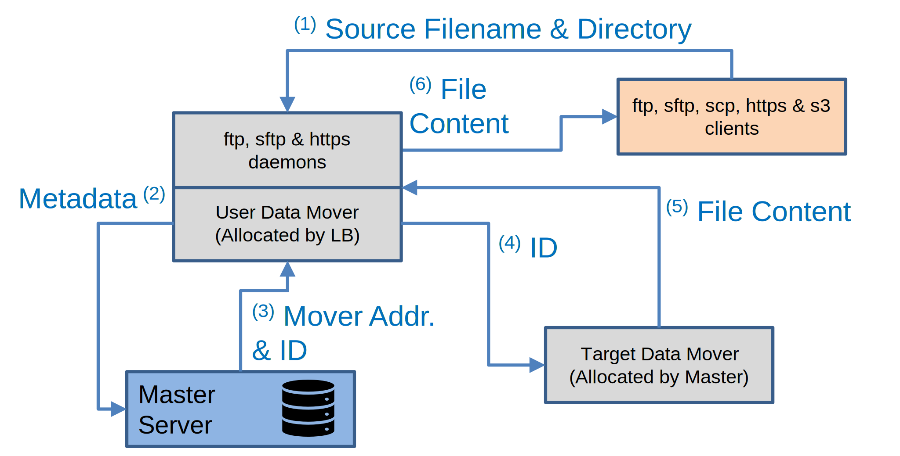

# Data Portal

The `ftp`, `sftp`, `scp`, `s3`, and `wget`/`curl` command-line tools can be used to
transfer data to and from OpenECPDS. These standard tools facilitate connections and file
transfers via the OpenECPDS [Data Portal](../architecture/components.md#data-portal). This
page examines the workflow for uploading and downloading files using these methods.

## Data Mover roles

In these workflows:

- The **User Data Mover** is the server where the customer connects using FTP, SFTP, SCP,
  HTTPS or S3 to upload or download a file.
- The **Target Data Mover** is the server where the file is stored.

In a multi-mover setup:

- The **User Data Mover** is selected by a Load Balancer, which distributes requests
  across available Data Movers.
- The **Target Data Mover** is allocated by the [Master Server](../architecture/components.md#master-server),
  considering available storage and system load.

Thus, the User Data Mover and Target Data Mover may not be the same.

## Synchronous Push

{ width="450" }

Workflow steps:

1. The client connects to the **User Data Mover** via FTP, SFTP, SCP, HTTPS or S3 and
   uploads a file.
2. The User Data Mover extracts the target path, filename, and metadata (e.g., user ID)
   and sends a request to the Master Server.
3. The Master Server determines the target destination based on the filename and user
   configuration. It then assigns a DataFileID and selects a **Target Data Mover**.
4. The User Data Mover connects to the Target Data Mover and streams the file directly
   from the client.
5. Once the transfer is complete, the Target Data Mover sends an acknowledgment to the
   Master Server.
6. The Master Server notifies the User Data Mover, which then closes the connection with
   the client.

## Synchronous Pull

{ width="450" }

Workflow steps:

1. The client connects to the **User Data Mover** via FTP, SFTP, SCP, HTTPS, or S3 and
   downloads a file.
2. The User Data Mover extracts the target path, filename, and metadata (e.g., user ID)
   and sends a request to the Master Server.
3. The Master Server determines the target destination and DataFileID based on the
   filename and user configuration, allowing it to locate the **Target Data Mover** where
   the data file is stored.
4. The User Data Mover connects to the Target Data Mover and requests the data file using
   its DataFileID.
5. The Target Data Mover streams the file content to the User Data Mover.
6. The User Data Mover streams the file content directly to the client.

## Related

- [ECPDS command-line Tool](ecpds-cli.md)
- [Portal Transfer Module](../transfer-modules/portal.md)
- [INH event fields](../event-logging/inh-fields.md) — incoming history records
- [DEA event fields](../event-logging/dea-fields.md) — denied access records
