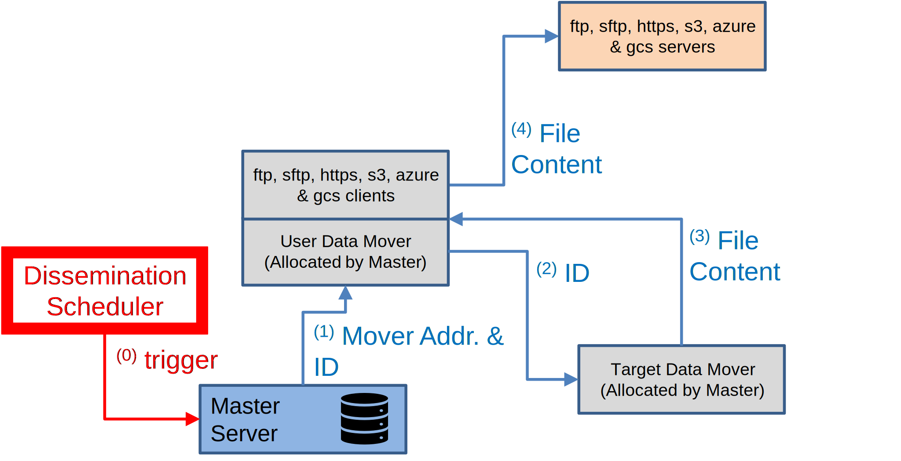

# Dissemination

After a file has been registered and stored in OpenECPDS — whether it was submitted and
pushed via the [`ecpds` command](ecpds-cli.md), uploaded through the
[Data Portal](data-portal.md), or acquired via the [Acquisition System](acquisition.md) —
it can then be disseminated to a remote site via the **Dissemination System**.

## Dissemination workflow

{ width="450" }

When a request for disseminating a file is triggered, the following steps occur:

1. The **Master Server** allocates a **User Data Mover** to handle the dissemination of
   the selected file, providing the **Data File ID** and the address of the **Target Data
   Mover** where the file is stored.
2. The **User Data Mover** forwards a request to the **Target Data Mover** containing the
   Data File ID.
3. The **Target Data Mover** locates the file and returns a stream to allow the User Data
   Mover to download its content.
4. The **User Data Mover** connects to the remote site using the configured
   [transfer module](../transfer-modules/index.md) and uploads the file's content
   directly from the Target Data Mover.

## Scheduling, failover & retries

Dissemination is driven by the destination's **transfer scheduler**, which controls
priorities, parallel transmissions, and a fully customisable retry mechanism. When a
primary host is unavailable, the [Failover Mechanism](../architecture/failover.md)
switches to fall-back hosts. The statuses a transfer passes through are described in the
[Lifecycle of a Data Transfer](../architecture/data-transfer-lifecycle.md).

For geographically distributed delivery, see
[Continental Data Movers](../architecture/continental-data-movers.md).

## Related

- [Acquisition](acquisition.md)
- [Dissemination Directory](../host-directory/dissemination.md)
- [UPH event fields](../event-logging/uph-fields.md) — upload history records
- [ERR event fields](../event-logging/err-fields.md) — dissemination errors
