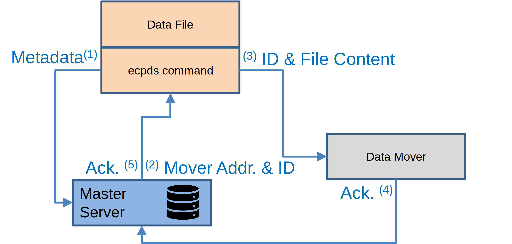
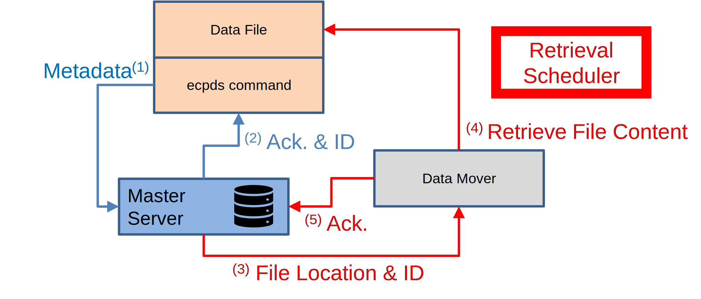
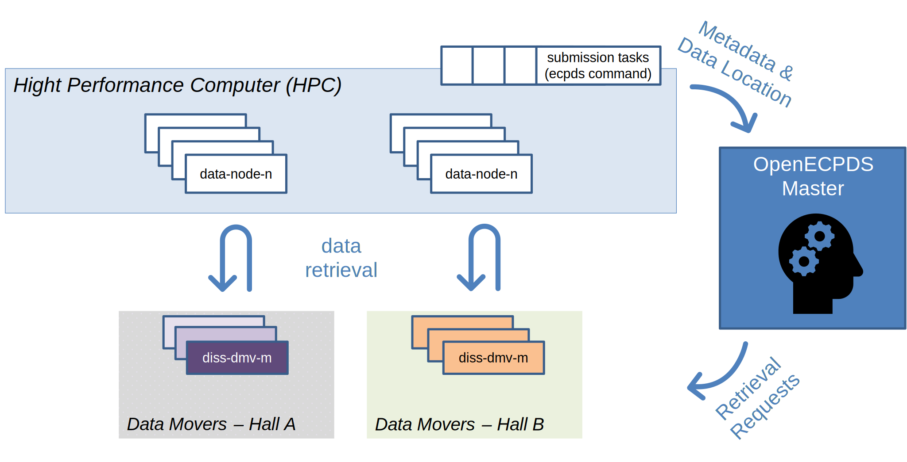

# ECPDS command-line Tool

The `ecpds` command-line is designed to submit local data files to a specified
[destination](../concepts/entities.md#destinations-and-aliases) on OpenECPDS. It provides
several options to fine-tune transfer requests, monitor transfer statuses, and manage
scheduled transfers. This page examines the workflow for submitting a local file in both
synchronous and asynchronous modes.

## Synchronous Push

This is the default mode for submitting data files to OpenECPDS. It allows both file
transfer and metadata registration in a single execution of the `ecpds` command-line.
Once OpenECPDS has successfully processed the file, it returns a **Data File ID**, which
can be used to track the file via the OpenECPDS monitoring interface. The returned Data
File ID guarantees that the file has been correctly registered and stored in the Data
Store.

{ width="450" }

Workflow steps:

1. The `ecpds` command connects to the [Master Server](../architecture/components.md#master-server),
   authenticates, and sends metadata (e.g., source hostname, user ID, filename, location,
   size).
2. The Master Server allocates a **Data File ID** for the file and assigns a
   [Data Mover](../architecture/components.md#mover-server-data-mover) to receive its
   content. It then returns the hostname and port of the selected Data Mover, along with
   the Data File ID, to the `ecpds` command.
3. The `ecpds` command connects to the Data Mover using the provided hostname and port
   and transfers the file content.
4. The Data Mover sends an acknowledgment of file reception to the Master Server.
5. The Master Server sends the acknowledgment to the `ecpds` command, including the Data
   File ID.

## Asynchronous Push

The asynchronous mode is recommended when handling a large number of data files or high
data volumes. In the first phase, metadata — including the file location and the source
host for retrieval — is registered in OpenECPDS. In the second phase, OpenECPDS initiates
the file downloads from the Data Movers. Typically, multiple files are registered at
once, organised into groups, and retrieved in parallel streams managed by OpenECPDS. This
approach enhances performance by using a load-balancing mechanism to distribute the
workload across Data Movers and source hosts.

{ width="450" }

### Submitting the request

1. The `ecpds` command connects to the Master Server, authenticates, and sends metadata
   (e.g., source hostname, user ID, filename, location, size).
2. The Master Server allocates a **Data File ID** for the file and assigns a Data Mover
   to receive its content. It then sends an acknowledgment to the `ecpds` command,
   including the Data File ID.

### Retrieving the file content

Triggered by the **Transfer Scheduler**:

1. The Master Server contacts the allocated Data Mover and requests that the data file be
   retrieved.
2. Using the provided metadata, the Data Mover connects to the source host with the user
   ID and retrieves the content of the file based on its filename and location.
3. After the retrieval is successfully completed, the Data Mover sends an acknowledgment
   to the Master Server.

After submitting the request with the `ecpds` command, the status can be checked using
the `ecpds` command and the Data File ID to track the data file retrieval. Tracking can
also be done through the OpenECPDS monitoring interface.

## Retrieval mechanism at ECMWF

At ECMWF, the forecast is produced and stored on the supercomputer (HPC) across multiple
data nodes. Some submission tasks register these files with the OpenECPDS Master. The
Master Server then records the requests, and the **Transfer Scheduler** asynchronously
load-balances the data file retrievals across multiple Data Movers in each hall. This
enables high parallelism between the HPC data nodes and the OpenECPDS Data Movers,
maximising the use of the local network. The maximum number of simultaneous data
retrievals is configurable in OpenECPDS.

{ width="500" }

Data submission requests to OpenECPDS are grouped under a specific name. At the end of a
batch submission, an `ecpds` command is executed to track the retrieval of all files in
the group. Once all files have been successfully retrieved, the `ecpds` command returns.

## Related

- [Data Portal](data-portal.md)
- [Dissemination](dissemination.md)
- [Lifecycle of a Data Transfer](../architecture/data-transfer-lifecycle.md)
- [PRS event fields](../event-logging/prs-fields.md) — product status updates from `ecpds`
