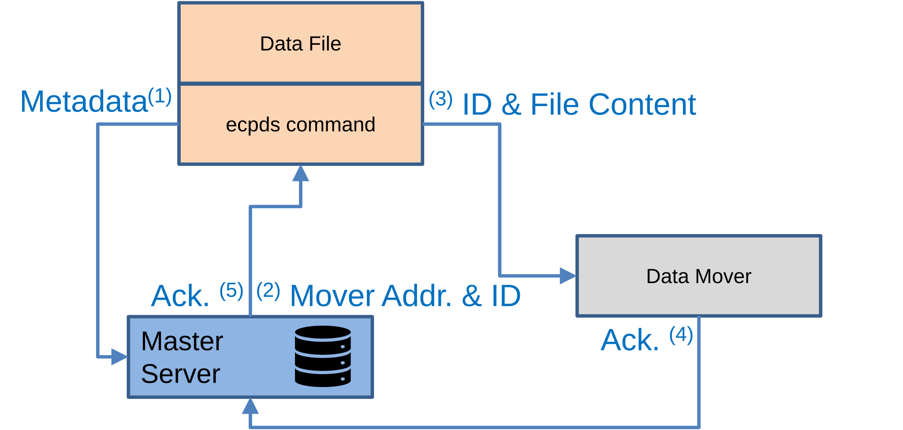
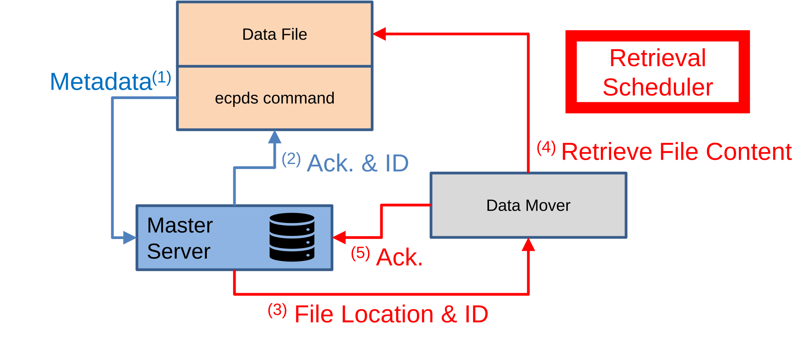
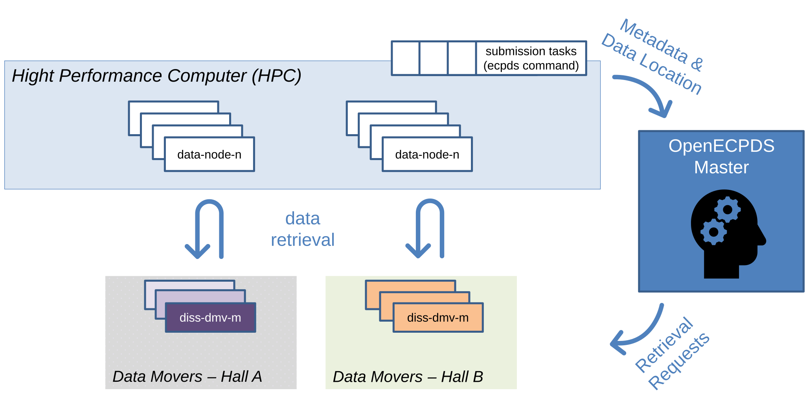

# ECPDS command-line Tool

The `ecpds` command-line is designed to submit local data files to a specified
[destination](../concepts/entities.md#destinations-and-aliases) on OpenECPDS. It provides
several options to fine-tune transfer requests, monitor transfer statuses, and manage
scheduled transfers. This page examines the workflow for submitting a local file in both
synchronous and asynchronous modes.

## Synchronous Push

This is the default mode for submitting data files to OpenECPDS. It allows both file
transfer and metadata registration in a single execution of the `ecpds` command-line.
Once OpenECPDS has successfully processed the file, it returns a **Data File ID**, which
can be used to track the file via the OpenECPDS monitoring interface. The returned Data
File ID guarantees that the file has been correctly registered and stored in the Data
Store.

{ width="450" }

Workflow steps:

1. The `ecpds` command connects to the [Master Server](../architecture/components.md#master-server),
   authenticates, and sends metadata (e.g., source hostname, user ID, filename, location,
   size).
2. The Master Server allocates a **Data File ID** for the file and assigns a
   [Data Mover](../architecture/components.md#mover-server-data-mover) to receive its
   content. It then returns the hostname and port of the selected Data Mover, along with
   the Data File ID, to the `ecpds` command.
3. The `ecpds` command connects to the Data Mover using the provided hostname and port
   and transfers the file content.
4. The Data Mover sends an acknowledgment of file reception to the Master Server.
5. The Master Server sends the acknowledgment to the `ecpds` command, including the Data
   File ID.

## Asynchronous Push

The asynchronous mode is recommended when handling a large number of data files or high
data volumes. In the first phase, metadata — including the file location and the source
host for retrieval — is registered in OpenECPDS. In the second phase, OpenECPDS initiates
the file downloads from the Data Movers. Typically, multiple files are registered at
once, organised into groups, and retrieved in parallel streams managed by OpenECPDS. This
approach enhances performance by using a load-balancing mechanism to distribute the
workload across Data Movers and source hosts.

{ width="450" }

### Submitting the request

1. The `ecpds` command connects to the Master Server, authenticates, and sends metadata
   (e.g., source hostname, user ID, filename, location, size).
2. The Master Server allocates a **Data File ID** for the file and assigns a Data Mover
   to receive its content. It then sends an acknowledgment to the `ecpds` command,
   including the Data File ID.

### Retrieving the file content

Triggered by the **Transfer Scheduler**:

1. The Master Server contacts the allocated Data Mover and requests that the data file be
   retrieved.
2. Using the provided metadata, the Data Mover connects to the source host with the user
   ID and retrieves the content of the file based on its filename and location.
3. After the retrieval is successfully completed, the Data Mover sends an acknowledgment
   to the Master Server.

After submitting the request with the `ecpds` command, the status can be checked using
the `ecpds` command and the Data File ID to track the data file retrieval. Tracking can
also be done through the OpenECPDS monitoring interface.

## Retrieval mechanism at ECMWF

At ECMWF, the forecast is produced and stored on the supercomputer (HPC) across multiple
data nodes. Some submission tasks register these files with the OpenECPDS Master. The
Master Server then records the requests, and the **Transfer Scheduler** asynchronously
load-balances the data file retrievals across multiple Data Movers in each hall. This
enables high parallelism between the HPC data nodes and the OpenECPDS Data Movers,
maximising the use of the local network. The maximum number of simultaneous data
retrievals is configurable in OpenECPDS.

{ width="500" }

Data submission requests to OpenECPDS are grouped under a specific name. At the end of a
batch submission, an `ecpds` command is executed to track the retrieval of all files in
the group. Once all files have been successfully retrieved, the `ecpds` command returns.

## Authentication

The `ecpds` CLI supports two authentication modes.

### IncomingUser authentication (recommended)

Use the `-user` and `-pass` options to authenticate as an [IncomingUser](../concepts/entities.md#incoming-users)
(also called a *data user*). The server:

1. Validates the credentials against the OpenECPDS user database.
2. Checks that the user is allowed to write to the requested **destination**.
3. Checks that the user has the required **permission** for the target path, applying any
   path-regex filters configured in the user's properties:
    - **`put`** permission for a normal submission or requeue (`-source`).
    - **`delete`** permission when purging a DataFile (`-purge`).

```bash
ecpds \
  -echost master.example.com \
  -user mylogin -pass mypassword \
  -destination MY_DESTINATION \
  -source /path/to/myfile.dat
```

This mode does **not** require a privileged (< 1024) source port, making it suitable for
use from containers, CI pipelines, or any unprivileged environment.

!!! warning "Password security"
    Passing a password directly on the command line may expose it in shell history or
    process listings. Consider setting it via an environment variable or reading from a
    secrets manager and passing it programmatically.

### ECUSER / privileged-port authentication (legacy)

When `-user`/`-pass` are **not** provided, the CLI falls back to the legacy mode: the
server identifies the caller by their Unix username (obtained from `getpwuid`) and
verifies that the connection originated from a **privileged port** (< 1024). This mode
is only available to privileged processes (typically those running as `root` on a trusted
host). It is the original ECMWF production mode and requires no password.

```bash
# Must be run as root or with CAP_NET_BIND_SERVICE on a trusted host
ecpds \
  -echost master.example.com \
  -destination MY_DESTINATION \
  -source /path/to/myfile.dat
```

The privileged-port check can be disabled server-side by setting
`ECpdsPlugin.checkPort=false` in `ecmwf.properties` (useful for local development).

### Shared-secret challenge-response (transport-level, optional)

Independently of the `-user`/`-pass` or ECUSER checks above, the connection between the
`ecpds` binary and the Master Server can be protected by an additional, transport-level
HMAC challenge-response. This runs **before** any application-level authentication and
guards against a completely different threat: a network peer that can reach the Master
Server's `ecpds` command port but does not hold the shared secret cannot open a session
at all, regardless of which user account it claims to be.

The protocol is symmetric with the one used to secure the
[mover/master REST control channel](../administration/mover-control-channel-security.md):

1. On connection, the Master Server sends the client a random 32-byte challenge.
2. The client computes an HMAC-SHA256 of the challenge using the shared secret and
   returns the 32-byte response.
3. The server computes the expected response the same way and compares it in constant
   time. On mismatch, the connection is closed before any command is processed.

This mechanism is **disabled by default** and fully backward-compatible: if no shared
secret is configured on the Master Server, the challenge-response step is skipped
entirely and the connection proceeds straight to the IncomingUser/ECUSER checks above.

!!! note "A separate secret from the mover control channel"
    This channel is configured with its own `[Security] cliSharedSecret` option, distinct
    from the `[Security] rccSharedSecret` option used by the
    [mover/master REST control channel](../administration/mover-control-channel-security.md).
    The two protect unrelated connections (this one is a direct socket between the
    `ecpds` CLI binary and the Master Server; the other is an HTTPS/JSON relay between
    Proxy/Continental Data Movers and a regular Data Mover) and do **not** need to share
    the same value.

**Server-side configuration** (Master Server, `ecmwf.properties`):

```properties
[Security]
cliSharedSecret=${clisharedsecret.value}
```

As with the mover control channel, `clisharedsecret.value` is resolved from a JVM system
property populated by the `master` startup script from the `CLI_SHARED_SECRET` environment
variable (set in `master.cnf`, or via the `CLI_SHARED_SECRET` container environment
variable in the Docker/Kubernetes deployments). See
[Mover Control Channel Security](../administration/mover-control-channel-security.md#configuration)
for the full rationale behind this indirection.

**Client-side configuration** (`ecpds` CLI binary):

The `ecpds` binary reads the shared secret from the same `CLI_SHARED_SECRET` environment
variable name (though it is read directly by the C binary at runtime, not via the JVM
indirection used server-side):

```bash
export CLI_SHARED_SECRET="dboUz95GH4U8LihvnJPGfBce5/rFJdbYXoZesRXBIyQ="
ecpds \
  -echost master.example.com \
  -user mylogin -pass mypassword \
  -destination MY_DESTINATION \
  -source /path/to/myfile.dat
```

!!! warning "Secret must match exactly"
    The value of `CLI_SHARED_SECRET` on every machine invoking `ecpds` must be
    identical to the Master Server's `[Security] cliSharedSecret`. A mismatch causes the
    connection to be rejected immediately, before the IncomingUser/ECUSER checks are
    even attempted.

## Command-line reference

Run `ecpds -help` for the full option list. The most commonly used options are:

| Option | Description |
|--------|-------------|
| `-echost <host>` | DNS name or IP of the Master Server (default: `localhost,host.docker.internal`) |
| `-ecport <port>` | Master Server port (default: `2640`) |
| `-user <login>` | IncomingUser login for authentication |
| `-pass <password>` | IncomingUser password for authentication |
| `-destination <name>` | Target destination name (**required** for file push) |
| `-source <file>` | Local file to submit (default: stdin) |
| `-target <name>` | Remote filename or directory (default: source filename) |
| `-priority <0–99>` | Transmission priority (default: `99`) |
| `-lifetime <duration>` | Lifetime of the data file (e.g. `2d`, `6h`) |
| `-delay <duration>` | Transmission delay before the file is dispatched |
| `-at <datetime>` | Scheduled dispatch time (format: `yyyyMMddHHmmss`) |
| `-metadata <k=v,...>` | Metadata key/value pairs |
| `-groupby <name>` | Organise transfers into a named group |
| `-standby` | Spool the file only (do not trigger dispatch) |
| `-asap` | Send as soon as all files in the group are retrieved |
| `-force` | Force re-registration when a duplicate DataFile is found |
| `-requeue` | Requeue a DataFile and reset related transfers |
| `-purge` | Remove a DataFile and all related transfers |
| `-verbose` | Print verbose connection and transfer information |

## Related

- [Data Portal](data-portal.md)
- [Dissemination](dissemination.md)
- [Lifecycle of a Data Transfer](../architecture/data-transfer-lifecycle.md)
- [PRS event fields](../event-logging/prs-fields.md) — product status updates from `ecpds`
